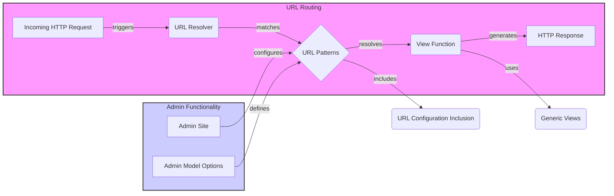

### Component Descriptions:

*   **Incoming HTTP Request:** Represents the initial request from a user's browser or client. It triggers the URL routing process.
    *   **Relevant source files:** N/A (Represents external input)

*   **URL Resolver:** Receives the HTTP request and attempts to match the URL against the defined URL patterns. It's the core of the URL routing system.
    *   **Relevant source files:** `django.urls.resolvers.URLResolver`

*   **URL Patterns:** A collection of URL patterns (RegexPattern, RoutePattern, URLPattern) that define the mapping between URLs and view functions. The URL resolver iterates through these patterns to find a match.
    *   **Relevant source files:** `django.urls.patterns`, `django.urls.resolvers.URLPattern`

*   **View Function:** The function or class-based view that is executed when a URL pattern matches the incoming request. It processes the request and generates an HTTP response.
    *   **Relevant source files:** N/A (User-defined views)

*   **HTTP Response:** The output generated by the view function, which is sent back to the user's browser or client.
    *   **Relevant source files:** N/A (Represents final output)

*   **Admin Site:** Encapsulates the Django admin application and configures URL patterns for admin views.
    *   **Relevant source files:** `django.contrib.admin.sites.AdminSite`

*   **Admin Model Options:** Configures the admin interface for specific models and defines custom URLs for admin actions.
    *   **Relevant source files:** `django.contrib.admin.options.ModelAdmin`

*   **URL Configuration Inclusion:** Allows including URL patterns from other URL modules, promoting modularity.
    *   **Relevant source files:** `django.urls.conf.include`

*   **Generic Views:** Provides reusable base classes for creating views, simplifying view development.
    *   **Relevant source files:** `django.views.generic.base.View`
