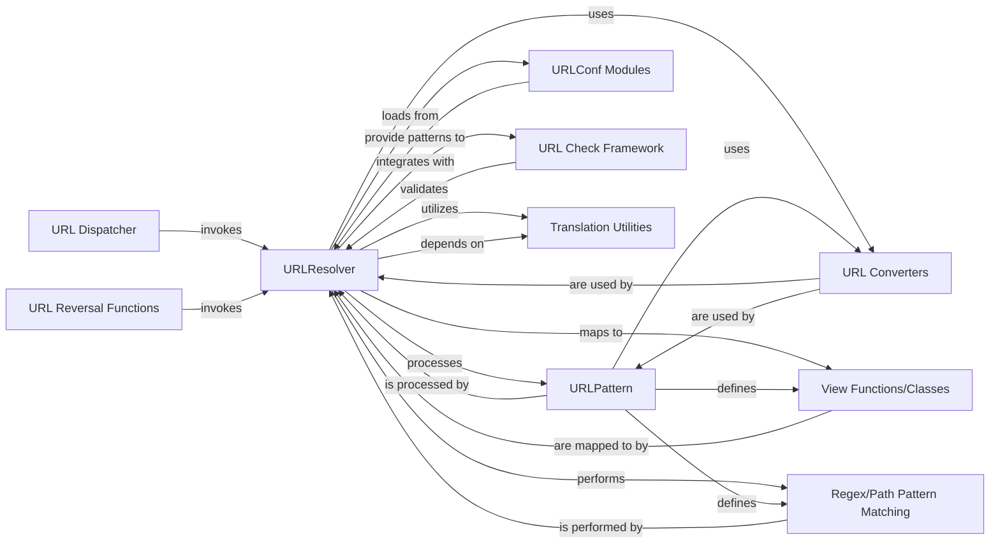

## Component Details

This analysis focuses on the `URLResolver` component within Django's URL subsystem, detailing its structure, flow, and purpose, along with its interactions with other fundamental components.

### URLResolver
The core engine for URL dispatching and reversal. It manages a collection of URL patterns, handles namespaces, and resolves incoming paths to callable views. It also facilitates the dynamic generation of URLs (reversal). It orchestrates the entire URL resolution and reversal process by recursively traversing URL configurations.

**Related Classes/Methods**:

- `URLResolver` (0:0)

### URLPattern
Represents a single mapping between a URL regular expression (or path) and a view callable. These patterns are the individual rules that URLResolver evaluates during both resolution and reversal.

**Related Classes/Methods**:

- `URLPattern` (0:0)

### URLConf Modules
Python modules (typically `urls.py` files) that define the `urlpatterns` list, which is the primary way Django projects declare their URL structure. URLResolver dynamically loads and interprets these modules.

**Related Classes/Methods**:

- `URLConf Modules` (0:0)

### URL Converters
Classes (e.g., `IntConverter`, `StrConverter`) that define how parts of a URL path are converted into specific Python types (and vice-versa during reversal). They enable type-safe and structured URL parameter handling.

**Related Classes/Methods**:

- `URL Converters` (0:0)

### URL Dispatcher
The public API function (`django.urls.base.resolve`) that initiates the URL resolution process for an incoming request. It acts as the primary entry point for HTTP requests into the routing system, delegating the core matching work to URLResolver.

**Related Classes/Methods**:

- `URL Dispatcher` (0:0)

### URL Reversal Functions
The public API function (`django.urls.base.reverse`) used to dynamically generate URLs from view names and arguments. It internally calls URLResolver's reversal logic to construct the correct URL path.

**Related Classes/Methods**:

- `URL Reversal Functions` (0:0)

### URL Check Framework
Contains functions within `django.core.checks.urls` for validating the correctness and consistency of URL configurations. URLResolver integrates with this framework to perform self-checks.

**Related Classes/Methods**:

- `URL Check Framework` (0:0)

### Translation Utilities
Provides functions for internationalization, specifically `get_language()`, which URLResolver uses to manage language-specific URL patterns and lookups, enabling localized URLs for global applications.

**Related Classes/Methods**:

- `Translation Utilities` (0:0)

### View Functions/Classes
The Python callables (functions or methods of class-based views) that are the ultimate targets of URL resolution. They are responsible for handling HTTP requests and returning responses.

**Related Classes/Methods**:

- `View Functions/Classes` (0:0)

### Regex/Path Pattern Matching
The underlying mechanism that performs the actual string matching of URL paths against the defined patterns. This is handled by the `pattern` attribute within URLResolver and URLPattern instances.

**Related Classes/Methods**:

- `Regex/Path Pattern Matching` (0:0)

### [FAQ](https://github.com/CodeBoarding/GeneratedOnBoardings/tree/main?tab=readme-ov-file#faq)