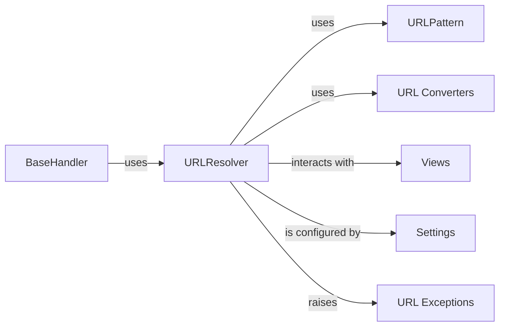

## Component Details

The URLResolver is the cornerstone of Django's URL routing mechanism. Its primary function is to translate an incoming HTTP request's URL path into the appropriate Python view function or class, along with any arguments extracted from the URL. It also provides the crucial capability of "URL reversing," allowing developers to generate URLs dynamically from view names, which is vital for maintaining flexible and maintainable links within a Django application. Together, these components ensure that Django applications can effectively map incoming web requests to the correct application logic and generate dynamic URLs, forming the backbone of any Django web application.

### URLResolver
The central component responsible for matching incoming URL paths against defined patterns and dispatching the request to the correct view. It manages a hierarchy of URL patterns, handles URL namespaces, and facilitates URL reversing. It recursively resolves URL patterns, allowing for nested URL configurations.

**Related Classes/Methods**:

- <a href="https://github.com/django/django/blob/master/django/urls/resolvers.py#L0-L0" target="_blank" rel="noopener noreferrer">`django.urls.resolvers.URLResolver` (0:0)</a>

### URLPattern
Represents a single, atomic URL pattern that URLResolver attempts to match against. Each URLPattern links a regular expression or path string to a specific view callable.

**Related Classes/Methods**:

- <a href="https://github.com/django/django/blob/master/django/urls/resolvers.py#L0-L0" target="_blank" rel="noopener noreferrer">`django.urls.resolvers.URLPattern` (0:0)</a>

### URL Converters
These are specialized classes used within URL patterns to parse and validate segments of the URL path, converting them into specific Python data types (e.g., int, str, slug, uuid). They are integral to how URLPattern extracts typed arguments.

**Related Classes/Methods**:

- <a href="https://github.com/django/django/blob/master/django/urls/converters.py#L0-L0" target="_blank" rel="noopener noreferrer">`django.urls.converters` (0:0)</a>

### Views
Callable Python functions or classes that receive an HttpRequest object as input and return an HttpResponse object. They encapsulate the application's logic for handling specific web requests.

**Related Classes/Methods**:

- <a href="https://github.com/django/django/blob/master/django/template/backends/django.py#L0-L0" target="_blank" rel="noopener noreferrer">`django.views` (0:0)</a>

### Settings
Django's configuration system, which includes the ROOT_URLCONF setting. This setting points to the Python module that contains the project's primary URL patterns, serving as the entry point for the URLResolver hierarchy.

**Related Classes/Methods**:

- `django.conf.settings.ROOT_URLCONF` (0:0)

### BaseHandler
The core component in Django's request-response cycle. It's responsible for receiving an incoming HTTP request, invoking the URLResolver to determine the appropriate view, and then executing that view to generate a response.

**Related Classes/Methods**:

- <a href="https://github.com/django/django/blob/master/django/core/handlers/base.py#L19-L364" target="_blank" rel="noopener noreferrer">`django.core.handlers.base.BaseHandler` (19:364)</a>

### URL Exceptions
Specific exceptions raised by the URL resolution and reversing mechanisms to indicate errors, such as a URL not being found (Resolver404) or a reverse lookup failing (NoReverseMatch).

**Related Classes/Methods**:

- <a href="https://github.com/django/django/blob/master/django/urls/exceptions.py#L7-L8" target="_blank" rel="noopener noreferrer">`django.urls.exceptions.NoReverseMatch` (7:8)</a>
- <a href="https://github.com/django/django/blob/master/django/urls/exceptions.py#L3-L4" target="_blank" rel="noopener noreferrer">`django.urls.exceptions.Resolver404` (3:4)</a>

### [FAQ](https://github.com/CodeBoarding/GeneratedOnBoardings/tree/main?tab=readme-ov-file#faq)