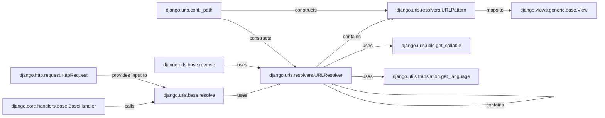

## Component Details

The `URLResolver` component is central to Django's URL routing mechanism, acting as the primary engine for both resolving incoming URLs to their corresponding views and for reversing view names back into URLs. Its fundamental role is to manage the hierarchical structure of URL configurations, enabling complex and modular URL definitions within a Django project.

### django.urls.resolvers.URLResolver
This is the core component responsible for URL routing. It represents a node in the URL configuration tree, capable of containing other `URLResolver` instances (for nested URL configurations) or `URLPattern` instances. It's responsible for recursively resolving incoming URL paths to find the correct view and for populating and using reverse lookup dictionaries (`_reverse_dict`, `_namespace_dict`, `_app_dict`) to generate URLs from view names. It dynamically loads URL configurations and handles language-specific URL lookups.

**Related Classes/Methods**:

- <a href="https://github.com/django/django/blob/master/django/urls/resolvers.py#L1-L1" target="_blank" rel="noopener noreferrer">`django.urls.resolvers.URLResolver` (1:1)</a>

### django.urls.resolvers.URLPattern
Represents a single URL pattern that maps a regular expression or route string to a view callable. It's a leaf node in the URL configuration tree and is contained within `URLResolver` instances. It holds the direct mapping from a URL segment to a specific view.

**Related Classes/Methods**:

- <a href="https://github.com/django/django/blob/master/django/urls/resolvers.py#L1-L1" target="_blank" rel="noopener noreferrer">`django.urls.resolvers.URLPattern` (1:1)</a>

### django.urls.base.resolve
A public utility function that initiates the URL resolution process. It takes a URL path (typically from an `HttpRequest`) and delegates the actual resolution to the root `URLResolver` instance, returning the corresponding view function and arguments if a match is found. This is the entry point for resolving URLs.

**Related Classes/Methods**:

- <a href="https://github.com/django/django/blob/master/django/urls/base.py#L21-L24" target="_blank" rel="noopener noreferrer">`django.urls.base.resolve` (21:24)</a>

### django.urls.base.reverse
A public utility function used to dynamically generate a URL from a view name, URL pattern name, or a callable view object, along with any arguments. It delegates the URL generation to the `reverse` method of the appropriate `URLResolver`, ensuring that URLs are consistently generated based on the defined patterns.

**Related Classes/Methods**:

- <a href="https://github.com/django/django/blob/master/django/urls/base.py#L27-L107" target="_blank" rel="noopener noreferrer">`django.urls.base.reverse` (27:107)</a>

### django.core.handlers.base.BaseHandler
The base class for Django's request handlers. It orchestrates the overall request/response cycle. Crucially, it invokes the URL resolution process by calling `django.urls.base.resolve` to determine which view should handle the incoming `HttpRequest`.

**Related Classes/Methods**:

- <a href="https://github.com/django/django/blob/master/django/core/handlers/base.py#L19-L364" target="_blank" rel="noopener noreferrer">`django.core.handlers.base.BaseHandler` (19:364)</a>

### django.http.request.HttpRequest
An object representing an incoming HTTP request. It encapsulates all request-related information, including the URL path that needs to be resolved by the `URLResolver`. It serves as the input for the URL resolution process.

**Related Classes/Methods**:

- <a href="https://github.com/django/django/blob/master/django/http/request.py#L52-L469" target="_blank" rel="noopener noreferrer">`django.http.request.HttpRequest` (52:469)</a>

### django.views.generic.base.View
The base class for all class-based views in Django. Instances or methods of this class are the ultimate targets of URL patterns, meaning `URLPattern` objects map an incoming URL to these view callables.

**Related Classes/Methods**:

- <a href="https://github.com/django/django/blob/master/django/views/generic/base.py#L36-L180" target="_blank" rel="noopener noreferrer">`django.views.generic.base.View` (36:180)</a>

### django.urls.conf._path
A function used in `urlpatterns` definitions (e.g., in `urls.py` files) to construct individual `URLPattern` or `URLResolver` objects. It's the primary declarative way developers define their URL routing configuration.

**Related Classes/Methods**:

- <a href="https://github.com/django/django/blob/master/django/urls/conf.py#L61-L91" target="_blank" rel="noopener noreferrer">`django.urls.conf._path` (61:91)</a>

### django.urls.utils.get_callable
A utility function used by `URLResolver` (and other parts of Django's URL system) to convert a string representation of a Python callable (e.g., "myapp.views.my_view") into the actual function or class object. This is vital for dynamically loading views.

**Related Classes/Methods**:

- <a href="https://github.com/django/django/blob/master/django/urls/utils.py#L8-L55" target="_blank" rel="noopener noreferrer">`django.urls.utils.get_callable` (8:55)</a>

### django.utils.translation.get_language
A utility function that returns the currently active language code. `URLResolver` uses this to manage language-specific URL patterns and reverse lookups, enabling internationalized URLs and ensuring the correct URL is resolved or generated based on the active language.

**Related Classes/Methods**:

- `django.utils.translation.get_language` (1:1)

### [FAQ](https://github.com/CodeBoarding/GeneratedOnBoardings/tree/main?tab=readme-ov-file#faq)