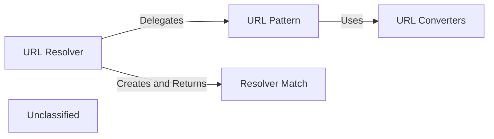

## Details

The Django URL routing subsystem is a modular, pattern-based mechanism for dispatching incoming HTTP requests to the appropriate view functions. At its core, a central `URLResolver` processes the request path against a list of `URLPattern` objects. Each `URLPattern` uses a specific pattern-matching strategy (`RoutePattern` for simple paths, `RegexPattern` for complex ones) and leverages `URLConverters` to validate and type-cast URL parameters. Upon a successful match, a `ResolverMatch` object is created, encapsulating the target view and its arguments, which is then used to invoke the business logic.

### URL Resolver
The central orchestrator of the routing process. It holds a collection of URL patterns and iterates through them to find the first one that matches the requested URL path. It is the primary entry point for the dispatching mechanism.

**Related Classes/Methods**:

- <a href="https://github.com/django/django/blob/main/django/urls/resolvers.py#L503-L842" target="_blank" rel="noopener noreferrer">`django.urls.resolvers.URLResolver`:503-842</a>

### URL Pattern
Represents a single, matchable route. It encapsulates the pattern string (either a regex or a path expression), the corresponding view, and any associated converters. Its primary responsibility is to determine if a given URL path matches its pattern.

**Related Classes/Methods**:

- <a href="https://github.com/django/django/blob/main/django/urls/resolvers.py#L192-L239" target="_blank" rel="noopener noreferrer">`django.urls.resolvers.RegexPattern`:192-239</a>
- <a href="https://github.com/django/django/blob/main/django/urls/resolvers.py#L314-L385" target="_blank" rel="noopener noreferrer">`django.urls.resolvers.RoutePattern`:314-385</a>

### URL Converters
A set of reusable components that define how to match specific segments of a URL path and convert them into the correct Python data types. They provide the type-casting logic used by URL Patterns (e.g., converting a string of digits into an integer).

**Related Classes/Methods**:

- <a href="https://github.com/django/django/blob/main/django/urls/converters.py#L5-L12" target="_blank" rel="noopener noreferrer">`django.urls.converters.IntConverter`:5-12</a>
- <a href="https://github.com/django/django/blob/main/django/urls/converters.py#L15-L22" target="_blank" rel="noopener noreferrer">`django.urls.converters.StringConverter`:15-22</a>

### Resolver Match
A data transfer object that represents a successful resolution. It is created by the URL Resolver and contains the matched view function, the arguments extracted from the URL, and other metadata. This object is the final output of the dispatch process.

**Related Classes/Methods**:

- <a href="https://github.com/django/django/blob/main/django/urls/resolvers.py#L34-L105" target="_blank" rel="noopener noreferrer">`django.urls.resolvers.ResolverMatch`:34-105</a>

### Unclassified
Component for all unclassified files and utility functions (Utility functions/External Libraries/Dependencies)

**Related Classes/Methods**: _None_

### [FAQ](https://github.com/CodeBoarding/GeneratedOnBoardings/tree/main?tab=readme-ov-file#faq)