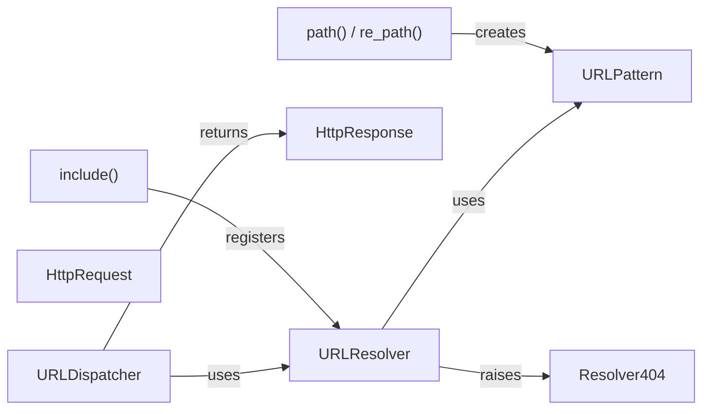

## Details

One paragraph explaining the functionality which is represented by this graph. What the main flow is and what is its purpose.

### URLResolver
Core URL resolution engine that matches request paths against registered patterns and maps to view functions.

**Related Classes/Methods**:

- <a href="https://github.com/django/django/blob/main/django/urls/resolvers.py#L100-L150" target="_blank" rel="noopener noreferrer">`django.urls.resolvers.URLResolver` (100:150)</a>

### URLPattern
Represents individual URL patterns defined via path()/re_path(), encapsulating regex patterns and view references.

**Related Classes/Methods**:

- <a href="https://github.com/django/django/blob/main/django/urls/resolvers.py#L50-L80" target="_blank" rel="noopener noreferrer">`django.urls.resolvers.URLPattern` (50:80)</a>

### URLDispatcher
Central coordinator that initializes resolvers and dispatches requests to the resolved view function.

**Related Classes/Methods**:

- `django.urls.base.URLDispatcher`

### HttpRequest
Carries raw HTTP request data (headers, body, method, path).

**Related Classes/Methods**:

- `django.http.HttpRequest`

### HttpResponse
Base class for HTTP responses returned by views.

**Related Classes/Methods**:

- `django.http.HttpResponse`

### Resolver404
Exception raised when no URL pattern matches a request.

**Related Classes/Methods**:

- <a href="https://github.com/django/django/blob/main/django/urls/exceptions.py#L3-L4" target="_blank" rel="noopener noreferrer">`django.urls.exceptions.Resolver404` (3:4)</a>

### path() / re_path()
Factory functions to define URL patterns with string-based or regex syntax.

**Related Classes/Methods**:

- `django.urls.path`
- `django.urls.re_path`

### include()
References external URL configurations to enable modular URL routing.

**Related Classes/Methods**:

- `django.urls.include`

### [FAQ](https://github.com/CodeBoarding/GeneratedOnBoardings/tree/main?tab=readme-ov-file#faq)