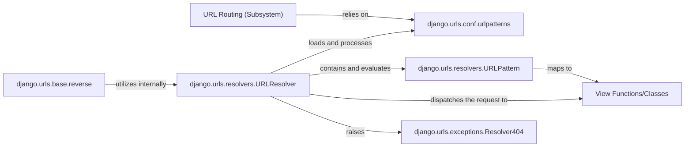

## Details

The Django URL Routing subsystem orchestrates the mapping of incoming HTTP requests to the appropriate application logic. At its core, `django.urls.conf.urlpatterns` defines the project's URL configuration, comprising `URLPattern` objects (for individual URL-to-view mappings) and nested `URLResolver` instances (for hierarchical routing). The `django.urls.resolvers.URLResolver` component is central to this process, responsible for matching incoming URLs against these defined patterns and dispatching the request to the corresponding `View Functions/Classes`. If no match is found, a `django.urls.exceptions.Resolver404` is raised. Conversely, the `django.urls.base.reverse` function allows developers to dynamically generate URLs from view names, leveraging the `URLResolver`'s capabilities to ensure consistency and maintainability.

### URL Routing (Subsystem)
The overarching mechanism responsible for mapping incoming HTTP requests to appropriate view functions or classes based on defined URL patterns and for dynamically generating URLs.

**Related Classes/Methods**:

- <a href="https://github.com/django/django//blob/django/urls/resolvers.py" target="_blank" rel="noopener noreferrer">`django.urls.resolvers`</a>
- <a href="https://github.com/django/django//blob/django/urls/conf.py" target="_blank" rel="noopener noreferrer">`django.urls.conf`</a>
- <a href="https://github.com/django/django//blob/django/urls/base.py" target="_blank" rel="noopener noreferrer">`django.urls.base`</a>

### django.urls.resolvers.URLResolver
The core component that matches incoming URL paths against a set of defined patterns (`resolve` method) and dispatches the request to the appropriate view. It also manages a collection of `URLPattern` objects and can include nested `URLResolver` instances for hierarchical routing. It provides functionality to reverse (generate) URLs from view names or callables (`reverse` method).

**Related Classes/Methods**:

- <a href="https://github.com/django/django//blob/django/urls/resolvers.py#L503-L842" target="_blank" rel="noopener noreferrer">`django.urls.resolvers.URLResolver`:503-842</a>

### django.urls.resolvers.URLPattern
Represents a single mapping from a regular expression URL pattern to a specific view function or class. It's the atomic unit of URL configuration.

**Related Classes/Methods**:

- <a href="https://github.com/django/django//blob/django/urls/resolvers.py#L422-L500" target="_blank" rel="noopener noreferrer">`django.urls.resolvers.URLPattern`:422-500</a>

### django.urls.conf.urlpatterns
A list (or tuple) of `URLPattern` and `URLResolver` instances that defines the URL configuration for a Django project or application. This is where developers declare their URL mappings.

**Related Classes/Methods**:

- <a href="https://github.com/django/django//blob/django/urls/conf.py" target="_blank" rel="noopener noreferrer">`django.urls.conf.urlpatterns`</a>

### View Functions/Classes
Callable Python objects (functions or class methods) that receive HTTP requests as input and return HTTP responses. They represent the application's business logic and are the ultimate targets of the URL routing process. While Django provides generic views in `django.views`, this component refers to the general concept of a view callable, which can be user-defined and reside in various application-specific modules.

**Related Classes/Methods**: _None_

### django.urls.base.reverse
The public API function used by developers to dynamically generate URLs from view names or callables. It internally leverages `URLResolver` to perform the URL reversal lookup.

**Related Classes/Methods**:

- <a href="https://github.com/django/django//blob/django/urls/base.py#L28-L108" target="_blank" rel="noopener noreferrer">`django.urls.base.reverse`:28-108</a>

### django.urls.exceptions.Resolver404
An exception raised by `URLResolver` when an incoming URL path does not match any defined URL patterns, indicating that the requested resource could not be found.

**Related Classes/Methods**:

- <a href="https://github.com/django/django//blob/django/urls/exceptions.py#L4-L5" target="_blank" rel="noopener noreferrer">`django.urls.exceptions.Resolver404`:4-5</a>

### [FAQ](https://github.com/CodeBoarding/GeneratedOnBoardings/tree/main?tab=readme-ov-file#faq)