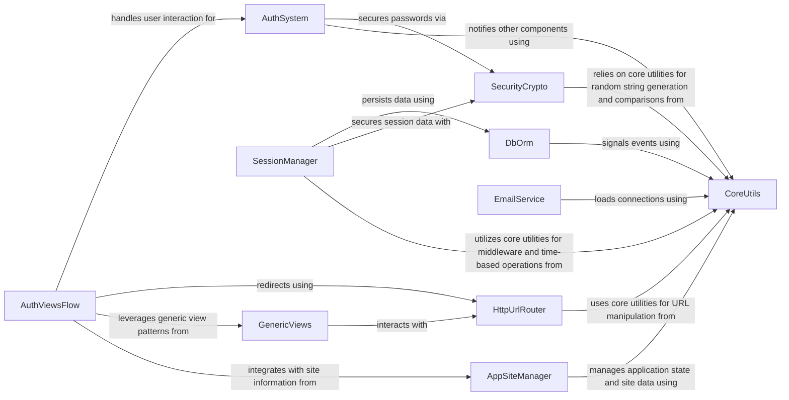

## Component Details

Manages user authentication, authorization, and session handling. This includes user models, login/logout views, password hashing, and various session storage backends to maintain user state across requests.

### AuthSystem
The Authentication System component is responsible for core user authentication and authorization logic. It handles user model definitions, password hashing, user login, logout, and authentication processes, and interacts with various backends to verify user credentials.

**Related Classes/Methods**:

- <a href="https://github.com/django/django/blob/master/django/contrib/auth/models.py#L446-L514" target="_blank" rel="noopener noreferrer">`django.contrib.auth.models.AbstractUser` (446:514)</a>
- <a href="https://github.com/django/django/blob/master/django/contrib/auth/hashers.py#L94-L113" target="_blank" rel="noopener noreferrer">`django.contrib.auth.hashers.make_password` (94:113)</a>
- <a href="https://github.com/django/django/blob/master/django/contrib/auth/models.py#L529-L634" target="_blank" rel="noopener noreferrer">`django.contrib.auth.models.AnonymousUser` (529:634)</a>
- <a href="https://github.com/django/django/blob/master/django/contrib/auth/base_user.py#L43-L164" target="_blank" rel="noopener noreferrer">`django.contrib.auth.base_user.AbstractBaseUser` (43:164)</a>
- <a href="https://github.com/django/django/blob/master/django/contrib/auth/base_user.py#L21-L40" target="_blank" rel="noopener noreferrer">`django.contrib.auth.base_user.BaseUserManager` (21:40)</a>
- <a href="https://github.com/django/django/blob/master/django/contrib/auth/hashers.py#L142-L164" target="_blank" rel="noopener noreferrer">`django.contrib.auth.hashers.get_hasher` (142:164)</a>
- <a href="https://github.com/django/django/blob/master/django/contrib/auth/hashers.py#L117-L127" target="_blank" rel="noopener noreferrer">`django.contrib.auth.hashers.get_hashers` (117:127)</a>
- <a href="https://github.com/django/django/blob/master/django/contrib/auth/hashers.py#L131-L132" target="_blank" rel="noopener noreferrer">`django.contrib.auth.hashers.get_hashers_by_algorithm` (131:132)</a>
- `django.contrib.auth.login` (full file reference)
- `django.contrib.auth.logout` (full file reference)
- `django.contrib.auth.authenticate` (full file reference)
- `django.contrib.auth._get_user_session_key` (full file reference)
- `django.contrib.auth._get_backend_from_user` (full file reference)
- `django.contrib.auth._get_compatible_backends` (full file reference)
- `django.contrib.auth._clean_credentials` (full file reference)
- `django.contrib.auth.get_user_model` (full file reference)
- `django.contrib.auth.load_backend` (full file reference)
- <a href="https://github.com/django/django/blob/master/django/contrib/auth/middleware.py#L30-L41" target="_blank" rel="noopener noreferrer">`django.contrib.auth.middleware.AuthenticationMiddleware` (30:41)</a>
- <a href="https://github.com/django/django/blob/master/django/contrib/auth/middleware.py#L44-L91" target="_blank" rel="noopener noreferrer">`django.contrib.auth.middleware.LoginRequiredMiddleware` (44:91)</a>

### AuthViewsFlow
The Authentication Views & Flow component manages the web-facing aspects of user authentication. It includes views for user login, handling form submissions, and managing redirects after successful or failed authentication attempts.

**Related Classes/Methods**:

- <a href="https://github.com/django/django/blob/master/django/contrib/auth/views.py#L66-L122" target="_blank" rel="noopener noreferrer">`django.contrib.auth.views.LoginView` (66:122)</a>
- <a href="https://github.com/django/django/blob/master/django/contrib/auth/views.py#L35-L62" target="_blank" rel="noopener noreferrer">`django.contrib.auth.views.RedirectURLMixin` (35:62)</a>
- <a href="https://github.com/django/django/blob/master/django/contrib/auth/views.py#L125-L169" target="_blank" rel="noopener noreferrer">`django.contrib.auth.views.LogoutView` (125:169)</a>
- <a href="https://github.com/django/django/blob/master/django/contrib/auth/views.py#L379-L385" target="_blank" rel="noopener noreferrer">`django.contrib.auth.views.PasswordChangeDoneView` (379:385)</a>
- <a href="https://github.com/django/django/blob/master/django/contrib/auth/views.py#L354-L376" target="_blank" rel="noopener noreferrer">`django.contrib.auth.views.PasswordChangeView` (354:376)</a>
- <a href="https://github.com/django/django/blob/master/django/contrib/auth/views.py#L344-L351" target="_blank" rel="noopener noreferrer">`django.contrib.auth.views.PasswordResetCompleteView` (344:351)</a>
- <a href="https://github.com/django/django/blob/master/django/contrib/auth/views.py#L256-L340" target="_blank" rel="noopener noreferrer">`django.contrib.auth.views.PasswordResetConfirmView` (256:340)</a>
- <a href="https://github.com/django/django/blob/master/django/contrib/auth/views.py#L250-L252" target="_blank" rel="noopener noreferrer">`django.contrib.auth.views.PasswordResetDoneView` (250:252)</a>
- <a href="https://github.com/django/django/blob/master/django/contrib/auth/views.py#L215-L243" target="_blank" rel="noopener noreferrer">`django.contrib.auth.views.PasswordResetView` (215:243)</a>

### SessionManager
The Session Management component provides the infrastructure for handling user sessions. This includes middleware for processing session data, backend implementations for storing sessions (e.g., in a database), and base classes for session operations like encoding, decoding, and expiration.

**Related Classes/Methods**:

- <a href="https://github.com/django/django/blob/master/django/contrib/sessions/middleware.py#L12-L77" target="_blank" rel="noopener noreferrer">`django.contrib.sessions.middleware.SessionMiddleware` (12:77)</a>
- <a href="https://github.com/django/django/blob/master/django/contrib/sessions/backends/db.py#L12-L198" target="_blank" rel="noopener noreferrer">`django.contrib.sessions.backends.db.SessionStore` (12:198)</a>
- <a href="https://github.com/django/django/blob/master/django/contrib/sessions/backends/base.py#L35-L523" target="_blank" rel="noopener noreferrer">`django.contrib.sessions.backends.base.SessionBase` (35:523)</a>
- <a href="https://github.com/django/django/blob/master/django/contrib/sessions/models.py#L8-L35" target="_blank" rel="noopener noreferrer">`django.contrib.sessions.models.Session` (8:35)</a>
- <a href="https://github.com/django/django/blob/master/django/contrib/sessions/exceptions.py#L16-L19" target="_blank" rel="noopener noreferrer">`django.contrib.sessions.exceptions.SessionInterrupted` (16:19)</a>
- <a href="https://github.com/django/django/blob/master/django/contrib/sessions/backends/signed_cookies.py#L51-L57" target="_blank" rel="noopener noreferrer">`django.contrib.sessions.backends.signed_cookies.SessionStore.exists` (51:57)</a>
- <a href="https://github.com/django/django/blob/master/django/contrib/sessions/backends/cache.py#L8-L145" target="_blank" rel="noopener noreferrer">`django.contrib.sessions.backends.cache.SessionStore` (8:145)</a>
- <a href="https://github.com/django/django/blob/master/django/contrib/sessions/backends/cached_db.py#L16-L135" target="_blank" rel="noopener noreferrer">`django.contrib.sessions.backends.cached_db.SessionStore` (16:135)</a>
- <a href="https://github.com/django/django/blob/master/django/contrib/sessions/backends/file.py#L18-L226" target="_blank" rel="noopener noreferrer">`django.contrib.sessions.backends.file.SessionStore` (18:226)</a>
- <a href="https://github.com/django/django/blob/master/django/contrib/sessions/backends/signed_cookies.py#L5-L103" target="_blank" rel="noopener noreferrer">`django.contrib.sessions.backends.signed_cookies.SessionStore` (5:103)</a>

### SecurityCrypto
The Security & Cryptography component offers essential utilities for securing data within Django. It provides functionalities for cryptographic signing, hashing, and managing Cross-Site Request Forgery (CSRF) tokens to protect against common web vulnerabilities.

**Related Classes/Methods**:

- <a href="https://github.com/django/django/blob/master/django/core/signing.py#L131-L152" target="_blank" rel="noopener noreferrer">`django.core.signing.dumps` (131:152)</a>
- <a href="https://github.com/django/django/blob/master/django/core/signing.py#L155-L174" target="_blank" rel="noopener noreferrer">`django.core.signing.loads` (155:174)</a>
- <a href="https://github.com/django/django/blob/master/django/core/signing.py#L177-L251" target="_blank" rel="noopener noreferrer">`django.core.signing.Signer` (177:251)</a>
- <a href="https://github.com/django/django/blob/master/django/core/signing.py#L254-L277" target="_blank" rel="noopener noreferrer">`django.core.signing.TimestampSigner` (254:277)</a>
- <a href="https://github.com/django/django/blob/master/django/core/signing.py#L118-L128" target="_blank" rel="noopener noreferrer">`django.core.signing.JSONSerializer` (118:128)</a>
- <a href="https://github.com/django/django/blob/master/django/core/signing.py#L89-L90" target="_blank" rel="noopener noreferrer">`django.core.signing.b64_encode` (89:90)</a>
- <a href="https://github.com/django/django/blob/master/django/core/signing.py#L93-L95" target="_blank" rel="noopener noreferrer">`django.core.signing.b64_decode` (93:95)</a>
- <a href="https://github.com/django/django/blob/master/django/core/signing.py#L98-L101" target="_blank" rel="noopener noreferrer">`django.core.signing.base64_hmac` (98:101)</a>
- <a href="https://github.com/django/django/blob/master/django/core/signing.py#L52-L55" target="_blank" rel="noopener noreferrer">`django.core.signing.BadSignature` (52:55)</a>
- <a href="https://github.com/django/django/blob/master/django/utils/crypto.py#L51-L62" target="_blank" rel="noopener noreferrer">`django.utils.crypto.get_random_string` (51:62)</a>
- <a href="https://github.com/django/django/blob/master/django/utils/crypto.py#L65-L67" target="_blank" rel="noopener noreferrer">`django.utils.crypto.constant_time_compare` (65:67)</a>
- <a href="https://github.com/django/django/blob/master/django/utils/crypto.py#L19-L45" target="_blank" rel="noopener noreferrer">`django.utils.crypto.salted_hmac` (19:45)</a>
- <a href="https://github.com/django/django/blob/master/django/middleware/csrf.py#L117-L122" target="_blank" rel="noopener noreferrer">`django.middleware.csrf.rotate_token` (117:122)</a>
- <a href="https://github.com/django/django/blob/master/django/middleware/csrf.py#L84-L93" target="_blank" rel="noopener noreferrer">`django.middleware.csrf._add_new_csrf_cookie` (84:93)</a>
- <a href="https://github.com/django/django/blob/master/django/middleware/csrf.py#L55-L56" target="_blank" rel="noopener noreferrer">`django.middleware.csrf._get_new_csrf_string` (55:56)</a>

### HttpUrlRouter
The HTTP & URL Routing component is responsible for handling HTTP requests and responses, including redirects, and for resolving URLs to their corresponding views. It provides the core mechanisms for navigating and responding within the web application.

**Related Classes/Methods**:

- <a href="https://github.com/django/django/blob/master/django/http/response.py#L655-L657" target="_blank" rel="noopener noreferrer">`django.http.response.HttpResponseRedirect` (655:657)</a>
- <a href="https://github.com/django/django/blob/master/django/http/response.py#L365-L435" target="_blank" rel="noopener noreferrer">`django.http.response.HttpResponse` (365:435)</a>
- <a href="https://github.com/django/django/blob/master/django/http/response.py#L33-L96" target="_blank" rel="noopener noreferrer">`django.http.response.ResponseHeaders` (33:96)</a>
- <a href="https://github.com/django/django/blob/master/django/http/request.py#L793-L804" target="_blank" rel="noopener noreferrer">`django.http.request.split_domain_port` (793:804)</a>
- <a href="https://github.com/django/django/blob/master/django/shortcuts.py#L156-L194" target="_blank" rel="noopener noreferrer">`django.shortcuts.resolve_url` (156:194)</a>
- <a href="https://github.com/django/django/blob/master/django/urls/base.py#L28-L108" target="_blank" rel="noopener noreferrer">`django.urls.base.reverse` (28:108)</a>
- <a href="https://github.com/django/django/blob/master/django/urls/base.py#L161-L166" target="_blank" rel="noopener noreferrer">`django.urls.base.get_urlconf` (161:166)</a>
- <a href="https://github.com/django/django/blob/master/django/urls/base.py#L129-L135" target="_blank" rel="noopener noreferrer">`django.urls.base.get_script_prefix` (129:135)</a>
- <a href="https://github.com/django/django/blob/master/django/urls/resolvers.py#L108-L111" target="_blank" rel="noopener noreferrer">`django.urls.resolvers.get_resolver` (108:111)</a>
- <a href="https://github.com/django/django/blob/master/django/urls/resolvers.py#L120-L127" target="_blank" rel="noopener noreferrer">`django.urls.resolvers.get_ns_resolver` (120:127)</a>
- <a href="https://github.com/django/django/blob/master/django/urls/resolvers.py#L501-L839" target="_blank" rel="noopener noreferrer">`django.urls.resolvers.URLResolver` (501:839)</a>
- <a href="https://github.com/django/django/blob/master/django/urls/resolvers.py#L192-L239" target="_blank" rel="noopener noreferrer">`django.urls.resolvers.RegexPattern` (192:239)</a>
- <a href="https://github.com/django/django/blob/master/django/urls/resolvers.py#L115-L116" target="_blank" rel="noopener noreferrer">`django.urls.resolvers._get_cached_resolver` (115:116)</a>
- <a href="https://github.com/django/django/blob/master/django/urls/resolvers.py#L752-L839" target="_blank" rel="noopener noreferrer">`django.urls.resolvers.URLResolver._reverse_with_prefix` (752:839)</a>
- <a href="https://github.com/django/django/blob/master/django/urls/exceptions.py#L8-L9" target="_blank" rel="noopener noreferrer">`django.urls.exceptions.NoReverseMatch` (8:9)</a>
- `django.utils.http.iri_to_uri` (full file reference)
- <a href="https://github.com/django/django/blob/master/django/utils/http.py#L245-L272" target="_blank" rel="noopener noreferrer">`django.utils.http.url_has_allowed_host_and_scheme` (245:272)</a>
- <a href="https://github.com/django/django/blob/master/django/utils/http.py#L275-L305" target="_blank" rel="noopener noreferrer">`django.utils.http._url_has_allowed_host_and_scheme` (275:305)</a>
- <a href="https://github.com/django/django/blob/master/django/utils/http.py#L308-L316" target="_blank" rel="noopener noreferrer">`django.utils.http.escape_leading_slashes` (308:316)</a>

### GenericViews
The Generic Views component provides a set of reusable, class-based views that abstract common web development patterns. It includes base classes for views, context management, and form handling, promoting code reusability and reducing boilerplate.

**Related Classes/Methods**:

- <a href="https://github.com/django/django/blob/master/django/views/generic/base.py#L37-L181" target="_blank" rel="noopener noreferrer">`django.views.generic.base.View` (37:181)</a>
- <a href="https://github.com/django/django/blob/master/django/views/generic/base.py#L22-L34" target="_blank" rel="noopener noreferrer">`django.views.generic.base.ContextMixin` (22:34)</a>
- <a href="https://github.com/django/django/blob/master/django/views/generic/edit.py#L13-L73" target="_blank" rel="noopener noreferrer">`django.views.generic.edit.FormMixin` (13:73)</a>
- <a href="https://github.com/django/django/blob/master/django/views/generic/edit.py#L33-L37" target="_blank" rel="noopener noreferrer">`django.views.generic.edit.FormMixin.get_form` (33:37)</a>
- <a href="https://github.com/django/django/blob/master/django/views/generic/edit.py#L29-L31" target="_blank" rel="noopener noreferrer">`django.views.generic.edit.FormMixin.get_form_class` (29:31)</a>
- <a href="https://github.com/django/django/blob/master/django/views/decorators/debug.py#L82-L147" target="_blank" rel="noopener noreferrer">`django.views.decorators.debug.sensitive_post_parameters` (82:147)</a>
- <a href="https://github.com/django/django/blob/master/django/views/decorators/debug.py#L11-L79" target="_blank" rel="noopener noreferrer">`django.views.decorators.debug.sensitive_variables` (11:79)</a>

### DbOrm
The Database & ORM component is the core interface for interacting with the database. It includes the Object-Relational Mapper (ORM) for defining and manipulating database models, transaction management, and utilities for database routing and query expression building.

**Related Classes/Methods**:

- `django.db.models.base.Model` (full file reference)
- `django.db.models.base.Model._prepare_related_fields_for_save` (full file reference)
- `django.db.models.base.Model._is_pk_set` (full file reference)
- `django.db.models.base.Model.save_base` (full file reference)
- `django.db.models.base.Model._validate_force_insert` (full file reference)
- `django.db.models.base.Model._save_parents` (full file reference)
- `django.db.models.base.Model._save_table` (full file reference)
- `django.db.models.base.Model._get_pk_val` (full file reference)
- `django.db.models.base.Model._do_update` (full file reference)
- `django.db.models.base.Model._do_insert` (full file reference)
- <a href="https://github.com/django/django/blob/master/django/db/models/functions/comparison.py#L70-L100" target="_blank" rel="noopener noreferrer">`django.db.models.functions.comparison.Coalesce` (70:100)</a>
- `django.db.models.expressions.ExpressionWrapper` (full file reference)
- <a href="https://github.com/django/django/blob/master/django/db/models/aggregates.py#L277-L280" target="_blank" rel="noopener noreferrer">`django.db.models.aggregates.Max` (277:280)</a>
- `django.db.models.expressions.Value` (full file reference)
- `django.db.models.fields.IntegerField` (full file reference)
- `django.db.models.fields.Field` (full file reference)
- `django.db.models.fields.IntegerField._check_max_length_warning` (full file reference)
- `django.db.models.expressions.Func` (full file reference)
- <a href="https://github.com/django/django/blob/master/django/db/models/expressions.py#L174-L514" target="_blank" rel="noopener noreferrer">`django.db.models.expressions.BaseExpression` (174:514)</a>
- <a href="https://github.com/django/django/blob/master/django/db/models/expressions.py#L876-L937" target="_blank" rel="noopener noreferrer">`django.db.models.expressions.F` (876:937)</a>
- `django.db.models.expressions.Func.copy` (full file reference)
- `django.db.models.expressions.Func.get_source_expressions` (full file reference)
- `django.db.models.expressions.Func.as_sql` (full file reference)
- `django.db.models.expressions.Func.__init__` (full file reference)
- <a href="https://github.com/django/django/blob/master/django/db/models/expressions.py#L193-L195" target="_blank" rel="noopener noreferrer">`django.db.models.expressions.BaseExpression.__init__` (193:195)</a>
- <a href="https://github.com/django/django/blob/master/django/db/models/expressions.py#L215-L223" target="_blank" rel="noopener noreferrer">`django.db.models.expressions.BaseExpression._parse_expressions` (215:223)</a>
- <a href="https://github.com/django/django/blob/master/django/db/transaction.py#L316-L323" target="_blank" rel="noopener noreferrer">`django.db.transaction.atomic` (316:323)</a>
- <a href="https://github.com/django/django/blob/master/django/db/transaction.py#L101-L126" target="_blank" rel="noopener noreferrer">`django.db.transaction.mark_for_rollback_on_error` (101:126)</a>
- <a href="https://github.com/django/django/blob/master/django/db/transaction.py#L18-L25" target="_blank" rel="noopener noreferrer">`django.db.transaction.get_connection` (18:25)</a>
- <a href="https://github.com/django/django/blob/master/django/db/transaction.py#L142-L313" target="_blank" rel="noopener noreferrer">`django.db.transaction.Atomic` (142:313)</a>
- <a href="https://github.com/django/django/blob/master/django/db/utils.py#L200-L281" target="_blank" rel="noopener noreferrer">`django.db.utils.ConnectionRouter` (200:281)</a>

### EmailService
The Email Service component provides the functionality for sending emails from the Django application. It includes utilities for establishing email connections and constructing various types of email messages, such as multi-part emails.

**Related Classes/Methods**:

- `django.core.mail.send_mail` (full file reference)
- `django.core.mail.get_connection` (full file reference)
- <a href="https://github.com/django/django/blob/master/django/core/mail/message.py#L440-L520" target="_blank" rel="noopener noreferrer">`django.core.mail.message.EmailMultiAlternatives` (440:520)</a>
- <a href="https://github.com/django/django/blob/master/django/core/mail/message.py#L198-L437" target="_blank" rel="noopener noreferrer">`django.core.mail.message.EmailMessage` (198:437)</a>
- `django.core.mail.message.EmailAlternative` (full file reference)
- <a href="https://github.com/django/django/blob/master/django/core/mail/message.py#L483-L487" target="_blank" rel="noopener noreferrer">`django.core.mail.message.EmailMultiAlternatives.attach_alternative` (483:487)</a>
- <a href="https://github.com/django/django/blob/master/django/core/mail/message.py#L301-L307" target="_blank" rel="noopener noreferrer">`django.core.mail.message.EmailMessage.send` (301:307)</a>
- <a href="https://github.com/django/django/blob/master/django/core/mail/message.py#L294-L299" target="_blank" rel="noopener noreferrer">`django.core.mail.message.EmailMessage.recipients` (294:299)</a>

### AppSiteManager
The Application & Site Management component handles the registration and management of installed applications and provides utilities for interacting with the Django 'sites' framework. It allows for dynamic retrieval of application models and current site information.

**Related Classes/Methods**:

- <a href="https://github.com/django/django/blob/master/django/apps/registry.py#L13-L434" target="_blank" rel="noopener noreferrer">`django.apps.registry.Apps` (13:434)</a>
- <a href="https://github.com/django/django/blob/master/django/apps/registry.py#L242-L249" target="_blank" rel="noopener noreferrer">`django.apps.registry.Apps.is_installed` (242:249)</a>
- <a href="https://github.com/django/django/blob/master/django/apps/registry.py#L129-L138" target="_blank" rel="noopener noreferrer">`django.apps.registry.Apps.check_apps_ready` (129:138)</a>
- <a href="https://github.com/django/django/blob/master/django/apps/registry.py#L188-L213" target="_blank" rel="noopener noreferrer">`django.apps.registry.Apps.get_model` (188:213)</a>
- <a href="https://github.com/django/django/blob/master/django/contrib/sites/shortcuts.py#L6-L18" target="_blank" rel="noopener noreferrer">`django.contrib.sites.shortcuts.get_current_site` (6:18)</a>
- <a href="https://github.com/django/django/blob/master/django/contrib/sites/models.py#L25-L76" target="_blank" rel="noopener noreferrer">`django.contrib.sites.models.SiteManager` (25:76)</a>
- <a href="https://github.com/django/django/blob/master/django/contrib/sites/models.py#L28-L32" target="_blank" rel="noopener noreferrer">`django.contrib.sites.models.SiteManager._get_site_by_id` (28:32)</a>
- <a href="https://github.com/django/django/blob/master/django/contrib/sites/models.py#L34-L46" target="_blank" rel="noopener noreferrer">`django.contrib.sites.models.SiteManager._get_site_by_request` (34:46)</a>
- <a href="https://github.com/django/django/blob/master/django/contrib/sites/requests.py#L1-L20" target="_blank" rel="noopener noreferrer">`django.contrib.sites.requests.RequestSite` (1:20)</a>

### CoreUtils
The Core Utilities component encompasses a collection of general-purpose utility functions and base classes used across various Django subsystems. This includes middleware mixins, caching utilities, timezone handling, module loading, signal dispatching, and common exception types.

**Related Classes/Methods**:

- <a href="https://github.com/django/django/blob/master/django/utils/deprecation.py#L86-L142" target="_blank" rel="noopener noreferrer">`django.utils.deprecation.MiddlewareMixin` (86:142)</a>
- <a href="https://github.com/django/django/blob/master/django/utils/cache.py#L299-L324" target="_blank" rel="noopener noreferrer">`django.utils.cache.patch_vary_headers` (299:324)</a>
- <a href="https://github.com/django/django/blob/master/django/utils/cache.py#L34-L100" target="_blank" rel="noopener noreferrer">`django.utils.cache.patch_cache_control` (34:100)</a>
- <a href="https://github.com/django/django/blob/master/django/utils/cache.py#L47-L52" target="_blank" rel="noopener noreferrer">`django.utils.cache.patch_cache_control.dictitem` (47:52)</a>
- <a href="https://github.com/django/django/blob/master/django/utils/cache.py#L54-L58" target="_blank" rel="noopener noreferrer">`django.utils.cache.patch_cache_control.dictvalue` (54:58)</a>
- <a href="https://github.com/django/django/blob/master/django/utils/timezone.py#L200-L204" target="_blank" rel="noopener noreferrer">`django.utils.timezone.now` (200:204)</a>
- <a href="https://github.com/django/django/blob/master/django/utils/module_loading.py#L19-L35" target="_blank" rel="noopener noreferrer">`django.utils.module_loading.import_string` (19:35)</a>
- <a href="https://github.com/django/django/blob/master/django/dispatch/dispatcher.py#L25-L488" target="_blank" rel="noopener noreferrer">`django.dispatch.dispatcher.Signal` (25:488)</a>
- <a href="https://github.com/django/django/blob/master/django/dispatch/dispatcher.py#L172-L216" target="_blank" rel="noopener noreferrer">`django.dispatch.dispatcher.Signal.send` (172:216)</a>
- <a href="https://github.com/django/django/blob/master/django/dispatch/dispatcher.py#L432-L479" target="_blank" rel="noopener noreferrer">`django.dispatch.dispatcher.Signal._live_receivers` (432:479)</a>
- <a href="https://github.com/django/django/blob/master/django/dispatch/dispatcher.py#L419-L430" target="_blank" rel="noopener noreferrer">`django.dispatch.dispatcher.Signal._clear_dead_receivers` (419:430)</a>
- <a href="https://github.com/django/django/blob/master/django/dispatch/dispatcher.py#L13-L16" target="_blank" rel="noopener noreferrer">`django.dispatch.dispatcher._make_id` (13:16)</a>
- <a href="https://github.com/django/django/blob/master/django/core/exceptions.py#L60-L63" target="_blank" rel="noopener noreferrer">`django.core.exceptions.DisallowedRedirect` (60:63)</a>
- <a href="https://github.com/django/django/blob/master/django/core/exceptions.py#L123-L126" target="_blank" rel="noopener noreferrer">`django.core.exceptions.ImproperlyConfigured` (123:126)</a>
- <a href="https://github.com/django/django/blob/master/django/utils/encoding.py#L87-L104" target="_blank" rel="noopener noreferrer">`django.utils.encoding.force_bytes` (87:104)</a>
- <a href="https://github.com/django/django/blob/master/django/utils/decorators.py#L62-L96" target="_blank" rel="noopener noreferrer">`django.utils.decorators.method_decorator` (62:96)</a>

### [FAQ](https://github.com/CodeBoarding/GeneratedOnBoardings/tree/main?tab=readme-ov-file#faq)