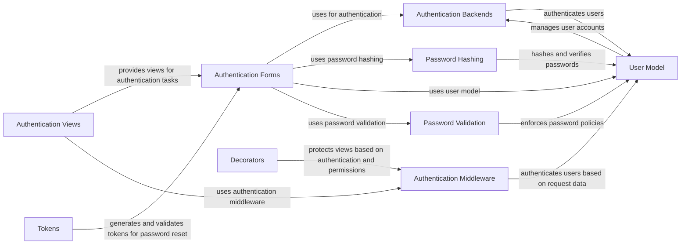

## Component Details

The User Authentication and Authorization component in Django manages user accounts, authentication, authorization, and password management. It provides tools for securing the application by managing user identities and controlling access to resources. The main flow involves authenticating users through backends, validating credentials, and managing user sessions. It also includes functionalities for password management, such as resetting and changing passwords, and enforcing password policies. Decorators and middleware are used to protect views and ensure that only authorized users can access specific resources.

### Authentication Backends
Authentication backends handle the process of authenticating users. They verify credentials and return a user object if authentication is successful. The `ModelBackend` authenticates against Django's user model, while other backends can be implemented for different authentication methods.
- **Related Classes/Methods**: `django.django.contrib.auth.backends.BaseBackend`, `django.django.contrib.auth.backends.ModelBackend`, `django.django.contrib.auth.backends.RemoteUserBackend`

### Authentication Forms
Authentication forms handle user login, password reset, and password change functionalities. `AuthenticationForm` is used for user login, `PasswordResetForm` for initiating password resets, and `SetPasswordForm` for setting a new password. These forms handle validation and user interaction.
- **Related Classes/Methods**: `django.django.contrib.auth.forms.AuthenticationForm`, `django.django.contrib.auth.forms.PasswordResetForm`, `django.django.contrib.auth.forms.SetPasswordForm`, `django.django.contrib.auth.forms.PasswordChangeForm`

### Password Hashing
Password hashing functions are responsible for securely storing user passwords. They provide functions to hash passwords, verify passwords against their hashes, and manage different hashing algorithms. The `PBKDF2PasswordHasher`, `Argon2PasswordHasher`, and `BCryptSHA256PasswordHasher` are different hashing algorithms used.
- **Related Classes/Methods**: `django.django.contrib.auth.hashers`, `django.django.contrib.auth.hashers.BasePasswordHasher`, `django.django.contrib.auth.hashers.PBKDF2PasswordHasher`, `django.django.contrib.auth.hashers.Argon2PasswordHasher`, `django.django.contrib.auth.hashers.BCryptSHA256PasswordHasher`

### User Model
The user model represents user accounts in the system. It includes methods for managing passwords, permissions, and user-related data. `AbstractBaseUser` provides the base implementation for user models, and `AbstractUser` extends it with common fields like username, first name, and last name. `UserManager` provides utilities for creating and managing user objects.
- **Related Classes/Methods**: `django.django.contrib.auth.models`, `django.django.contrib.auth.base_user.AbstractBaseUser`

### Authentication Middleware
Authentication middleware automatically authenticates users based on sessions or other request data. `AuthenticationMiddleware` populates `request.user` with the authenticated user. `LoginRequiredMiddleware` redirects unauthenticated users to the login page when they try to access protected views.
- **Related Classes/Methods**: `django.django.contrib.auth.middleware.AuthenticationMiddleware`, `django.django.contrib.auth.middleware.LoginRequiredMiddleware`, `django.django.contrib.auth.middleware.RemoteUserMiddleware`

### Password Validation
Password validation enforces password policies to ensure strong passwords. It includes validators for minimum length, user attribute similarity, common passwords, and numeric passwords. These validators are applied when users set or change their passwords.
- **Related Classes/Methods**: `django.django.contrib.auth.password_validation`, `django.django.contrib.auth.password_validation.MinimumLengthValidator`, `django.django.contrib.auth.password_validation.UserAttributeSimilarityValidator`, `django.django.contrib.auth.password_validation.CommonPasswordValidator`, `django.django.contrib.auth.password_validation.NumericPasswordValidator`

### Authentication Views
Authentication views provide pre-built views for common authentication tasks like login, logout, password reset, and password change. `LoginView` handles user login, `LogoutView` handles user logout, `PasswordResetView` handles password reset requests, and `PasswordChangeView` handles password changes.
- **Related Classes/Methods**: `django.django.contrib.auth.views.LoginView`, `django.django.contrib.auth.views.LogoutView`, `django.django.contrib.auth.views.PasswordResetView`, `django.django.contrib.auth.views.PasswordResetConfirmView`, `django.django.contrib.auth.views.PasswordResetCompleteView`, `django.django.contrib.auth.views.PasswordChangeView`, `django.django.contrib.auth.views.PasswordChangeDoneView`

### Decorators
Decorators provide a way to protect views based on user authentication and permissions. `login_required` ensures that only authenticated users can access a view, while `permission_required` restricts access to users with specific permissions.
- **Related Classes/Methods**: `django.django.contrib.auth.decorators`

### Tokens
Tokens are used for password reset functionality. `PasswordResetTokenGenerator` generates and validates tokens used in the password reset process.
- **Related Classes/Methods**: `django.django.contrib.auth.tokens`
