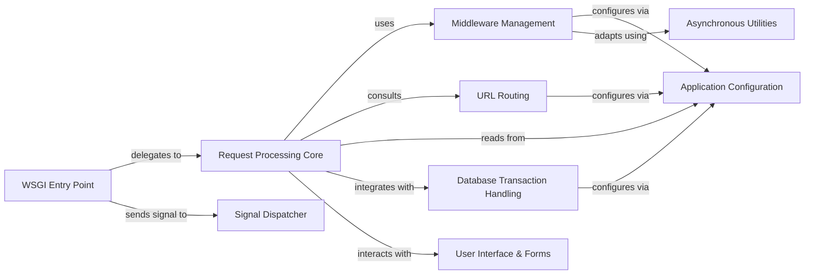

## Component Details

This architectural overview describes the core request-response handling mechanism in Django. It starts with the `WSGI Entry Point` receiving requests, which then delegates to the `Request Processing Core`. The core orchestrates the request lifecycle, involving `Middleware Management` for request/response processing, `URL Routing` for dispatching to views, and interacting with `Application Configuration` for settings. It also integrates with `Database Transaction Handling` for data integrity and utilizes `Asynchronous Utilities` for sync/async bridging. `Signal Dispatcher` provides a decoupled communication system. Finally, the `User Interface & Forms` component handles the presentation layer, including template rendering, form processing, and the administrative interface, which the `Request Processing Core` interacts with to generate responses.

### WSGI Entry Point
The primary interface for Django to interact with WSGI servers. It receives raw WSGI environment data, constructs the initial HttpRequest, and delegates the request processing to the core handler.

**Related Classes/Methods**:

- <a href="https://github.com/django/django/blob/master/django/core/handlers/wsgi.py#L112-L143" target="_blank" rel="noopener noreferrer">`django.core.handlers.wsgi.WSGIHandler` (112:143)</a>
- <a href="https://github.com/django/django/blob/master/django/core/handlers/wsgi.py#L55-L109" target="_blank" rel="noopener noreferrer">`django.core.handlers.wsgi.WSGIRequest` (55:109)</a>

### Request Processing Core
This component orchestrates the entire request-response lifecycle within Django. It's responsible for loading and applying middleware, resolving URLs to views, executing view logic, and preparing the final HttpResponse.

**Related Classes/Methods**:

- <a href="https://github.com/django/django/blob/master/django/core/handlers/base.py#L19-L364" target="_blank" rel="noopener noreferrer">`django.core.handlers.base.BaseHandler` (19:364)</a>
- <a href="https://github.com/django/django/blob/master/django/core/handlers/base.py#L135-L149" target="_blank" rel="noopener noreferrer">`django.core.handlers.base.BaseHandler.get_response` (135:149)</a>
- <a href="https://github.com/django/django/blob/master/django/core/handlers/base.py#L173-L225" target="_blank" rel="noopener noreferrer">`django.core.handlers.base.BaseHandler._get_response` (173:225)</a>
- <a href="https://github.com/django/django/blob/master/django/core/handlers/base.py#L227-L297" target="_blank" rel="noopener noreferrer">`django.core.handlers.base.BaseHandler._get_response_async` (227:297)</a>

### Middleware Management
Manages the chain of middleware components that process requests and responses. It dynamically loads middleware based on settings and ensures proper execution order and mode (sync/async) adaptation.

**Related Classes/Methods**:

- <a href="https://github.com/django/django/blob/master/django/core/handlers/base.py#L25-L101" target="_blank" rel="noopener noreferrer">`django.core.handlers.base.BaseHandler.load_middleware` (25:101)</a>
- <a href="https://github.com/django/django/blob/master/django/core/handlers/base.py#L103-L133" target="_blank" rel="noopener noreferrer">`django.core.handlers.base.BaseHandler.adapt_method_mode` (103:133)</a>

### URL Routing
Handles the mapping of incoming URL paths to specific view functions or class-based views. It uses defined URL patterns to resolve the correct callable and its arguments.

**Related Classes/Methods**:

- `django.urls.get_resolver` (full file reference)
- `django.urls.set_script_prefix` (full file reference)
- <a href="https://github.com/django/django/blob/master/django/core/handlers/base.py#L299-L314" target="_blank" rel="noopener noreferrer">`django.core.handlers.base.BaseHandler.resolve_request` (299:314)</a>

### Application Configuration
Provides a centralized repository for all Django project settings. These settings dictate the behavior of various Django components, including installed apps, middleware, and database configurations.

**Related Classes/Methods**:

- `django.conf.settings` (full file reference)

### Signal Dispatcher
Implements a decoupled communication system within Django, allowing different parts of the framework to send and receive notifications about specific events, such as a request starting.

**Related Classes/Methods**:

- `django.core.signals.request_started` (full file reference)

### Asynchronous Utilities
Offers helper functions for bridging synchronous and asynchronous code execution. This is crucial for allowing Django to handle both traditional synchronous views and modern asynchronous views.

**Related Classes/Methods**:

- `django.utils.asyncio.sync_to_async` (full file reference)
- `django.utils.asyncio.async_to_sync` (full file reference)

### Database Transaction Handling
Manages database transactions to ensure data integrity. It provides mechanisms to execute a block of code within an atomic transaction, guaranteeing that all operations within the block either succeed or are rolled back.

**Related Classes/Methods**:

- <a href="https://github.com/django/django/blob/master/django/db/transaction.py#L315-L322" target="_blank" rel="noopener noreferrer">`django.db.transaction.atomic` (315:322)</a>
- `django.db.connections` (full file reference)

### User Interface & Forms
Handles the presentation layer of the application, including rendering dynamic content using templates, processing and validating user input through forms, and providing an automated administrative interface for managing application data.

**Related Classes/Methods**:

- <a href="https://github.com/django/django/blob/master/django/template/engine.py#L12-L213" target="_blank" rel="noopener noreferrer">`django.template.engine.Engine` (12:213)</a>
- <a href="https://github.com/django/django/blob/master/django/forms/forms.py#L432-L433" target="_blank" rel="noopener noreferrer">`django.forms.forms.Form` (432:433)</a>
- <a href="https://github.com/django/django/blob/master/django/contrib/admin/sites.py#L29-L605" target="_blank" rel="noopener noreferrer">`django.contrib.admin.sites.AdminSite` (29:605)</a>

### [FAQ](https://github.com/CodeBoarding/GeneratedOnBoardings/tree/main?tab=readme-ov-file#faq)