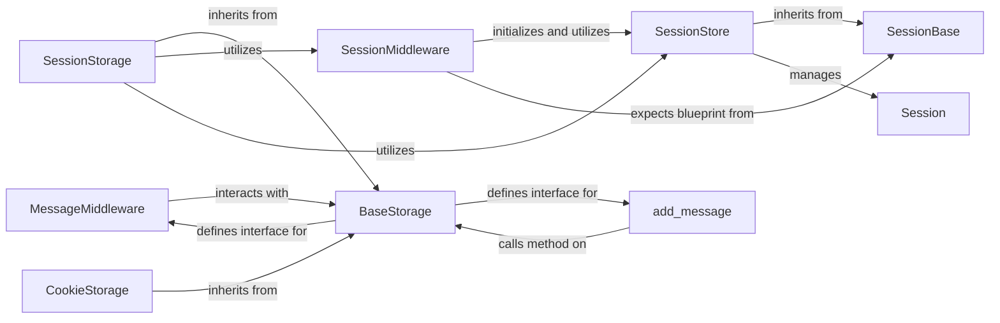

## Component Details

The User State & Messaging component in Django provides robust mechanisms for managing user-specific data across HTTP requests (sessions) and for delivering one-time notification messages. This functionality is crucial for maintaining user context and providing feedback within web applications.
These nine components are fundamental to the User State & Messaging subsystem because they collectively form a complete, extensible, and integrated system for managing transient user data and notifications in Django.
Middleware as Entry Points: SessionMiddleware and MessageMiddleware are critical as they seamlessly integrate session and message handling into Django's request-response lifecycle. They ensure that session and message objects are available and properly managed for every request.
Abstract Bases for Extensibility: SessionBase and BaseStorage are vital for the architectural flexibility of Django. They define clear interfaces, allowing developers to easily swap out or create custom storage backends for sessions and messages without altering the core framework logic. This promotes a pluggable design.
Concrete Implementations for Functionality: SessionStore and Session provide the most common and robust server-side session persistence mechanism (database-backed). Similarly, SessionStorage and CookieStorage offer practical and widely used methods for message persistence, demonstrating both server-side (via session) and client-side (via cookie) storage options.
API for Usability: The add_message function is crucial for developer usability. It provides a simple, high-level API for adding messages, abstracting away the complexities of the underlying storage mechanism and ensuring consistency across the application.
Together, these components ensure that Django applications can effectively maintain user state across requests and provide timely, user-friendly feedback, which are essential features for almost any interactive web application.

### SessionMiddleware
This middleware is the primary entry point for session management. It intercepts incoming requests to load existing session data and outgoing responses to save any modified session data. It makes the session data accessible via request.session.

**Related Classes/Methods**: _None_

### SessionBase
An abstract base class that defines the fundamental interface and common logic for all session storage backends in Django. Any concrete session backend, such as SessionStore, must inherit from this class and implement its core methods for managing session data (e.g., load, save, create, delete).

**Related Classes/Methods**: _None_

### SessionStore
A concrete implementation of SessionBase specifically designed to store session data in the database. It manages the creation, retrieval, update, and deletion of session records by interacting directly with the Session Django model.

**Related Classes/Methods**: _None_

### Session
This is the concrete Django model (django.contrib.sessions.models.Session) that represents a single user session record within the database. It defines the schema for storing session information, including the session key, serialized session data, and expiration date.

**Related Classes/Methods**: _None_

### MessageMiddleware
This middleware integrates Django's messages framework into the request-response cycle. It attaches a message storage backend to the request object, enabling other parts of the application to add messages. It also ensures that messages are saved to the response for display on subsequent requests.

**Related Classes/Methods**: _None_

### add_message
A high-level convenience function that serves as the primary API for queuing one-time notification messages for the user. It abstracts the underlying storage mechanism, allowing developers to simply add messages with a specified level and content, which are then dispatched to the active message storage backend.

**Related Classes/Methods**: _None_

### BaseStorage
An abstract base class that defines the contract for all message storage backends. Subclasses must implement specific methods (_get for retrieval and _store for persistence) to provide a pluggable architecture for how messages are temporarily stored (e.g., in sessions, cookies, or a fallback mechanism).

**Related Classes/Methods**: _None_

### SessionStorage
A concrete implementation of BaseStorage that stores messages within the user's existing Django session. This approach leverages the session framework's capabilities for message persistence, making it a common and convenient choice for many applications.

**Related Classes/Methods**: _None_

### CookieStorage
A concrete implementation of BaseStorage that stores messages directly in a browser cookie. This backend is suitable for smaller amounts of message data and does not require server-side session storage, making it useful in scenarios where sessions are not desired or available.

**Related Classes/Methods**: _None_

### [FAQ](https://github.com/CodeBoarding/GeneratedOnBoardings/tree/main?tab=readme-ov-file#faq)