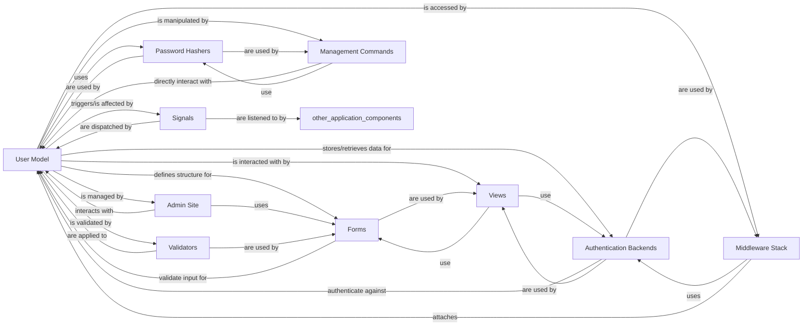

## Component Details

The `User Model` subsystem in Django's authentication system is a cornerstone for managing user identities and their associated data. It provides the fundamental building blocks for authentication, authorization, and user management within a Django application.

### User Model
The core data models that define how user accounts are structured and stored in the database. `AbstractBaseUser` provides fundamental user fields (e.g., password, last login, is active) and methods for password management and authentication status. The `User` model (or a custom user model inheriting from `AbstractBaseUser`) extends this with common user attributes like username, email, first name, and last name.

**Related Classes/Methods**:

- `AbstractBaseUser` (1:1000)
- `User` (1:1000)

### Authentication Backends
These classes define how users are authenticated. They provide methods to verify credentials (e.g., username and password) against the `User Model` and retrieve the corresponding user object. Django's default backend authenticates against the database-backed `User Model`.

**Related Classes/Methods**:

- `Authentication Backends` (1:1000)

### Password Hashers
Responsible for securely hashing and verifying user passwords. They are used by the `User Model` to store passwords in a non-reversible format and to check provided passwords during authentication.

**Related Classes/Methods**:

- `Password Hashers` (1:1000)

### Forms
Django provides forms (e.g., `AuthenticationForm`, `UserCreationForm`, `PasswordChangeForm`) that interact directly with the `User Model` for user input, validation, and creation/modification of user instances.

**Related Classes/Methods**:

- <a href="https://github.com/django/django/blob/master/django/contrib/admin/forms.py#L1-L1000" target="_blank" rel="noopener noreferrer">`Forms` (1:1000)</a>

### Middleware Stack
`AuthenticationMiddleware` processes incoming requests, using configured authentication backends to identify and attach the authenticated `User` object to the `HttpRequest` object. This makes the current user accessible throughout the request-response cycle.

**Related Classes/Methods**:

- `AuthenticationMiddleware` (1:1000)

### Admin Site
The Django Admin provides a built-in interface for managing `User` objects, including creating, updating, deleting users, and managing their permissions and groups. It leverages the `User Model`'s ORM capabilities.

**Related Classes/Methods**:

- `Admin Site` (1:1000)

### Signals
Django's signals allow other parts of the application to react to events related to the `User Model`, such as user login (`user_logged_in`), logout (`user_logged_out`), or password change.

**Related Classes/Methods**:

- <a href="https://github.com/django/django/blob/master/django/contrib/postgres/signals.py#L1-L1000" target="_blank" rel="noopener noreferrer">`Signals` (1:1000)</a>

### Management Commands
Command-line utilities (e.g., `createsuperuser`, `changepassword`) that directly interact with the `User Model` for administrative tasks, such as creating initial superusers or resetting passwords.

**Related Classes/Methods**:

- <a href="https://github.com/django/django/blob/master/django/contrib/auth/management/commands/createsuperuser.py#L1-L1000" target="_blank" rel="noopener noreferrer">`createsuperuser` (1:1000)</a>
- <a href="https://github.com/django/django/blob/master/django/contrib/auth/management/commands/changepassword.py#L1-L1000" target="_blank" rel="noopener noreferrer">`changepassword` (1:1000)</a>

### Views
Django provides built-in views for common authentication-related functionalities like login, logout, password change, and password reset. These views interact with the `User Model`, forms, and authentication backends to perform their operations.

**Related Classes/Methods**:

- <a href="https://github.com/django/django/blob/master/django/contrib/messages/views.py#L1-L1000" target="_blank" rel="noopener noreferrer">`Views` (1:1000)</a>

### Validators
Functions that enforce rules on user-provided data, particularly for passwords. These validators are used by the `User Model` and related forms to ensure data integrity and security (e.g., preventing common passwords).

**Related Classes/Methods**:

- <a href="https://github.com/django/django/blob/master/django/contrib/postgres/validators.py#L1-L1000" target="_blank" rel="noopener noreferrer">`Validators` (1:1000)</a>
- <a href="https://github.com/django/django/blob/master/django/contrib/postgres/validators.py#L1-L1000" target="_blank" rel="noopener noreferrer">`Validators` (1:1000)</a>

### [FAQ](https://github.com/CodeBoarding/GeneratedOnBoardings/tree/main?tab=readme-ov-file#faq)