```mermaid
graph LR
    django_contrib_auth["django.contrib.auth"]
    django_contrib_auth_models["django.contrib.auth.models"]
    django_contrib_auth_views["django.contrib.auth.views"]
    django_contrib_auth_forms["django.contrib.auth.forms"]
    django_contrib_auth_backends["django.contrib.auth.backends"]
    django_contrib_auth_hashers["django.contrib.auth.hashers"]
    django_contrib_auth_middleware_AuthenticationMiddleware["django.contrib.auth.middleware.AuthenticationMiddleware"]
    django_contrib_sessions["django.contrib.sessions"]
    django_contrib_sessions_middleware_SessionMiddleware["django.contrib.sessions.middleware.SessionMiddleware"]
    django_contrib_sessions_backends_base_SessionBase["django.contrib.sessions.backends.base.SessionBase"]
    django_contrib_auth -- "contains" --> django_contrib_auth_models
    django_contrib_auth -- "contains" --> django_contrib_auth_views
    django_contrib_auth_models -- "extends" --> django_db_models_base_Model
    django_contrib_auth_models -- "used by" --> django_contrib_auth_backends
    django_contrib_auth_views -- "uses" --> django_contrib_auth_forms
    django_contrib_auth_views -- "interacts with" --> django_contrib_auth_backends
    django_contrib_auth_forms -- "uses" --> django_contrib_auth_hashers
    django_contrib_auth_forms -- "used by" --> django_contrib_auth_views
    django_contrib_auth_backends -- "uses" --> django_contrib_auth_models
    django_contrib_auth_backends -- "used by" --> django_contrib_auth_middleware_AuthenticationMiddleware
    django_contrib_auth_hashers -- "used by" --> django_contrib_auth_forms
    django_contrib_auth_hashers -- "used by" --> django_contrib_auth_backends
    django_contrib_auth_middleware_AuthenticationMiddleware -- "uses" --> django_contrib_sessions_backends_base_SessionBase
    django_contrib_auth_middleware_AuthenticationMiddleware -- "uses" --> django_contrib_auth_backends
    django_contrib_sessions -- "contains" --> django_contrib_sessions_middleware_SessionMiddleware
    django_contrib_sessions -- "contains" --> django_contrib_sessions_backends_base_SessionBase
    django_contrib_sessions_middleware_SessionMiddleware -- "uses" --> django_contrib_sessions_backends_base_SessionBase
    django_contrib_sessions_middleware_SessionMiddleware -- "interacts with" --> django_http_HttpRequest
    django_contrib_sessions_backends_base_SessionBase -- "interacts with" --> django_db
    django_contrib_sessions_backends_base_SessionBase -- "interacts with" --> django_core_cache
```

## Details

The `User & Session Management` component in Django provides a comprehensive framework for handling user authentication, authorization, and session persistence. It ensures secure access to application resources by managing user accounts, permissions, password security, and maintaining user-specific state across requests.

### django.contrib.auth
The core application providing the fundamental authentication and authorization framework. It serves as the central hub for all user-related functionalities.

**Related Classes/Methods**:

- <a href="https://github.com/django/django/django/template/backends/django.py#L1-L1" target="_blank" rel="noopener noreferrer">`django.contrib.auth` (1:1)</a>

### django.contrib.auth.models
Defines the database models, including `AbstractBaseUser`, `AbstractUser`, `User`, `Group`, and `Permission`. These models are the persistent representation of user identities and their access rights within the database.

**Related Classes/Methods**:

- <a href="https://github.com/django/django/django/contrib/auth/models.py#L1-L1" target="_blank" rel="noopener noreferrer">`django.contrib.auth.models` (1:1)</a>

### django.contrib.auth.views
Offers pre-built, generic class-based views for common user authentication actions such as login, logout, password change, and password reset. These views manage the user-facing interactions.

**Related Classes/Methods**:

- <a href="https://github.com/django/django/django/contrib/auth/views.py#L1-L1" target="_blank" rel="noopener noreferrer">`django.contrib.auth.views` (1:1)</a>

### django.contrib.auth.forms
Contains forms like `AuthenticationForm`, `UserCreationForm`, `PasswordChangeForm`, and `PasswordResetForm`. These forms are responsible for validating and cleaning user input during authentication and user management processes.

**Related Classes/Methods**:

- <a href="https://github.com/django/django/django/contrib/auth/forms.py#L1-L1" target="_blank" rel="noopener noreferrer">`django.contrib.auth.forms` (1:1)</a>

### django.contrib.auth.backends
Defines authentication backends, which are classes that encapsulate the logic for authenticating users (e.g., verifying credentials against a database or external source). This allows for flexible authentication strategies.

**Related Classes/Methods**:

- <a href="https://github.com/django/django/django/contrib/auth/backends.py#L1-L1" target="_blank" rel="noopener noreferrer">`django.contrib.auth.backends` (1:1)</a>

### django.contrib.auth.hashers
Provides various password hashing algorithms (e.g., PBKDF2, Argon2, BCrypt) to securely store user passwords in the database, preventing them from being stored in plain text.

**Related Classes/Methods**:

- <a href="https://github.com/django/django/django/contrib/auth/hashers.py#L1-L1" target="_blank" rel="noopener noreferrer">`django.contrib.auth.hashers` (1:1)</a>

### django.contrib.auth.middleware.AuthenticationMiddleware
A middleware that processes incoming requests to identify and associate the authenticated user with the `HttpRequest` object (`request.user`). This makes user information readily available throughout the application for authorization checks.

**Related Classes/Methods**:

- <a href="https://github.com/django/django/django/contrib/auth/middleware.py#L29-L40" target="_blank" rel="noopener noreferrer">`django.contrib.auth.middleware.AuthenticationMiddleware` (29:40)</a>

### django.contrib.sessions
The application responsible for managing user sessions, enabling Django to store and retrieve arbitrary, user-specific data across multiple HTTP requests. It supports various storage backends.

**Related Classes/Methods**:

- <a href="https://github.com/django/django/django/template/backends/django.py#L1-L1" target="_blank" rel="noopener noreferrer">`django.contrib.sessions` (1:1)</a>

### django.contrib.sessions.middleware.SessionMiddleware
A middleware that enables session support by loading session data from the session store and attaching it to `request.session`. It also handles saving session data back to the store after the response is generated.

**Related Classes/Methods**:

- <a href="https://github.com/django/django/django/contrib/sessions/middleware.py#L11-L76" target="_blank" rel="noopener noreferrer">`django.contrib.sessions.middleware.SessionMiddleware` (11:76)</a>

### django.contrib.sessions.backends.base.SessionBase
Defines the abstract interface for session storage. Concrete implementations (e.g., `SessionStore` in `django.contrib.sessions.backends.db`, `cache`, `file`, `signed_cookies`) handle the actual persistence of session data.

**Related Classes/Methods**:

- <a href="https://github.com/django/django/django/contrib/sessions/backends/base.py#L34-L522" target="_blank" rel="noopener noreferrer">`django.contrib.sessions.backends.base.SessionBase` (34:522)</a>

### [FAQ](https://github.com/CodeBoarding/GeneratedOnBoardings/tree/main?tab=readme-ov-file#faq)