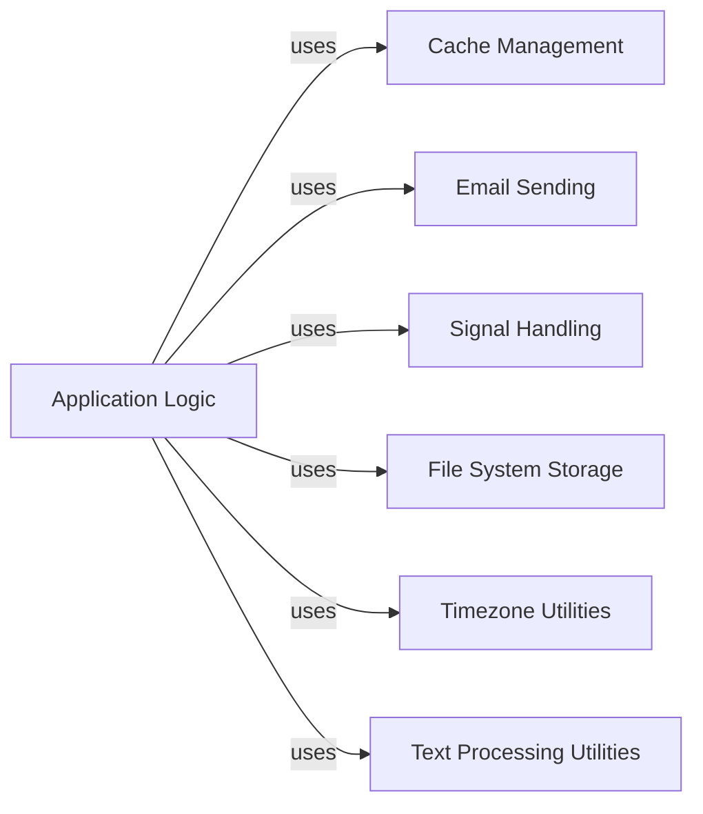

## Component Details

This overview details the 'Utilities & Services' subsystem, which provides foundational functionalities like caching, email dispatch, inter-component communication via signals, file storage, and various text and timezone manipulation utilities. The 'Application Logic' component represents the higher-level code that integrates and utilizes these core services to perform its operations, demonstrating a clear dependency on these utility components.

### Cache Management
This component provides an interface for interacting with Django's caching framework, allowing for storage, retrieval, and invalidation of cached data. It abstracts the underlying cache backend.

**Related Classes/Methods**:

- <a href="https://github.com/django/django/blob/master/django/core/cache/backends/base.py#L57-L389" target="_blank" rel="noopener noreferrer">`django.core.cache.backends.base.BaseCache` (57:389)</a>
- <a href="https://github.com/django/django/blob/master/django/core/cache/backends/base.py#L143-L148" target="_blank" rel="noopener noreferrer">`django.core.cache.backends.base.BaseCache.get` (143:148)</a>
- <a href="https://github.com/django/django/blob/master/django/core/cache/backends/base.py#L155-L160" target="_blank" rel="noopener noreferrer">`django.core.cache.backends.base.BaseCache.set` (155:160)</a>
- <a href="https://github.com/django/django/blob/master/django/core/cache/backends/base.py#L181-L188" target="_blank" rel="noopener noreferrer">`django.core.cache.backends.base.BaseCache.delete` (181:188)</a>

### Email Sending
This component is responsible for sending emails. It provides a high-level function to send email messages, abstracting the complexities of email backend configuration and communication.

**Related Classes/Methods**:

- `django.core.mail.send_mail` (10:100)

### Signal Handling
This component implements Django's signal dispatching mechanism, enabling decoupled communication between different parts of the application. It allows components to send notifications and register handlers for specific events.

**Related Classes/Methods**:

- <a href="https://github.com/django/django/blob/master/django/dispatch/dispatcher.py#L24-L487" target="_blank" rel="noopener noreferrer">`django.dispatch.dispatcher.Signal` (24:487)</a>
- <a href="https://github.com/django/django/blob/master/django/dispatch/dispatcher.py#L171-L215" target="_blank" rel="noopener noreferrer">`django.dispatch.dispatcher.Signal.send` (171:215)</a>
- <a href="https://github.com/django/django/blob/master/django/dispatch/dispatcher.py#L51-L129" target="_blank" rel="noopener noreferrer">`django.dispatch.dispatcher.Signal.connect` (51:129)</a>

### File System Storage
This component provides functionalities for interacting with the local file system, specifically for saving and deleting files managed by Django's default file storage system.

**Related Classes/Methods**:

- `django.core.files.storage.FileSystemStorage` (10:100)
- `django.core.files.storage.FileSystemStorage._save` (10:100)
- `django.core.files.storage.FileSystemStorage.delete` (10:100)

### Timezone Utilities
This component offers utility functions for handling dates and times, including obtaining the current time and converting between timezones, respecting Django's timezone settings.

**Related Classes/Methods**:

- <a href="https://github.com/django/django/blob/master/django/utils/timezone.py#L1-L200" target="_blank" rel="noopener noreferrer">`django.utils.timezone` (1:200)</a>
- <a href="https://github.com/django/django/blob/master/django/utils/timezone.py#L1-L200" target="_blank" rel="noopener noreferrer">`django.utils.timezone.now` (1:200)</a>
- <a href="https://github.com/django/django/blob/master/django/utils/timezone.py#L1-L200" target="_blank" rel="noopener noreferrer">`django.utils.timezone.localtime` (1:200)</a>

### Text Processing Utilities
This component provides various utility functions for manipulating strings, such as converting text into a URL-friendly slug and capitalizing the first letter of a string.

**Related Classes/Methods**:

- <a href="https://github.com/django/django/blob/master/django/utils/text.py#L1-L200" target="_blank" rel="noopener noreferrer">`django.utils.text` (1:200)</a>
- <a href="https://github.com/django/django/blob/master/django/utils/text.py#L452-L469" target="_blank" rel="noopener noreferrer">`django.utils.text.slugify` (452:469)</a>
- <a href="https://github.com/django/django/blob/master/django/utils/text.py#L25-L31" target="_blank" rel="noopener noreferrer">`django.utils.text.capfirst` (25:31)</a>

### Application Logic
This represents the higher-level application code that utilizes various Django utility and service components to perform its operations, such as caching data, sending emails, handling events, managing files, and processing text and time.

**Related Classes/Methods**: _None_

### [FAQ](https://github.com/CodeBoarding/GeneratedOnBoardings/tree/main?tab=readme-ov-file#faq)