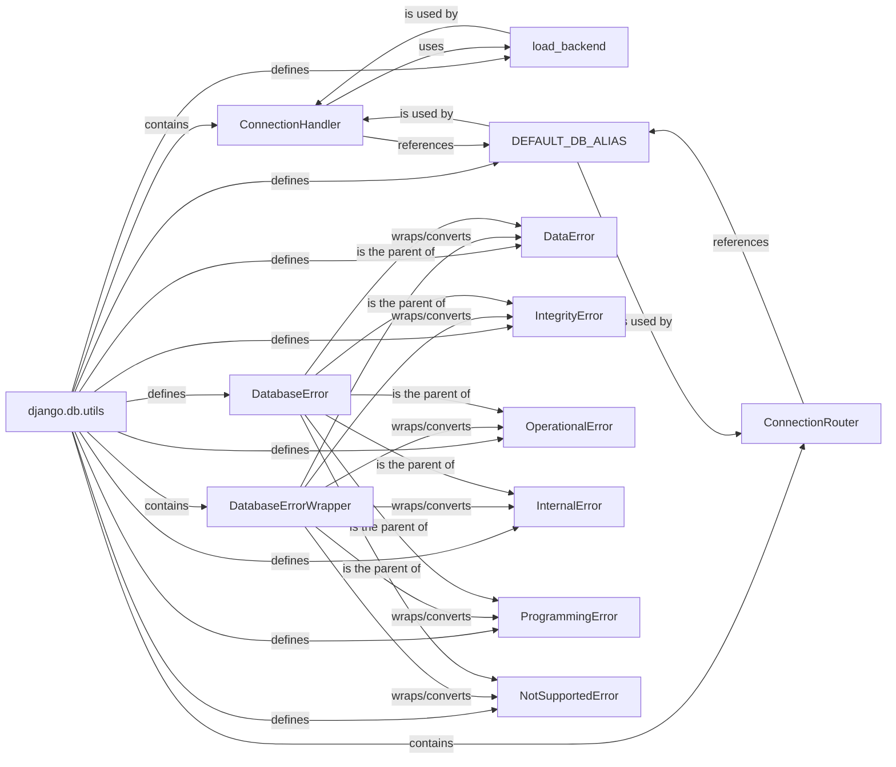

## Component Details

The `django.db.utils` module is a foundational component within Django's database layer, providing essential utilities and a standardized exception hierarchy for database interactions. It abstracts away the complexities of direct database communication, offering a consistent interface for the ORM and other database-dependent parts of the framework.

### django.db.utils
The primary utility module containing core functions, classes, and exceptions for managing database connections, routing queries, and handling database-specific errors in a unified manner. It acts as the central hub for low-level database operations.

**Related Classes/Methods**:

- <a href="https://github.com/django/django/blob/master/django/db/utils.py#L140-L196" target="_blank" rel="noopener noreferrer">`django.db.utils.ConnectionHandler` (140:196)</a>
- <a href="https://github.com/django/django/blob/master/django/db/utils.py#L199-L280" target="_blank" rel="noopener noreferrer">`django.db.utils.ConnectionRouter` (199:280)</a>
- <a href="https://github.com/django/django/blob/master/django/db/utils.py#L52-L102" target="_blank" rel="noopener noreferrer">`django.db.utils.DatabaseErrorWrapper` (52:102)</a>
- <a href="https://github.com/django/django/blob/master/django/db/utils.py#L105-L137" target="_blank" rel="noopener noreferrer">`django.db.utils.load_backend` (105:137)</a>
- <a href="https://github.com/django/django/blob/master/django/db/utils.py#L0-L0" target="_blank" rel="noopener noreferrer">`django.db.utils.DEFAULT_DB_ALIAS` (0:0)</a>
- <a href="https://github.com/django/django/blob/master/django/db/utils.py#L24-L25" target="_blank" rel="noopener noreferrer">`django.db.utils.DatabaseError` (24:25)</a>
- <a href="https://github.com/django/django/blob/master/django/db/utils.py#L28-L29" target="_blank" rel="noopener noreferrer">`django.db.utils.DataError` (28:29)</a>
- <a href="https://github.com/django/django/blob/master/django/db/utils.py#L36-L37" target="_blank" rel="noopener noreferrer">`django.db.utils.IntegrityError` (36:37)</a>
- <a href="https://github.com/django/django/blob/master/django/db/utils.py#L32-L33" target="_blank" rel="noopener noreferrer">`django.db.utils.OperationalError` (32:33)</a>
- <a href="https://github.com/django/django/blob/master/django/db/utils.py#L40-L41" target="_blank" rel="noopener noreferrer">`django.db.utils.InternalError` (40:41)</a>
- <a href="https://github.com/django/django/blob/master/django/db/utils.py#L44-L45" target="_blank" rel="noopener noreferrer">`django.db.utils.ProgrammingError` (44:45)</a>
- <a href="https://github.com/django/django/blob/master/django/db/utils.py#L48-L49" target="_blank" rel="noopener noreferrer">`django.db.utils.NotSupportedError` (48:49)</a>

### ConnectionHandler
Responsible for managing the lifecycle and access to all configured database connections. It initializes connections based on Django settings, provides access to them via aliases, and handles their proper closure.

**Related Classes/Methods**:

- <a href="https://github.com/django/django/blob/master/django/db/utils.py#L105-L137" target="_blank" rel="noopener noreferrer">`django.db.utils.load_backend` (105:137)</a>
- <a href="https://github.com/django/django/blob/master/django/db/utils.py#L0-L0" target="_blank" rel="noopener noreferrer">`django.db.utils.DEFAULT_DB_ALIAS` (0:0)</a>

### ConnectionRouter
Implements the logic for routing database operations (read, write, relation, migrate) to different database aliases in a multi-database setup. It allows developers to define custom routing rules to distribute database load or manage data across multiple databases.

**Related Classes/Methods**:

- <a href="https://github.com/django/django/blob/master/django/db/utils.py#L0-L0" target="_blank" rel="noopener noreferrer">`django.db.utils.DEFAULT_DB_ALIAS` (0:0)</a>

### DatabaseErrorWrapper
A context manager and decorator designed to catch backend-specific database exceptions (e.g., `psycopg2.IntegrityError`, `sqlite3.OperationalError`) and re-raise them as Django's standardized `django.db.utils` exceptions. This ensures consistent error handling across different database backends.

**Related Classes/Methods**:

- <a href="https://github.com/django/django/blob/master/django/db/utils.py#L28-L29" target="_blank" rel="noopener noreferrer">`django.db.utils.DataError` (28:29)</a>
- <a href="https://github.com/django/django/blob/master/django/db/utils.py#L36-L37" target="_blank" rel="noopener noreferrer">`django.db.utils.IntegrityError` (36:37)</a>
- <a href="https://github.com/django/django/blob/master/django/db/utils.py#L32-L33" target="_blank" rel="noopener noreferrer">`django.db.utils.OperationalError` (32:33)</a>
- <a href="https://github.com/django/django/blob/master/django/db/utils.py#L40-L41" target="_blank" rel="noopener noreferrer">`django.db.utils.InternalError` (40:41)</a>
- <a href="https://github.com/django/django/blob/master/django/db/utils.py#L44-L45" target="_blank" rel="noopener noreferrer">`django.db.utils.ProgrammingError` (44:45)</a>
- <a href="https://github.com/django/django/blob/master/django/db/utils.py#L48-L49" target="_blank" rel="noopener noreferrer">`django.db.utils.NotSupportedError` (48:49)</a>

### load_backend
A utility function that dynamically imports and returns a specified database backend module. This function is crucial for Django's pluggable database architecture, allowing the framework to support various database systems without hardcoding their implementations.

**Related Classes/Methods**: _None_

### DEFAULT_DB_ALIAS
A string constant, typically set to `'default'`, representing the alias for the primary database connection. It's widely used throughout Django to refer to the main database.

**Related Classes/Methods**: _None_

### DatabaseError
The base exception class for all database-related errors in Django. All other specific database exceptions (e.g., `IntegrityError`, `DataError`) inherit from this class, providing a unified error handling hierarchy.

**Related Classes/Methods**: _None_

### DataError
A subclass of `DatabaseError`, specifically raised when issues arise with the data itself, such as data exceeding column length or invalid data format.

**Related Classes/Methods**: _None_

### IntegrityError
A subclass of `DatabaseError`, raised when a database operation violates data integrity rules, such as attempting to insert a duplicate primary key or violating a foreign key constraint.

**Related Classes/Methods**: _None_

### OperationalError
A subclass of `DatabaseError`, indicating errors related to the database's operational environment, such as unexpected disconnections, database not found, or issues with transactions.

**Related Classes/Methods**: _None_

### InternalError
A subclass of `DatabaseError`, raised when an internal error occurs within the database itself, which might indicate a bug in the database system or its driver.

**Related Classes/Methods**: _None_

### ProgrammingError
A subclass of `DatabaseError`, raised for programming errors, such as a syntax error in a SQL query, a table not found, or a column not found.

**Related Classes/Methods**: _None_

### NotSupportedError
A subclass of `DatabaseError`, raised when a requested database feature is not supported by the database backend being used.

**Related Classes/Methods**: _None_

### [FAQ](https://github.com/CodeBoarding/GeneratedOnBoardings/tree/main?tab=readme-ov-file#faq)