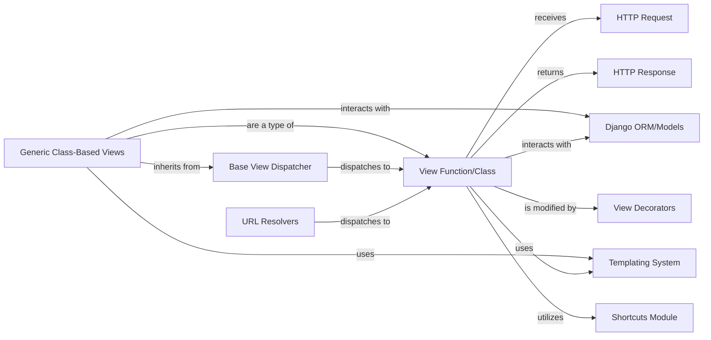

## Component Details

This section provides a detailed overview of the `View Function/Class` component within a Django project, outlining its structure, purpose, and interactions with other core Django components.

### View Function/Class
This represents the application-specific business logic. It's a callable (either a Python function or a method of a class-based view) that receives an HttpRequest object as input. Its primary responsibility is to process the request, interact with the application's models (if necessary), and return an HttpResponse object. While not a Django framework class itself, it is the ultimate destination for a resolved URL and the core of an application's response generation.

**Related Classes/Methods**:

- `myapp.views.ViewFunctionOrClass` (0:0)

### HTTP Request
Encapsulates an incoming HTTP request. It provides attributes and methods to access request data such as GET/POST parameters, cookies, headers, and the request body. It's the primary input to a Django view, allowing the view to understand the client's request.

**Related Classes/Methods**:

- <a href="https://github.com/django/django/blob/master/django/http/request.py#L52-L469" target="_blank" rel="noopener noreferrer">`django.http.request.HttpRequest` (52:469)</a>

### HTTP Response
Represents an outgoing HTTP response. It allows setting the response content (e.g., HTML, JSON), status code (e.g., 200 OK, 404 Not Found), headers, and cookies. Views are responsible for constructing and returning an HttpResponse object, which is then sent back to the client.

**Related Classes/Methods**:

- <a href="https://github.com/django/django/blob/master/django/http/response.py#L364-L434" target="_blank" rel="noopener noreferrer">`django.http.response.HttpResponse` (364:434)</a>

### Django ORM/Models
Django's Object-Relational Mapper, providing an abstraction layer for interacting with the database using Python objects (models). Views often interact with models to retrieve, create, update, or delete data, bridging the application logic with the persistence layer.

**Related Classes/Methods**:

- `django.db.models.Model` (0:0)

### Templating System
Django's built-in templating engine used for rendering dynamic HTML content. Views commonly use the templating system (e.g., via `render()` shortcut) to combine data from the view with HTML templates, generating the final HTML response sent to the client.

**Related Classes/Methods**:

- <a href="https://github.com/django/django/blob/master/django/template/loader.py#L51-L61" target="_blank" rel="noopener noreferrer">`django.template.loader.render_to_string` (51:61)</a>

### View Decorators
Functions that modify the behavior of view functions or methods by wrapping them. They are used to add cross-cutting concerns such as caching (`@cache_page`), CSRF protection (`@csrf_exempt`), HTTP method restrictions (`@require_http_methods`), and authentication (`@login_required`) without altering the core view logic.

**Related Classes/Methods**:

- <a href="https://github.com/django/django/blob/master/django/views/decorators/http.py#L0-L0" target="_blank" rel="noopener noreferrer">`django.views.decorators.http.require_http_methods` (0:0)</a>

### Shortcuts Module
Provides convenient helper functions that simplify common operations within views. Examples include `render()` for rendering templates with context, `redirect()` for issuing HTTP redirects, and `get_object_or_404()` for retrieving an object or raising an `Http404` exception.

**Related Classes/Methods**:

- <a href="https://github.com/django/django/blob/master/django/shortcuts.py#L0-L0" target="_blank" rel="noopener noreferrer">`django.shortcuts.render` (0:0)</a>

### URL Resolvers
Django's mechanism for mapping incoming URLs to the appropriate `View Function/Class`. It parses the URL, matches it against defined URL patterns, and identifies which view should handle the request.

**Related Classes/Methods**:

- <a href="https://github.com/django/django/blob/master/django/urls/resolvers.py#L0-L0" target="_blank" rel="noopener noreferrer">`django.urls.resolvers.URLResolver` (0:0)</a>

### Base View Dispatcher
The fundamental abstract base class (`django.views.View`) from which all class-based views in Django inherit. Its primary responsibility is to provide the core dispatch mechanism, routing incoming HTTP requests (e.g., GET, POST, PUT) to corresponding methods (e.g., `get()`, `post()`, `put()`) defined within the view class.

**Related Classes/Methods**:

- `django.views.base.View` (0:0)

### Generic Class-Based Views
A comprehensive set of pre-built, reusable class-based views that implement common web development patterns. These include views for displaying lists of objects (`ListView`), showing single object details (`DetailView`), and handling forms for creating, updating, or deleting objects (`CreateView`, `UpdateView`, `DeleteView`). They significantly reduce boilerplate code and encourage consistent application structure.

**Related Classes/Methods**:

- <a href="https://github.com/django/django/blob/master/django/views/generic/list.py#L219-L223" target="_blank" rel="noopener noreferrer">`django.views.generic.list.ListView` (219:223)</a>

### [FAQ](https://github.com/CodeBoarding/GeneratedOnBoardings/tree/main?tab=readme-ov-file#faq)