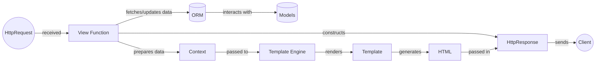

## View Function Component Overview

The View Function component is central to handling web requests in Django. It receives an HttpRequest, interacts with models (often via the ORM), and prepares data for rendering a template or constructing an HTTP response directly. The `render` shortcut combines template rendering and response creation, while `render_to_string` allows rendering templates into strings for more flexible use. The `HttpResponse` class encapsulates the final HTTP response.

### Component Descriptions:

*   **HttpRequest:** Represents the incoming HTTP request. It contains all the information about the request, such as headers, user data, and query parameters.
    *   **Source Files:** `django.http.request`

*   **View Function:** Receives the HttpRequest, processes it (often interacting with the ORM to fetch or update data), and prepares data for the Template Engine or directly constructs an HTTP Response.
    *   **Source Files:** Varies depending on the application.

*   **ORM:** Object-Relational Mapper. It allows interaction with the database using Python code instead of raw SQL queries.
    *   **Source Files:** `django.db.models`

*   **Models:** Define the structure of the data in the database. They are Python classes that represent database tables.
    *   **Source Files:** `django.db.models`

*   **Context:** A dictionary-like object that provides the data to be used when rendering a template.
    *   **Source Files:** `django.template.context`

*   **Template Engine:** Responsible for loading and rendering templates. Django supports multiple template engines, such as Django Templates and Jinja2.
    *   **Source Files:** `django.template.engine`

*   **Template:** Represents a compiled template. It provides a render method to generate the output string based on a context.
    *   **Source Files:** `django.template.template`

*   **HTML:** The final HTML content generated by the template engine.
    
*   **HttpResponse:** A base class for HTTP responses. It encapsulates the content, headers, and status code of an HTTP response.
    *   **Source Files:** `django.http.response.HttpResponse`

*   **Client:** The user's web browser or other application that sends the HTTP request and receives the HTTP response.
