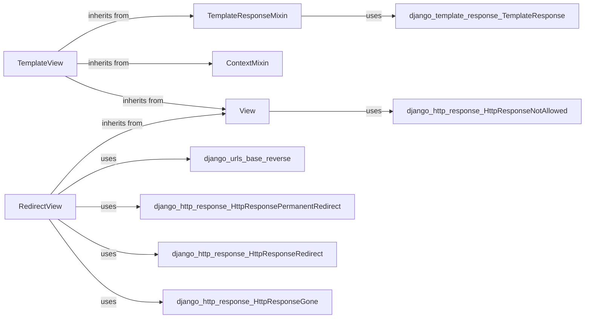

## Component Details

### View
The base class for all Django views. It provides the fundamental structure for handling HTTP requests and dispatching them to appropriate handler methods based on the HTTP verb (GET, POST, etc.). It also includes basic checks and error handling.
- **Related Classes/Methods**: `django.views.generic.base.View`

### ContextMixin
A mixin class that enhances views by providing a way to inject context data into the template. It defines the `get_context_data` method, which can be overridden to add custom data to the template context. This mixin ensures that the view instance itself is available in the template context.
- **Related Classes/Methods**: `django.views.generic.base.ContextMixin`

### TemplateResponseMixin
A mixin class that facilitates rendering templates within views. It defines attributes for specifying the template name, template engine, response class, and content type. The `render_to_response` method is used to render the template with the context and return a response.
- **Related Classes/Methods**: `django.views.generic.base.TemplateResponseMixin`

### TemplateView
A view that renders a template. It combines the functionalities of `TemplateResponseMixin`, `ContextMixin`, and `View`. It automatically renders a specified template and includes context data. It is a simple way to display static content or data retrieved from a model.
- **Related Classes/Methods**: `django.views.generic.base.TemplateView`

### RedirectView
A view that redirects the user to another URL. It allows specifying the redirect URL directly or using a pattern name to dynamically generate the URL. It supports permanent and temporary redirects, as well as handling cases where the target URL is no longer available.
- **Related Classes/Methods**: `django.views.generic.base.RedirectView`
