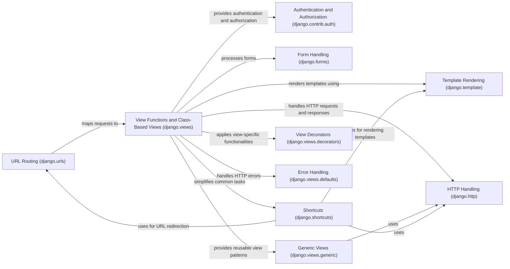

## Component Details

The View Processing and Business Logic component in Django handles incoming HTTP requests, processes data, interacts with models, and renders templates to generate responses. It orchestrates the flow of data between the data access layer, form handling, and template rendering components, implementing the application's specific functionality. This component relies heavily on Django's built-in features for view creation, URL routing, and template rendering, as well as authentication and authorization mechanisms.

### URL Routing (django.urls)
Maps incoming HTTP requests to specific view functions or class-based views based on the URL pattern. It uses URL resolvers to determine the appropriate view to execute.
- **Related Classes/Methods**: `django.django.urls.base:reverse`

### View Functions and Class-Based Views (django.views)
Receive HTTP requests, process data, interact with models, and render templates to generate HTTP responses. Class-based views provide a reusable way to implement common view patterns.
- **Related Classes/Methods**: `django.django.views.generic.base.View:as_view`, `django.django.views.generic.list.MultipleObjectMixin:get_queryset`, `django.django.views.generic.edit.FormMixin:form_valid`

### Template Rendering (django.template)
Populates templates with data and renders them into HTML or other formats. It uses template engines to process template files and generate the final output.
- **Related Classes/Methods**: `django.template.loader.render_to_string`, `django.template.context.Context`

### HTTP Handling (django.http)
Provides classes for representing HTTP requests and responses. It allows views to access request data and construct responses with appropriate headers and content.
- **Related Classes/Methods**: `django.http.request.HttpRequest`, `django.http.response.HttpResponse`, `django.http.response.HttpResponseRedirect`

### Authentication and Authorization (django.contrib.auth)
Provides functionalities for user authentication and authorization. It includes decorators and mixins for restricting access to views based on user login status and permissions.
- **Related Classes/Methods**: `django.django.contrib.auth.decorators:login_required`, `django.django.contrib.auth.mixins.LoginRequiredMixin:dispatch`

### Form Handling (django.forms)
Provides functionalities for creating, processing, and validating HTML forms. It simplifies the process of handling user input and interacting with models.
- **Related Classes/Methods**: _None_

### Shortcuts (django.shortcuts)
Provides shortcut functions to simplify common tasks in views, such as rendering templates, redirecting to other views, and retrieving objects from the database.
- **Related Classes/Methods**: `django.django.shortcuts:render`, `django.django.shortcuts:redirect`, `django.django.shortcuts:get_object_or_404`

### Generic Views (django.views.generic)
Offers pre-built views for common tasks like displaying lists, details, creating, updating, and deleting objects. They reduce boilerplate code and promote consistency.
- **Related Classes/Methods**: `django.django.views.generic.list`, `django.django.views.generic.edit`, `django.django.views.generic.detail`

### View Decorators (django.views.decorators)
Provides decorators for applying view-specific functionalities like caching and HTTP method restrictions.
- **Related Classes/Methods**: `django.django.views.decorators.cache:cache_page`, `django.django.views.decorators.http:require_http_methods`

### Error Handling (django.views.defaults)
Provides default views for handling common HTTP errors like 404 (Not Found), 500 (Server Error), 400 (Bad Request), and 403 (Permission Denied).
- **Related Classes/Methods**: `django.django.views.defaults:page_not_found`, `django.django.views.defaults:server_error`
