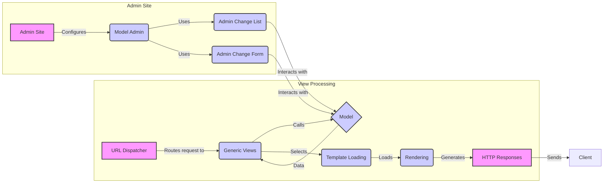

## View Processing

This component is responsible for handling incoming HTTP requests, processing them according to the defined view logic, and returning an appropriate HTTP response. It acts as the central orchestrator for a specific URL endpoint, coordinating interactions between models, templates, and other components to generate the final output.

### Components:

*   **URL Dispatcher:**
    *   **Description:** Maps incoming URLs to specific views. It acts as the entry point for the application, directing traffic to the appropriate handler based on the URL requested.
    *   **Interaction:** Routes the request to the corresponding view (e.g., Generic Views, Admin Site, or Flatpages).
    *   **Relevant source files:** `django.urls`

*   **Generic Views:**
    *   **Description:** Provides reusable view classes that encapsulate common view patterns. The base `View` class provides a foundation for handling different HTTP methods (GET, POST, etc.) and dispatching requests to the appropriate handler method.
    *   **Interaction:** Interacts with Models to retrieve or update data, selects templates using Template Loading, and generates HTTP Responses.
    *   **Relevant source files:** `django.views.generic.base.View`

*   **Model:**
    *   **Description:** Represents the data structure and business logic of the application. It provides an interface for accessing and manipulating data stored in the database.
    *   **Interaction:** Provides data to Generic Views and is updated by Admin Change List and Admin Change Form.
    *   **Relevant source files:** `django.db.models`

*   **Template Loading:**
    *   **Description:** Loads and selects templates for rendering. It provides mechanisms for finding templates in different locations and choosing the most appropriate template based on the request.
    *   **Interaction:** Used by Generic Views to load the appropriate template for rendering.
    *   **Relevant source files:** `django.template.loader`

*   **Rendering:**
    *   **Description:** Handles rendering templates into HTTP responses. This involves selecting the appropriate template, populating it with data (context), and converting it into a string that can be sent as part of an HTTP response.
    *   **Interaction:** Generates HTTP Responses from loaded templates and data.
    *   **Relevant source files:** `django.shortcuts.render`, `django.template.loader.render_to_string`

*   **HTTP Responses:**
    *   **Description:** Creates different types of HTTP responses, such as HTML responses, redirects, JSON responses, and error responses. These classes provide a standardized way to send data back to the client.
    *   **Interaction:** Sends the generated response to the client.
    *   **Relevant source files:** `django.http.response`

*   **Admin Site:**
    *   **Description:** The central administration interface for Django models. It provides a user-friendly way to manage the data in your application.
    *   **Interaction:** Configures Model Admin.
    *   **Relevant source files:** `django.contrib.admin.sites.AdminSite`

*   **Model Admin:**
    *   **Description:** Configuration class for Django models within the admin interface. It defines how a model should be displayed and edited in the admin.
    *   **Interaction:** Uses Admin Change List and Admin Change Form to manage model data.
    *   **Relevant source files:** `django.contrib.admin.options.ModelAdmin`

*   **Admin Change List:**
    *   **Description:** Handles the display and modification of lists of objects in the admin interface. It provides features such as pagination, filtering, and sorting.
    *   **Interaction:** Interacts with Models to display and modify data.
    *   **Relevant source files:** `django.contrib.admin.options.ModelAdmin.changelist_view`, `django.contrib.admin.views.main.ChangeList`

*   **Admin Change Form:**
    *   **Description:** Handles the display and submission of forms for creating and editing objects in the admin interface. It provides features such as validation and saving of data.
    *   **Interaction:** Interacts with Models to create, update, and delete data.
    *   **Relevant source files:** `django.contrib.admin.options.ModelAdmin.changeform_view`
