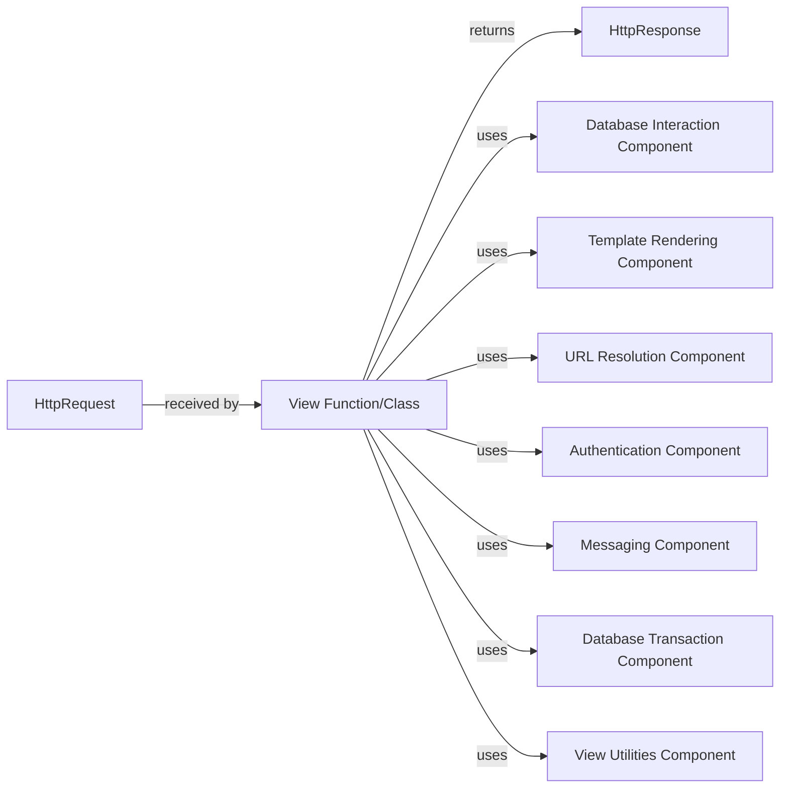

## Component Details

The View Function/Class is the central orchestrator within a Django application's request-response cycle. It receives an HttpRequest, processes business logic (often interacting with the database), and returns an HttpResponse. The selected components are fundamental because they represent the core functionalities and interactions that almost every view will engage with to fulfill its purpose.

### View Function/Class
The core application logic callable (a Python function or a method of a class-based view) that receives an HttpRequest object, processes its data, interacts with other components (like the ORM, template engine, authentication system), and returns an HttpResponse object. It acts as the central coordinator for a specific URL's business logic.

**Related Classes/Methods**:

- `View Function/Class` (0:0)

### HttpRequest
An object encapsulating all incoming request data, including headers, GET/POST parameters, user information, and session data. It provides the view with the necessary context to process the client's request.

**Related Classes/Methods**:

- `HttpRequest` (0:0)

### HttpResponse
An object used to construct and send the response back to the client. It contains the response content, status code, and headers. Views are responsible for creating and returning an HttpResponse.

**Related Classes/Methods**:

- `HttpResponse` (0:0)

### Database Interaction Component
Represents Django's Object-Relational Mapper (ORM), allowing views to interact with the database using Python objects (Models) and QuerySets. This component handles data retrieval (filter, get), creation, updates (save), and deletion.

**Related Classes/Methods**:

- `QuerySet.filter` (0:0)
- `Model.save` (0:0)

### Template Rendering Component
Responsible for processing and rendering HTML templates, combining them with context data to generate the final HTML content that is sent back to the client. The render shortcut is a common entry point.

**Related Classes/Methods**:

- <a href="https://github.com/django/django/blob/master/tests/admin_scripts/custom_templates/project_template/.hidden/render.py#L0-L0" target="_blank" rel="noopener noreferrer">`render` (0:0)</a>
- `render_to_string` (0:0)

### URL Resolution Component
Provides utilities for dynamically generating URLs from URL patterns and view names (reverse) or resolving URLs to their corresponding view functions. This prevents hardcoding URLs and makes the application more maintainable.

**Related Classes/Methods**:

- `reverse` (0:0)

### Authentication Component
Manages user authentication state, including logging users in (login), logging them out (logout), and checking user permissions. It integrates with Django's authentication system.

**Related Classes/Methods**:

- `login` (0:0)
- `logout` (0:0)

### Messaging Component
Provides a way to display temporary, user-facing messages (e.g., "Successfully saved!" or "Invalid credentials") across requests, typically used for feedback after an action.

**Related Classes/Methods**:

- `add_message` (0:0)

### Database Transaction Component
Ensures that a block of database operations is executed as a single, indivisible transaction. If any operation within the block fails, all changes are rolled back, maintaining data integrity.

**Related Classes/Methods**:

- `atomic` (0:0)

### View Utilities Component
A collection of helper functions that simplify common view operations, such as render (combining template loading and HttpResponse creation), redirect (generating an HttpResponseRedirect), and get_object_or_404 (retrieving an object or raising a 404 error).

**Related Classes/Methods**:

- <a href="https://github.com/django/django/blob/master/tests/admin_scripts/custom_templates/project_template/.hidden/render.py#L0-L0" target="_blank" rel="noopener noreferrer">`render` (0:0)</a>
- `redirect` (0:0)

### [FAQ](https://github.com/CodeBoarding/GeneratedOnBoardings/tree/main?tab=readme-ov-file#faq)