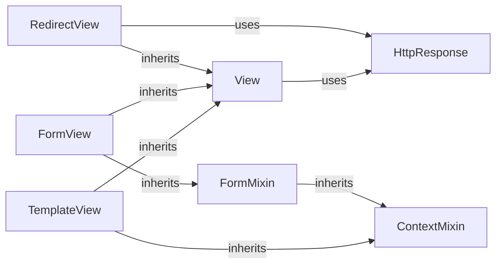

## Details

Updated analysis showing Django's class-based views architecture. The base View class no longer incorrectly inherits from ContextMixin. ContextMixin is now properly shown being inherited by TemplateView and FormMixin, which in turn provides context capabilities to FormView. This reflects Django's actual implementation where context handling is mixed into specific view classes rather than being part of the base View class.

### View
Base class for all views, handles request dispatching and response generation

**Related Classes/Methods**:

- <a href="https://github.com/django/django/blob/main/django/views/generic/base.py#L36-L180" target="_blank" rel="noopener noreferrer">`django.views.generic.base.View` (36:180)</a>

### HttpResponse
Core response handling with status codes and content management

**Related Classes/Methods**:

- <a href="https://github.com/django/django/blob/main/django/http/response.py#L365-L435" target="_blank" rel="noopener noreferrer">`django.http.response.HttpResponse` (365:435)</a>

### ContextMixin
Provides template context data and rendering capabilities

**Related Classes/Methods**:

- <a href="https://github.com/django/django/blob/main/django/views/generic/base.py#L21-L33" target="_blank" rel="noopener noreferrer">`django.views.generic.base.ContextMixin` (21:33)</a>

### FormMixin
Adds form processing capabilities (GET/POST handling)

**Related Classes/Methods**:

- <a href="https://github.com/django/django/blob/main/django/views/generic/edit.py#L12-L72" target="_blank" rel="noopener noreferrer">`django.views.generic.edit.FormMixin` (12:72)</a>

### TemplateView
Generic view for template rendering with context

**Related Classes/Methods**:

- <a href="https://github.com/django/django/blob/main/django/views/generic/base.py#L221-L228" target="_blank" rel="noopener noreferrer">`django.views.generic.base.TemplateView` (221:228)</a>

### FormView
Handles form display, validation, and submission

**Related Classes/Methods**:

- <a href="https://github.com/django/django/blob/main/django/views/generic/edit.py#L164-L165" target="_blank" rel="noopener noreferrer">`django.views.generic.edit.FormView` (164:165)</a>

### RedirectView
Handles HTTP redirects with URL pattern matching

**Related Classes/Methods**:

- <a href="https://github.com/django/django/blob/main/django/views/generic/base.py#L231-L285" target="_blank" rel="noopener noreferrer">`django.views.generic.base.RedirectView` (231:285)</a>

### [FAQ](https://github.com/CodeBoarding/GeneratedOnBoardings/tree/main?tab=readme-ov-file#faq)