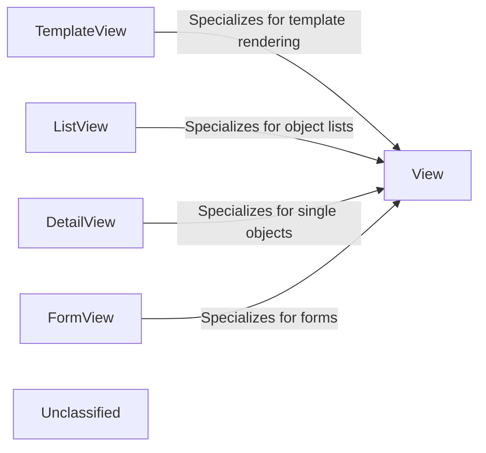

## Details

Django's class-based views (CBVs) provide a powerful, extensible, and reusable way to handle web requests. The architecture is fundamentally object-oriented, centered on the base `View` class which handles request dispatching to appropriate methods (e.g., `get()`, `post()`). More specialized views are created not through simple inheritance, but through a compositional approach using mixin classes. These mixins provide targeted functionality, such as rendering templates (`TemplateResponseMixin`), handling forms (`FormMixin`), or retrieving database objects (`SingleObjectMixin`, `MultipleObjectMixin`). This allows developers to compose complex views by combining a base view with various mixins. This compositional pattern is a more structured alternative to traditional function-based views, which are standalone Python functions that process a request and return a response.

### View
The master class-based view. It provides the fundamental request-dispatching logic by routing requests to the appropriate method (`get`, `post`, etc.) based on the HTTP verb. All other class-based views ultimately inherit from this class.

**Related Classes/Methods**:

- <a href="https://github.com/django/django/blob/main/django/views/generic/base.py#L97-L105" target="_blank" rel="noopener noreferrer">`django.views.generic.base.View`:97-105</a>

### TemplateView
A view specialized for rendering a template. It composes the base `View` with `TemplateResponseMixin` and `ContextMixin` to provide the logic for rendering a specified template with context data in response to a GET request.

**Related Classes/Methods**:

- <a href="https://github.com/django/django/blob/main/django/views/generic/base.py#L221-L228" target="_blank" rel="noopener noreferrer">`django.views.generic.base.TemplateView`:221-228</a>

### ListView
A view for displaying a list of database objects. It inherits from `View` and composes functionality from `MultipleObjectMixin` to retrieve a collection of records from the model layer and `TemplateResponseMixin` to pass them to a template for rendering.

**Related Classes/Methods**:

- <a href="https://github.com/django/django/blob/main/django/views/generic/list.py#L219-L223" target="_blank" rel="noopener noreferrer">`django.views.generic.list.ListView`:219-223</a>

### DetailView
A view for displaying a single, specific database object. It inherits from `View` and composes functionality from `SingleObjectMixin` to fetch one record from the model layer based on a unique identifier from the URL.

**Related Classes/Methods**:

- <a href="https://github.com/django/django/blob/main/django/views/generic/detail.py#L183-L190" target="_blank" rel="noopener noreferrer">`django.views.generic.detail.DetailView`:183-190</a>

### FormView
A view designed to handle form display and processing. It inherits from `View` and composes functionality from `FormMixin` to render a form on a GET request and process the submitted data (including validation) on a POST request.

**Related Classes/Methods**:

- <a href="https://github.com/django/django/blob/main/django/views/generic/edit.py#L164-L165" target="_blank" rel="noopener noreferrer">`django.views.generic.edit.FormView`:164-165</a>

### Unclassified
Component for all unclassified files and utility functions (Utility functions/External Libraries/Dependencies)

**Related Classes/Methods**: _None_

### [FAQ](https://github.com/CodeBoarding/GeneratedOnBoardings/tree/main?tab=readme-ov-file#faq)