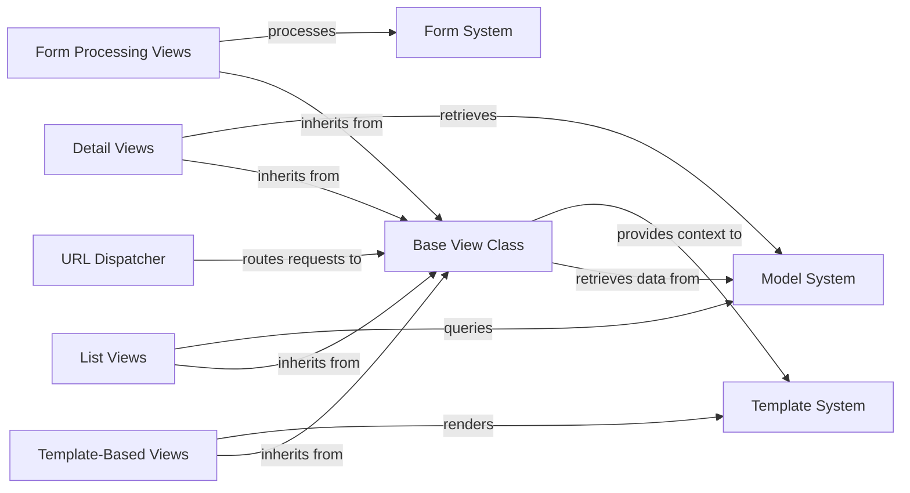

## Details

The Django View System is a core component of Django's Model-View-Template (MVT) architecture that handles HTTP requests and returns appropriate responses. It serves as the intermediary between the user interface and data models, implementing the Controller aspect of traditional MVC patterns. The system is built around a hierarchy of view classes, starting with the Base View Class that provides core request handling functionality. Specialized views like Template-Based Views, List Views, Detail Views, and Form Processing Views extend this base class to provide specific functionality. The View System interacts with other key Django components: it receives requests from the URL Dispatcher, retrieves and manipulates data from the Model System, prepares context data for the Template System, and processes user input through the Form System. This architecture promotes code reuse, maintainability, and a clean separation of concerns following Django's "fat models, thin views, stupid templates" philosophy.

### Base View Class
The foundational class that defines the core view functionality, handling HTTP methods and dispatching requests.

**Related Classes/Methods**:

- <a href="https://github.com/django/django/blob/main/django/views/generic/base.py#L36-L180" target="_blank" rel="noopener noreferrer">`django.views.generic.base.View` (36:180)</a>

### Template-Based Views
Views that render templates with context data, providing the primary mechanism for displaying HTML content.

**Related Classes/Methods**:

- <a href="https://github.com/django/django/blob/main/django/views/generic/base.py#L221-L228" target="_blank" rel="noopener noreferrer">`django.views.generic.base.TemplateView` (221:228)</a>

### List Views
Specialized views for displaying collections of objects, often used for index pages and search results.

**Related Classes/Methods**:

- <a href="https://github.com/django/django/blob/main/django/views/generic/list.py#L219-L223" target="_blank" rel="noopener noreferrer">`django.views.generic.list.ListView` (219:223)</a>

### Detail Views
Views focused on displaying a single object's details, commonly used for individual item pages.

**Related Classes/Methods**:

- <a href="https://github.com/django/django/blob/main/django/views/generic/detail.py#L182-L188" target="_blank" rel="noopener noreferrer">`django.views.generic.detail.DetailView` (182:188)</a>

### Form Processing Views
Views that handle form submission, validation, and processing, enabling user input and data manipulation.

**Related Classes/Methods**:

- <a href="https://github.com/django/django/blob/main/django/views/generic/edit.py#L164-L165" target="_blank" rel="noopener noreferrer">`django.views.generic.edit.FormView` (164:165)</a>

### URL Dispatcher
System that maps URLs to views and routes HTTP requests to the appropriate view function or class.

**Related Classes/Methods**:

- `django.urls.path`

### Model System
Django's ORM that provides structured data access and manipulation capabilities.

**Related Classes/Methods**:

- `django.db.models.Model`

### Template System [[Expand]](./Template_System.md)
System for rendering HTML templates with context data provided by views.

**Related Classes/Methods**:

- <a href="https://github.com/django/django/blob/main/django/template/backends/django.py#L92-L108" target="_blank" rel="noopener noreferrer">`django.template.Template` (92:108)</a>

### Form System [[Expand]](./Form_System.md)
System for creating, validating and processing HTML forms and user input.

**Related Classes/Methods**:

- `django.forms.Form`

### [FAQ](https://github.com/CodeBoarding/GeneratedOnBoardings/tree/main?tab=readme-ov-file#faq)