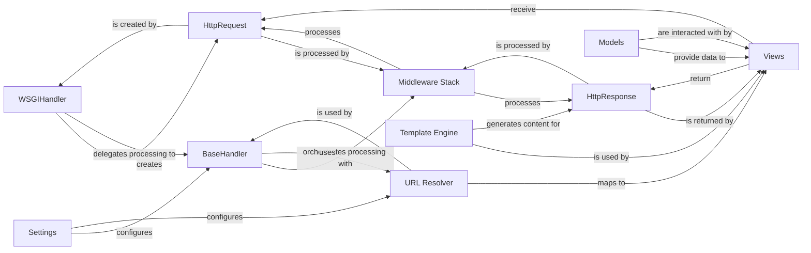

## Component Details

This overview details the core components involved in Django's request-response cycle, with a focus on the `WSGIHandler` as the primary entry point. These components are fundamental because they collectively manage the entire lifecycle of an HTTP request, from its reception by the web server to the generation and sending of the final HTTP response.

Together, these components ensure that Django can efficiently receive, process, and respond to web requests, providing a robust and extensible framework for web development.

### WSGIHandler
The `WSGIHandler` serves as the initial entry point for Django applications when running under a WSGI-compliant web server. It is responsible for receiving the raw WSGI environment, constructing a Django-specific `WSGIRequest` object (a subclass of `HttpRequest`), and then delegating the subsequent processing of this request to its parent, `BaseHandler`, to orchestrate the full request-response cycle.

**Related Classes/Methods**:

- <a href="https://github.com/django/django/blob/master/django/core/handlers/wsgi.py#L1-L1" target="_blank" rel="noopener noreferrer">`django/core/handlers/wsgi.py` (1:1)</a>

### BaseHandler
An abstract base class that provides the core logic for processing an HTTP request. `BaseHandler` orchestrates the application of middleware, resolves the URL to the appropriate view, invokes the view, and handles any exceptions that occur during this process. `WSGIHandler` inherits from `BaseHandler` to leverage this fundamental request processing pipeline.

**Related Classes/Methods**:

- <a href="https://github.com/django/django/blob/master/django/core/handlers/base.py#L1-L1" target="_blank" rel="noopener noreferrer">`django/core/handlers/base.py` (1:1)</a>

### HttpRequest
An object that encapsulates all information about an incoming HTTP request. This includes request headers, GET and POST data, user information, session data, and file uploads. It provides a standardized and convenient way for Django's internal components and application logic to access request details.

**Related Classes/Methods**:

- <a href="https://github.com/django/django/blob/master/django/http/request.py#L1-L1" target="_blank" rel="noopener noreferrer">`django/http/request.py` (1:1)</a>

### HttpResponse
An object that represents the HTTP response that will be sent back to the client. It holds the response content (e.g., HTML, JSON), the HTTP status code (e.g., 200 OK, 404 Not Found), and response headers. It is the ultimate output of a Django view.

**Related Classes/Methods**:

- <a href="https://github.com/django/django/blob/master/django/http/response.py#L1-L1" target="_blank" rel="noopener noreferrer">`django/http/response.py` (1:1)</a>

### Middleware Stack
A configurable chain of lightweight, pluggable components (middleware) that process requests and responses globally. Middleware can modify incoming `HttpRequest` objects before they reach the view, modify `HttpResponse` objects before they are sent to the client, or perform other cross-cutting concerns like authentication, session management, or CSRF protection.

**Related Classes/Methods**:

- <a href="https://github.com/django/django/blob/master/django/middleware/common.py#L1-L1" target="_blank" rel="noopener noreferrer">`django/middleware/common.py` (1:1)</a>

### URL Resolver
Responsible for matching the incoming URL from an `HttpRequest` object to the appropriate view function or class based on the defined URL patterns (`urlpatterns`) in the project's configuration. It extracts any parameters from the URL to pass to the view.

**Related Classes/Methods**:

- <a href="https://github.com/django/django/blob/master/django/urls/resolvers.py#L1-L1" target="_blank" rel="noopener noreferrer">`django/urls/resolvers.py` (1:1)</a>

### Views
Python functions or classes that receive an `HttpRequest` object as input and are responsible for returning an `HttpResponse` object. They contain the core business logic of the application, interacting with models to retrieve or manipulate data and often using a template engine to render content.

**Related Classes/Methods**:

- <a href="https://github.com/django/django/blob/master/django/views/defaults.py#L1-L1" target="_blank" rel="noopener noreferrer">`django/views/defaults.py` (1:1)</a>

### Models
Define the structure of the application's data and provide an Object-Relational Mapper (ORM) interface for interacting with the database. Models abstract database operations, allowing developers to work with Python objects instead of raw SQL.

**Related Classes/Methods**:

- <a href="https://github.com/django/django/blob/master/django/db/models/base.py#L1-L1" target="_blank" rel="noopener noreferrer">`django/db/models/base.py` (1:1)</a>

### Template Engine
Responsible for loading, parsing, and rendering templates. Templates are text files (often HTML) that contain placeholders and logic for displaying dynamic content, which is then combined with data from views to produce the final `HttpResponse` content.

**Related Classes/Methods**:

- <a href="https://github.com/django/django/blob/master/django/template/engine.py#L1-L1" target="_blank" rel="noopener noreferrer">`django/template/engine.py` (1:1)</a>

### Settings
A global configuration object that holds all project-specific settings. This includes database connections, installed applications, middleware classes, template directories, static file configurations, and various other parameters that influence Django's behavior.

**Related Classes/Methods**:

- `django/conf/settings.py` (1:1)

### [FAQ](https://github.com/CodeBoarding/GeneratedOnBoardings/tree/main?tab=readme-ov-file#faq)