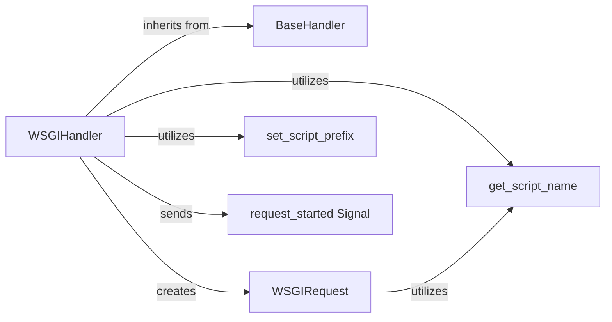

## Component Details

WSGIHandler is the concrete implementation of Django's request handling for the WSGI (Web Server Gateway Interface) protocol. It serves as the primary entry point for traditional synchronous Django applications, translating raw WSGI environment data into a Django HttpRequest object and converting the resulting HttpResponse back into a WSGI-compatible format. It orchestrates the initial setup of the request context, including URL prefixing and signal dispatch, before delegating to its base class for core request processing.

### WSGIHandler
The central component responsible for adapting the WSGI environment to Django's request/response cycle. It initializes the request, sets up the script prefix, dispatches the request_started signal, and invokes the get_response method inherited from BaseHandler. Finally, it formats the Django HttpResponse into a WSGI-compliant response.

**Related Classes/Methods**:

- <a href="https://github.com/django/django/blob/master/django/core/handlers/wsgi.py#L112-L143" target="_blank" rel="noopener noreferrer">`django.core.handlers.wsgi.WSGIHandler` (112:143)</a>

### BaseHandler
An abstract base class that provides the foundational request handling logic. WSGIHandler inherits from BaseHandler and utilizes its get_response method, which is responsible for loading and applying middleware, resolving URLs, and generating the final response.

**Related Classes/Methods**:

- <a href="https://github.com/django/django/blob/master/django/core/handlers/base.py#L19-L364" target="_blank" rel="noopener noreferrer">`django.core.handlers.base.BaseHandler` (19:364)</a>

### WSGIRequest
A Django-specific HttpRequest subclass that encapsulates the WSGI environment dictionary. It provides a convenient interface for accessing request details like GET/POST parameters, headers, and the request body stream, abstracting away the raw WSGI environment.

**Related Classes/Methods**:

- <a href="https://github.com/django/django/blob/master/django/core/handlers/wsgi.py#L55-L109" target="_blank" rel="noopener noreferrer">`django.core.handlers.wsgi.WSGIRequest` (55:109)</a>

### set_script_prefix
A utility function that sets the URL prefix for the current thread. This is vital for Django to correctly generate absolute URLs and resolve incoming URLs, especially when the application is deployed under a subpath.

**Related Classes/Methods**:

- <a href="https://github.com/django/django/blob/master/django/urls/base.py#L119-L125" target="_blank" rel="noopener noreferrer">`django.urls.base.set_script_prefix` (119:125)</a>

### get_script_name
A helper function that extracts the script name (the portion of the URL path corresponding to the application's entry point) from the WSGI environment. It handles various server configurations and Django settings like FORCE_SCRIPT_NAME.

**Related Classes/Methods**:

- <a href="https://github.com/django/django/blob/master/django/core/handlers/wsgi.py#L153-L183" target="_blank" rel="noopener noreferrer">`django.core.handlers.wsgi.get_script_name` (153:183)</a>

### request_started Signal
Represents a Django signal that is dispatched at the very beginning of a request. It allows decoupled components and applications to execute code or perform actions when a new request starts, such as initializing request-specific data.

**Related Classes/Methods**:

- <a href="https://github.com/django/django/blob/master/django/core/signals.py#L1-L1" target="_blank" rel="noopener noreferrer">`django.core.signals.request_started` (1:1)</a>

### [FAQ](https://github.com/CodeBoarding/GeneratedOnBoardings/tree/main?tab=readme-ov-file#faq)