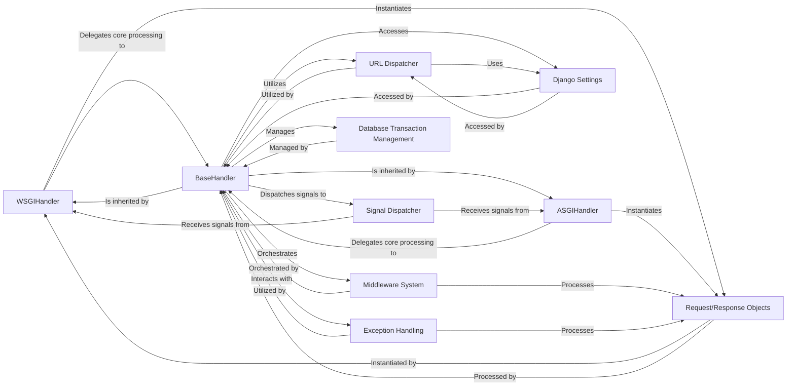

## Component Details

This subsystem represents the core of Django's request-response handling, acting as the crucial interface between the web server and the Django application. It manages the entire lifecycle of an HTTP request, from its initial reception to the final response delivery, adapting to both synchronous (WSGI) and asynchronous (ASGI) environments.

### WSGIHandler
The primary entry point for handling synchronous HTTP requests in a WSGI environment. It translates the raw WSGI `environ` into a Django `WSGIRequest` object, dispatches initial signals, delegates the core processing to `BaseHandler`, and finally converts the `HttpResponse` back into a WSGI-compliant response.

**Related Classes/Methods**:

- <a href="https://github.com/django/django/blob/master/django/core/handlers/wsgi.py#L112-L143" target="_blank" rel="noopener noreferrer">`django.core.handlers.wsgi.WSGIHandler` (112:143)</a>

### ASGIHandler
The primary entry point for handling asynchronous HTTP requests in an ASGI environment. It manages the ASGI `scope`, `receive`, and `send` channels, constructs an `ASGIRequest` object, orchestrates the asynchronous request processing and response sending (via `BaseHandler`), and efficiently handles streaming responses.

**Related Classes/Methods**:

- <a href="https://github.com/django/django/blob/master/django/core/handlers/asgi.py#L138-L380" target="_blank" rel="noopener noreferrer">`django.core.handlers.asgi.ASGIHandler` (138:380)</a>

### BaseHandler
An abstract base class that encapsulates the common, protocol-agnostic request handling logic shared by both `WSGIHandler` and `ASGIHandler`. Its `get_response` method is central to processing the request through the middleware chain, managing database connections, and handling transaction management.

**Related Classes/Methods**:

- <a href="https://github.com/django/django/blob/master/django/core/handlers/base.py#L19-L364" target="_blank" rel="noopener noreferrer">`django.core.handlers.base.BaseHandler` (19:364)</a>

### Request/Response Objects
These classes (`HttpRequest`, `HttpResponse`, `WSGIRequest`, `ASGIRequest`) are the fundamental data structures that encapsulate all information about an incoming HTTP request (headers, body, method, path, etc.) and format the outgoing HTTP response. `WSGIRequest` and `ASGIRequest` are specific implementations tailored to their respective server protocols.

**Related Classes/Methods**:

- <a href="https://github.com/django/django/blob/master/django/http/request.py#L52-L469" target="_blank" rel="noopener noreferrer">`django.http.request.HttpRequest` (52:469)</a>
- <a href="https://github.com/django/django/blob/master/django/http/response.py#L364-L434" target="_blank" rel="noopener noreferrer">`django.http.response.HttpResponse` (364:434)</a>
- <a href="https://github.com/django/django/blob/master/django/core/handlers/wsgi.py#L55-L109" target="_blank" rel="noopener noreferrer">`django.core.handlers.wsgi.WSGIRequest` (55:109)</a>
- <a href="https://github.com/django/django/blob/master/django/core/handlers/asgi.py#L37-L135" target="_blank" rel="noopener noreferrer">`django.core.handlers.asgi.ASGIRequest` (37:135)</a>

### Middleware System
A configurable chain of callable components that process requests and responses globally. It allows for injecting logic (e.g., authentication, session management, CSRF protection) before and after the view is executed, and for handling exceptions. This system is orchestrated by `BaseHandler`.

**Related Classes/Methods**:

- <a href="https://github.com/django/django/blob/master/django/core/handlers/base.py#L25-L101" target="_blank" rel="noopener noreferrer">`django.core.handlers.base.BaseHandler:load_middleware` (25:101)</a>
- <a href="https://github.com/django/django/blob/master/django/core/handlers/base.py#L1-L1" target="_blank" rel="noopener noreferrer">`django.core.handlers.base.BaseHandler:_middleware_chain` (1:1)</a>

### URL Dispatcher
Responsible for resolving an incoming request's URL to the appropriate view function or class-based view based on the project's URL configuration. It extracts any parameters from the URL for the view.

**Related Classes/Methods**:

- <a href="https://github.com/django/django/blob/master/django/core/handlers/base.py#L299-L314" target="_blank" rel="noopener noreferrer">`django.core.handlers.base.BaseHandler:resolve_request` (299:314)</a>
- <a href="https://github.com/django/django/blob/master/django/urls/resolvers.py#L1-L1" target="_blank" rel="noopener noreferrer">`django.urls.resolvers` (1:1)</a>
- <a href="https://github.com/django/django/blob/master/django/urls/base.py#L1-L1" target="_blank" rel="noopener noreferrer">`django.urls.base` (1:1)</a>

### Signal Dispatcher
A publish-subscribe system that allows decoupled components within Django (and third-party applications) to send notifications (signals) and register functions (receivers) to be called when those signals are sent. Key signals in this subsystem include `request_started` and `request_finished`.

**Related Classes/Methods**:

- <a href="https://github.com/django/django/blob/master/django/dispatch/dispatcher.py#L1-L1" target="_blank" rel="noopener noreferrer">`django.dispatch.dispatcher` (1:1)</a>

### Exception Handling
Manages the graceful handling of errors that occur during the request-response cycle. It involves catching exceptions, potentially passing them through exception middleware, and ultimately rendering an appropriate HTTP error response (e.g., 400 Bad Request, 404 Not Found, 500 Internal Server Error) or logging them.

**Related Classes/Methods**:

- <a href="https://github.com/django/django/blob/master/django/core/handlers/base.py#L355-L364" target="_blank" rel="noopener noreferrer">`django.core.handlers.base.BaseHandler:process_exception_by_middleware` (355:364)</a>
- <a href="https://github.com/django/django/blob/master/django/core/handlers/base.py#L1-L1" target="_blank" rel="noopener noreferrer">`django.core.handlers.base.BaseHandler:handle_uncaught_exception` (1:1)</a>
- <a href="https://github.com/django/django/blob/master/django/core/exceptions.py#L1-L1" target="_blank" rel="noopener noreferrer">`django.core.exceptions` (1:1)</a>

### Django Settings
A global configuration object that provides access to all project-specific settings (e.g., `DEBUG`, `MIDDLEWARE`, `ROOT_URLCONF`, `DATABASES`). These settings dictate the behavior and enable/disable various features of the Django application.

**Related Classes/Methods**:

- <a href="https://github.com/django/django/blob/master/django/template/backends/django.py#L1-L1" target="_blank" rel="noopener noreferrer">`django.conf.settings` (1:1)</a>

### Database Transaction Management
Manages the lifecycle of database connections and ensures that database operations performed during a request are properly encapsulated within atomic transactions. This guarantees that either all operations within a request succeed or none do, maintaining data integrity.

**Related Classes/Methods**:

- <a href="https://github.com/django/django/blob/master/django/db/transaction.py#L1-L1" target="_blank" rel="noopener noreferrer">`django.db.transaction` (1:1)</a>
- <a href="https://github.com/django/django/blob/master/django/template/backends/django.py#L1-L1" target="_blank" rel="noopener noreferrer">`django.db` (1:1)</a>

### [FAQ](https://github.com/CodeBoarding/GeneratedOnBoardings/tree/main?tab=readme-ov-file#faq)