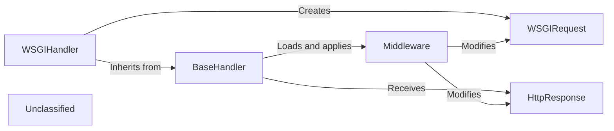

## Details

An analysis of the Django request handling subsystem reveals a layered, middleware-centric pipeline architecture. The process initiates with the WSGIHandler, which serves as the bridge between the WSGI server and the Django framework. It wraps the raw WSGI environment in a WSGIRequest object, providing a rich, high-level interface for the application. The core logic resides within BaseHandler, which orchestrates the request-response lifecycle. A key feature of this architecture is its extensibility through a configurable Middleware chain. BaseHandler dynamically loads and applies this chain, allowing developers to hook into various stages of request and response processing. After the request passes through the middleware, BaseHandler resolves the URL, invokes the appropriate view, and receives an HttpResponse object. This response then travels back through the middleware chain for any final modifications before being sent to the client.

### WSGIHandler
The primary entry point for requests from a WSGI-compliant web server. It translates the WSGI environment into a Django request object and orchestrates the entire request-response cycle.

**Related Classes/Methods**:

- <a href="https://github.com/django/django/blob/main/django/core/handlers/wsgi.py#L113-L144" target="_blank" rel="noopener noreferrer">`django.core.handlers.wsgi.WSGIHandler`:113-144</a>

### BaseHandler
Provides the core, protocol-agnostic request processing logic. It is responsible for loading and applying middleware, resolving the requested URL, and calling the appropriate view.

**Related Classes/Methods**:

- <a href="https://github.com/django/django/blob/main/django/core/handlers/base.py#L20-L366" target="_blank" rel="noopener noreferrer">`django.core.handlers.base.BaseHandler`:20-366</a>

### Middleware [[Expand]](./Middleware.md)
A conceptual framework of hooks into Django's request/response processing. It is not a single class but a collection of developer-configured components that BaseHandler loads and applies. Middleware allows for custom logic to be executed at various stages, such as session management, authentication, or modifying the response.

**Related Classes/Methods**:

- <a href="https://github.com/django/django/blob/main/django/middleware/__init__.py" target="_blank" rel="noopener noreferrer">`django.middleware.Middleware`</a>

### WSGIRequest
An object that encapsulates an incoming HTTP request. It is created by the WSGIHandler from the WSGI environment and provides a high-level interface to request data like headers, body, and GET/POST parameters.

**Related Classes/Methods**:

- <a href="https://github.com/django/django/blob/main/django/core/handlers/wsgi.py#L56-L110" target="_blank" rel="noopener noreferrer">`django.core.handlers.wsgi.WSGIRequest`:56-110</a>

### HttpResponse
An object that encapsulates an outgoing HTTP response. Views return instances of this class (or a subclass), and it is ultimately formatted by the handler to be sent back to the web server.

**Related Classes/Methods**:

- <a href="https://github.com/django/django/blob/main/django/http/response.py#L366-L436" target="_blank" rel="noopener noreferrer">`django.http.response.HttpResponse`:366-436</a>

### Unclassified
Component for all unclassified files and utility functions (Utility functions/External Libraries/Dependencies)

**Related Classes/Methods**: _None_

### [FAQ](https://github.com/CodeBoarding/GeneratedOnBoardings/tree/main?tab=readme-ov-file#faq)