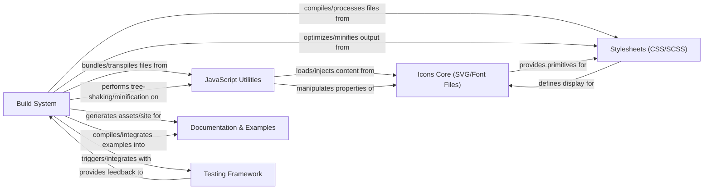

## Details

The Icon Toolkit subsystem is designed to provide a comprehensive solution for managing and deploying visual icons. At its core, the Icons Core houses the raw SVG and font icon assets. These assets are styled by Stylesheets, which define their visual presentation, and can be dynamically manipulated or loaded by JavaScript Utilities. The entire process, from asset optimization to code bundling and documentation generation, is orchestrated by the Build System. Finally, the Testing Framework ensures the quality and consistency of the generated output, while Documentation & Examples provide essential guidance for developers integrating the toolkit. This interconnected system ensures efficient development, consistent styling, and reliable deployment of icons across various applications. The subsystem boundaries are defined by the scope of an "Icon Toolkit," encompassing all assets, styling, scripting, build processes, documentation, and testing related to icon management and usage.

### Icons Core (SVG/Font Files)
Manages the raw icon assets, including SVG files for vector graphics and font files (e.g., TTF, WOFF) for icon fonts. This is the primary source of visual assets.

**Related Classes/Methods**:

### Stylesheets (CSS/SCSS)
Contains all styling definitions for the icons, including sizing, coloring, spacing, and any visual effects. It processes SCSS into final CSS.

**Related Classes/Methods**:

### JavaScript Utilities
Provides helper functions for dynamic icon loading, manipulation (e.g., changing colors via JS), integration with frameworks, and potentially SVG sprite generation or injection.

**Related Classes/Methods**:

### Build System
Orchestrates the entire build process, including compiling SCSS, optimizing SVGs, generating icon fonts, bundling JavaScript, and creating distributable packages.

**Related Classes/Methods**:

### Documentation & Examples
Provides usage guides, API references, examples, and a showcase of available icons. This component is vital for developers consuming the toolkit.

**Related Classes/Methods**:

- <a href="https://github.com/django/django/blob/main/docs/" target="_blank" rel="noopener noreferrer">`docs/`</a>

### Testing Framework
Contains unit, integration, and visual regression tests to ensure the quality, consistency, and correct rendering of icons and associated code.

**Related Classes/Methods**:

- <a href="https://github.com/django/django/blob/main/tests/" target="_blank" rel="noopener noreferrer">`tests/`</a>

### [FAQ](https://github.com/CodeBoarding/GeneratedOnBoardings/tree/main?tab=readme-ov-file#faq)