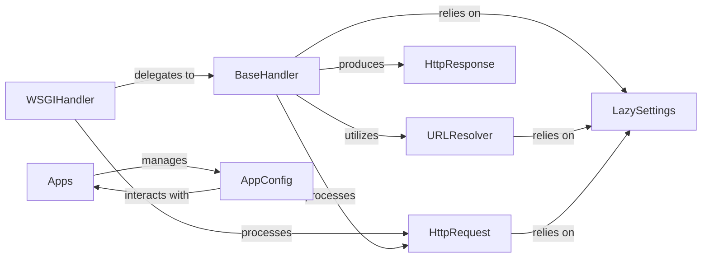

## Component Details

The Web Request-Response Core subsystem focuses on its structure, flow, and purpose. These components are fundamental because they collectively form the backbone of how Django receives, processes, and responds to web requests, manages application lifecycle, and provides access to configuration.

### WSGIHandler
The primary entry point for Django applications when running under a WSGI-compliant web server. It receives the raw WSGI environment, constructs an `WSGIRequest` object (a subclass of `HttpRequest`), and orchestrates the entire request-response cycle by delegating to the `BaseHandler`.

**Related Classes/Methods**: _None_

### BaseHandler
Provides the fundamental request processing logic, independent of the specific server interface (WSGI or ASGI). It manages the execution of middleware, resolves the URL to a view, invokes the view, and handles exceptions, ultimately returning an `HttpResponse`. This is the core orchestrator of the request lifecycle.

**Related Classes/Methods**: _None_

### HttpRequest
Encapsulates an incoming HTTP request. It provides a convenient interface to access various parts of the request, including headers, GET and POST parameters (via `QueryDict`), cookies, and uploaded files. It handles parsing raw request data.

**Related Classes/Methods**: _None_

### HttpResponse
The base class for all HTTP responses generated by Django. It provides methods for constructing responses, setting HTTP headers (via `ResponseHeaders`), managing cookies, and handling various content types (e.g., plain text, JSON, streaming files). Subclasses handle specific response behaviors.

**Related Classes/Methods**: _None_

### URLResolver
The core component for URL routing. It takes an incoming URL path and resolves it to the appropriate view function based on defined URL patterns. It also supports URL reversing (generating URLs from view names) and managing URL namespaces.

**Related Classes/Methods**: _None_

### Apps
The central registry for all installed Django applications. It manages the loading, configuration, and lifecycle of applications, ensuring they are properly initialized and their models are available. It's responsible for the `populate` process, which loads app configurations and models and calls their `ready()` methods.

**Related Classes/Methods**: _None_

### AppConfig
Represents the configuration of a single Django application. It provides metadata about the app (e.g., name, label) and defines hooks for application-specific initialization, such as the `ready()` method, which is called once Django is fully loaded. The `create` method is a factory for instantiating `AppConfig` objects.

**Related Classes/Methods**: _None_

### LazySettings
Provides a lazy-loaded interface to Django's project settings. It defers the loading of settings until they are first accessed, which can improve startup performance. It acts as a proxy to the actual settings object, making project-wide configurations accessible.

**Related Classes/Methods**: _None_

### [FAQ](https://github.com/CodeBoarding/GeneratedOnBoardings/tree/main?tab=readme-ov-file#faq)