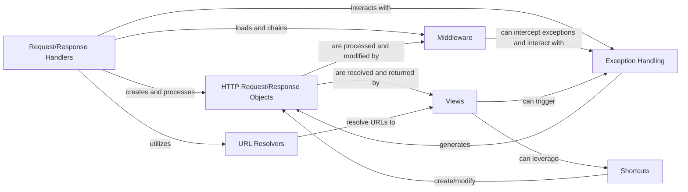

## Component Details

This component handles the entire lifecycle of an HTTP request in Django, from its initial reception to the final response sent back to the client. It orchestrates the flow through various stages, including middleware processing, URL routing, view execution, and error handling.

### Request/Response Handlers
These are the foundational entry points for handling web requests in Django. They are responsible for orchestrating the entire request lifecycle, from receiving the raw HTTP request to dispatching it through middleware and ultimately to the appropriate view, and then sending back the generated HTTP response. They act as the central control unit.

**Related Classes/Methods**:

- <a href="https://github.com/django/django/blob/master/django/core/handlers/base.py#L0-L0" target="_blank" rel="noopener noreferrer">`django.core.handlers.base` (0:0)</a>
- <a href="https://github.com/django/django/blob/master/django/core/handlers/wsgi.py#L0-L0" target="_blank" rel="noopener noreferrer">`django.core.handlers.wsgi` (0:0)</a>
- <a href="https://github.com/django/django/blob/master/django/core/handlers/asgi.py#L0-L0" target="_blank" rel="noopener noreferrer">`django.core.handlers.asgi` (0:0)</a>

### HTTP Request/Response Objects
These are the fundamental data structures that encapsulate all information related to an incoming HTTP request (HttpRequest) and an outgoing HTTP response (HttpResponse). They provide a standardized way for different parts of the pipeline (middleware, views) to interact with the request and response data.

**Related Classes/Methods**:

- <a href="https://github.com/django/django/blob/master/django/http/request.py#L52-L469" target="_blank" rel="noopener noreferrer">`django.http.request:HttpRequest` (52:469)</a>
- <a href="https://github.com/django/django/blob/master/django/http/response.py#L364-L434" target="_blank" rel="noopener noreferrer">`django.http.response:HttpResponse` (364:434)</a>

### URL Resolvers
This component is responsible for mapping incoming URLs to the correct Python callable (view function or class) that will handle the request. It uses defined URL patterns to perform this crucial routing, extracting any parameters from the URL path.

**Related Classes/Methods**:

- <a href="https://github.com/django/django/blob/master/django/urls/resolvers.py#L0-L0" target="_blank" rel="noopener noreferrer">`django.urls.resolvers:URLResolver` (0:0)</a>
- <a href="https://github.com/django/django/blob/master/django/urls/resolvers.py#L0-L0" target="_blank" rel="noopener noreferrer">`django.urls.resolvers:URLPattern` (0:0)</a>

### Middleware
Middleware components are a powerful mechanism for injecting global logic into the request/response pipeline. They act as "hooks" that can process requests before they reach the view, and process responses before they are sent back to the client. This allows for cross-cutting concerns like authentication, session management, CSRF protection, and caching to be handled cleanly and efficiently.

**Related Classes/Methods**:

- <a href="https://github.com/django/django/blob/master/django/middleware/csrf.py#L0-L0" target="_blank" rel="noopener noreferrer">`django.middleware.csrf:CsrfViewMiddleware` (0:0)</a>
- <a href="https://github.com/django/django/blob/master/django/template/backends/django.py#L0-L0" target="_blank" rel="noopener noreferrer">`django.middleware.sessions` (0:0)</a>
- <a href="https://github.com/django/django/blob/master/django/middleware/common.py#L0-L0" target="_blank" rel="noopener noreferrer">`django.middleware.common` (0:0)</a>

### Views
Views are the core of Django's application logic. They receive the HttpRequest object, perform the necessary business logic (e.g., interacting with the database, processing form data), and then return an HttpResponse object. Generic Views provide reusable, pre-built implementations for common web patterns, reducing boilerplate code.

**Related Classes/Methods**:

- <a href="https://github.com/django/django/blob/master/django/views/generic/base.py#L36-L180" target="_blank" rel="noopener noreferrer">`django.views.generic.base:View` (36:180)</a>
- <a href="https://github.com/django/django/blob/master/django/views/generic/detail.py#L182-L188" target="_blank" rel="noopener noreferrer">`django.views.generic.detail:DetailView` (182:188)</a>
- <a href="https://github.com/django/django/blob/master/django/views/generic/list.py#L219-L223" target="_blank" rel="noopener noreferrer">`django.views.generic.list:ListView` (219:223)</a>

### Shortcuts
This component provides convenience functions that simplify common tasks within views, making the code more concise and readable. These functions often wrap more complex operations, such as rendering templates, performing redirects, or fetching objects from the database with built-in error handling.

**Related Classes/Methods**:

- <a href="https://github.com/django/django/blob/master/django/shortcuts.py#L0-L0" target="_blank" rel="noopener noreferrer">`django.shortcuts:render` (0:0)</a>
- <a href="https://github.com/django/django/blob/master/django/shortcuts.py#L0-L0" target="_blank" rel="noopener noreferrer">`django.shortcuts:redirect` (0:0)</a>
- <a href="https://github.com/django/django/blob/master/django/shortcuts.py#L0-L0" target="_blank" rel="noopener noreferrer">`django.shortcuts:get_object_or_404` (0:0)</a>

### Exception Handling
This component is responsible for gracefully handling exceptions that occur during the request/response pipeline. It ensures that appropriate error responses (e.g., 404 Not Found, 500 Internal Server Error) are generated and returned to the client, preventing raw traceback exposure and providing a better user experience.

**Related Classes/Methods**:

- <a href="https://github.com/django/django/blob/master/django/core/handlers/exception.py#L62-L158" target="_blank" rel="noopener noreferrer">`django.core.handlers.exception:response_for_exception` (62:158)</a>
- <a href="https://github.com/django/django/blob/master/django/views/defaults.py#L0-L0" target="_blank" rel="noopener noreferrer">`django.views.defaults` (0:0)</a>

### [FAQ](https://github.com/CodeBoarding/GeneratedOnBoardings/tree/main?tab=readme-ov-file#faq)