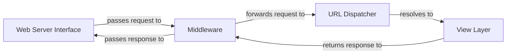

## Details

The Django subsystem, at its core, manages the lifecycle of an HTTP request from its arrival to the generation of a response. The Web Server Interface acts as the initial gateway, translating raw HTTP into a format consumable by Django. Upon entry, requests are first processed by the Middleware chain, which can modify the request, handle sessions, authentication, or other global concerns. After middleware processing, the request is handed to the URL Dispatcher, which determines the appropriate view function or class-based view based on the URL pattern. Once the view processes the request and generates a response, the response travels back through the Middleware chain for any final modifications before being returned to the Web Server Interface for transmission back to the client. This structured flow ensures consistent processing and extensibility for all incoming requests.

### Web Server Interface [[Expand]](./Web_Server_Interface.md)
This component serves as the primary external entry point for all HTTP requests, acting as the crucial bridge between standard web servers (via WSGI and ASGI protocols) and the internal Django application. It is responsible for translating incoming HTTP requests into a format Django can process and for converting Django's responses back into HTTP for the web server.

**Related Classes/Methods**:

- <a href="https://github.com/django/django/blob/main/django/core/wsgi.py#L5-L13" target="_blank" rel="noopener noreferrer">`django.core.wsgi.get_wsgi_application`:5-13</a>
- <a href="https://github.com/django/django/blob/main/django/core/asgi.py#L5-L13" target="_blank" rel="noopener noreferrer">`django.core.asgi.get_asgi_application`:5-13</a>
- <a href="https://github.com/django/django/blob/main/django/core/servers/basehttp.py#L177-L255" target="_blank" rel="noopener noreferrer">`django.core.servers.basehttp.WSGIRequestHandler`:177-255</a>
- <a href="https://github.com/django/django/blob/main/django/core/servers/basehttp.py#L68-L83" target="_blank" rel="noopener noreferrer">`django.core.servers.basehttp.WSGIServer`:68-83</a>

### Middleware
Middleware components act as a chain of hooks that process requests and responses globally. They are executed in a specific order during both the request and response phases, allowing for global modifications to requests, responses, or the handling of exceptions. This enables cross-cutting concerns like authentication, session management, and CSRF protection.

**Related Classes/Methods**:

- <a href="https://github.com/django/django/blob/main/django/utils/deprecation.py#L266-L322" target="_blank" rel="noopener noreferrer">`django.utils.deprecation.MiddlewareMixin`:266-322</a>
- <a href="https://github.com/django/django/blob/main/django/middleware/common.py#L13-L115" target="_blank" rel="noopener noreferrer">`django.middleware.common.CommonMiddleware`:13-115</a>
- <a href="https://github.com/django/django/blob/main/django/contrib/sessions/middleware.py#L12-L77" target="_blank" rel="noopener noreferrer">`django.contrib.sessions.middleware.SessionMiddleware`:12-77</a>
- <a href="https://github.com/django/django/blob/main/django/contrib/auth/middleware.py#L30-L41" target="_blank" rel="noopener noreferrer">`django.contrib.auth.middleware.AuthenticationMiddleware`:30-41</a>

### URL Dispatcher
This component is responsible for mapping incoming request URLs to the appropriate view functions or class-based views. It parses the URL, matches it against defined URL patterns, and resolves it to the corresponding callable view, effectively directing the request to its intended handler within the application.

**Related Classes/Methods**:

- <a href="https://github.com/django/django/blob/main/django/urls/resolvers.py#L503-L842" target="_blank" rel="noopener noreferrer">`django.urls.resolvers.URLResolver`:503-842</a>
- <a href="https://github.com/django/django/blob/main/django/urls/resolvers.py#L422-L500" target="_blank" rel="noopener noreferrer">`django.urls.resolvers.URLPattern`:422-500</a>

### View Layer
This component represents the application's view logic, responsible for processing requests, interacting with models, and rendering responses.

**Related Classes/Methods**: _None_

### [FAQ](https://github.com/CodeBoarding/GeneratedOnBoardings/tree/main?tab=readme-ov-file#faq)