```mermaid
graph LR
    django_db["django.db"]
    django_db_backends["django.db.backends"]
    django_db_migrations["django.db.migrations"]
    django_db_models["django.db.models"]
    django_db_models_base_Model["django.db.models.base.Model"]
    django_db_models_fields["django.db.models.fields"]
    django_db_models_query_QuerySet["django.db.models.query.QuerySet"]
    django_db_models_manager_Manager["django.db.models.manager.Manager"]
    django_db_transaction["django.db.transaction"]
    django_db_utils_ConnectionRouter["django.db.utils.ConnectionRouter"]
    django_db -- "Contains" --> django_db_backends
    django_db -- "Contains" --> django_db_models
    django_db_backends -- "Used by" --> django_db_models
    django_db_backends -- "Used by" --> django_db_migrations
    django_db_migrations -- "Manages" --> django_db_models
    django_db_migrations -- "Interacts with" --> django_db_backends
    django_db_models -- "Defines" --> django_db_models_base_Model
    django_db_models -- "Uses" --> django_db_models_query_QuerySet
    django_db_models_base_Model -- "Composed of" --> django_db_models_fields
    django_db_models_base_Model -- "Uses" --> django_db_models_manager_Manager
    django_db_models_fields -- "Defines types for" --> django_db_models_base_Model
    django_db_models_query_QuerySet -- "Returned by" --> django_db_models_manager_Manager
    django_db_models_query_QuerySet -- "Interacts with" --> django_db_backends
    django_db_models_manager_Manager -- "Provides interface for" --> django_db_models_base_Model
    django_db_models_manager_Manager -- "Creates" --> django_db_models_query_QuerySet
    django_db_transaction -- "Manages operations for" --> django_db_models
    django_db_transaction -- "Interacts with" --> django_db_backends
    django_db_utils_ConnectionRouter -- "Routes connections for" --> django_db
    django_db_utils_ConnectionRouter -- "Influences" --> django_db_models
    click django_db href "https://github.com/CodeBoarding/GeneratedOnBoardings/blob/main//django/django_db.md" "Details"
    click django_db_migrations href "https://github.com/CodeBoarding/GeneratedOnBoardings/blob/main//django/django_db_migrations.md" "Details"
    click django_db_models href "https://github.com/CodeBoarding/GeneratedOnBoardings/blob/main//django/django_db_models.md" "Details"
    click django_db_models_base_Model href "https://github.com/CodeBoarding/GeneratedOnBoardings/blob/main//django/django_db_models_base_Model.md" "Details"
    click django_db_models_manager_Manager href "https://github.com/CodeBoarding/GeneratedOnBoardings/blob/main//django/django_db_models_manager_Manager.md" "Details"
```

## Component Details

The `django.db` subsystem is the cornerstone of Django's database integration, providing a robust Object-Relational Mapper (ORM), migration framework, and a flexible backend system to interact with various database engines. Its design emphasizes abstraction, allowing developers to work with databases using Python objects rather than raw SQL, while still offering granular control when needed.

### django.db
The top-level package for Django's database layer. It acts as the central orchestrator, managing database connections, providing access to the ORM, and integrating the migration system. It defines the `connections` object, which is the entry point for database interaction.

**Related Classes/Methods**:

- <a href="https://github.com/django/django/blob/master/django/template/backends/django.py#L1-L1" target="_blank" rel="noopener noreferrer">`django.db` (1:1)</a>

### django.db.backends
This package provides the abstraction layer for different database systems (e.g., PostgreSQL, MySQL, SQLite). It defines a common interface (`BaseDatabaseWrapper`, `BaseDatabaseClient`, etc.) that specific database backends implement, allowing Django's ORM to interact with various databases uniformly.

**Related Classes/Methods**:

- <a href="https://github.com/django/django/blob/master/django/template/backends/django.py#L1-L1" target="_blank" rel="noopener noreferrer">`django.db.backends` (1:1)</a>
- `django.db.backends.base.BaseDatabaseWrapper` (1:1)
- `django.db.backends.base.BaseDatabaseClient` (1:1)

### django.db.migrations
Manages database schema changes over time. It allows developers to define model changes in Python, which are then translated into database-specific SQL commands. Key components include `Loader` (for loading migration history), `Executor` (for applying/unapplying migrations), and `Autodetector` (for generating migrations).

**Related Classes/Methods**:

- <a href="https://github.com/django/django/blob/master/django/template/backends/django.py#L1-L1" target="_blank" rel="noopener noreferrer">`django.db.migrations` (1:1)</a>
- <a href="https://github.com/django/django/blob/master/django/db/migrations/loader.py#L1-L1" target="_blank" rel="noopener noreferrer">`django.db.migrations.Loader` (1:1)</a>
- <a href="https://github.com/django/django/blob/master/django/db/migrations/executor.py#L1-L1" target="_blank" rel="noopener noreferrer">`django.db.migrations.Executor` (1:1)</a>
- <a href="https://github.com/django/django/blob/master/django/db/migrations/autodetector.py#L1-L1" target="_blank" rel="noopener noreferrer">`django.db.migrations.Autodetector` (1:1)</a>

### django.db.models
The core of Django's ORM. It enables developers to define database tables as Python classes (`Model`), map Python data types to database fields, and establish relationships between tables. It's the primary interface for defining the application's data structure.

**Related Classes/Methods**:

- <a href="https://github.com/django/django/blob/master/django/template/backends/django.py#L1-L1" target="_blank" rel="noopener noreferrer">`django.db.models` (1:1)</a>

### django.db.models.base.Model
The base class from which all Django models inherit. It provides the fundamental functionality for defining a database table, including meta-options, field definitions, and core methods for saving, deleting, and retrieving instances.

**Related Classes/Methods**:

- <a href="https://github.com/django/django/blob/master/django/db/models/base.py#L480-L2407" target="_blank" rel="noopener noreferrer">`django.db.models.base.Model` (480:2407)</a>

### django.db.models.fields
Defines the various types of fields (e.g., `CharField`, `IntegerField`, `ForeignKey`) that can be used within Django models. These fields handle data validation, database type mapping, and serialization/deserialization.

**Related Classes/Methods**:

- `django.db.models.fields` (1:1)

### django.db.models.query.QuerySet
Represents a collection of database objects. It provides the API for querying the database, allowing for filtering, ordering, slicing, and retrieving data in an efficient and object-oriented manner. Operations on a `QuerySet` are lazily evaluated.

**Related Classes/Methods**:

- <a href="https://github.com/django/django/blob/master/django/db/models/query.py#L1-L1" target="_blank" rel="noopener noreferrer">`django.db.models.query.QuerySet` (1:1)</a>

### django.db.models.manager.Manager
The interface through which database query operations are provided to Django models. Every `Model` has at least one `Manager` (the default `objects` manager), which provides methods for creating, retrieving, updating, and deleting model instances.

**Related Classes/Methods**:

- <a href="https://github.com/django/django/blob/master/django/db/models/manager.py#L175-L176" target="_blank" rel="noopener noreferrer">`django.db.models.manager.Manager` (175:176)</a>

### django.db.transaction
Provides utilities for managing database transactions. It ensures that a series of database operations are treated as a single, atomic unit, either all succeeding or all failing, maintaining data integrity.

**Related Classes/Methods**:

- <a href="https://github.com/django/django/blob/master/django/db/transaction.py#L1-L1" target="_blank" rel="noopener noreferrer">`django.db.transaction` (1:1)</a>

### django.db.utils.ConnectionRouter
In multi-database setups, this component determines which database should be used for specific read/write operations or migrations. It allows for routing queries to different databases based on application logic.

**Related Classes/Methods**:

- <a href="https://github.com/django/django/blob/master/django/db/utils.py#L199-L280" target="_blank" rel="noopener noreferrer">`django.db.utils.ConnectionRouter` (199:280)</a>

### [FAQ](https://github.com/CodeBoarding/GeneratedOnBoardings/tree/main?tab=readme-ov-file#faq)