```mermaid
graph LR
    django_core_management_commands_makemigrations_Command["django.core.management.commands.makemigrations.Command"]
    django_core_management_commands_migrate_Command["django.core.management.commands.migrate.Command"]
    django_db_migrations_autodetector_MigrationAutodetector["django.db.migrations.autodetector.MigrationAutodetector"]
    django_db_migrations_loader_MigrationLoader["django.db.migrations.loader.MigrationLoader"]
    django_db_migrations_executor_MigrationExecutor["django.db.migrations.executor.MigrationExecutor"]
    django_db_migrations_state_ProjectState["django.db.migrations.state.ProjectState"]
    django_db_migrations_graph_MigrationGraph["django.db.migrations.graph.MigrationGraph"]
    django_db_migrations_recorder_MigrationRecorder["django.db.migrations.recorder.MigrationRecorder"]
    django_db_migrations_operations_base_Operation["django.db.migrations.operations.base.Operation"]
    django_db_migrations_migration_Migration["django.db.migrations.migration.Migration"]
    django_core_management_commands_makemigrations_Command -- "initiates" --> django_db_migrations_autodetector_MigrationAutodetector
    django_core_management_commands_makemigrations_Command -- "loads migrations via" --> django_db_migrations_loader_MigrationLoader
    django_core_management_commands_makemigrations_Command -- "provides states to" --> django_db_migrations_autodetector_MigrationAutodetector
    django_core_management_commands_makemigrations_Command -- "uses" --> django_db_migrations_state_ProjectState
    django_core_management_commands_migrate_Command -- "uses" --> django_db_migrations_loader_MigrationLoader
    django_core_management_commands_migrate_Command -- "delegates execution to" --> django_db_migrations_executor_MigrationExecutor
    django_db_migrations_autodetector_MigrationAutodetector -- "compares" --> django_db_migrations_state_ProjectState
    django_db_migrations_autodetector_MigrationAutodetector -- "generates" --> django_db_migrations_operations_base_Operation
    django_db_migrations_autodetector_MigrationAutodetector -- "uses" --> django_db_migrations_graph_MigrationGraph
    django_db_migrations_loader_MigrationLoader -- "discovers and loads" --> django_db_migrations_migration_Migration
    django_db_migrations_loader_MigrationLoader -- "builds" --> django_db_migrations_graph_MigrationGraph
    django_db_migrations_loader_MigrationLoader -- "reads applied migrations from" --> django_db_migrations_recorder_MigrationRecorder
    django_db_migrations_loader_MigrationLoader -- "creates" --> django_db_migrations_state_ProjectState
    django_db_migrations_executor_MigrationExecutor -- "uses" --> django_db_migrations_loader_MigrationLoader
    django_db_migrations_executor_MigrationExecutor -- "executes" --> django_db_migrations_migration_Migration
    django_db_migrations_executor_MigrationExecutor -- "updates history via" --> django_db_migrations_recorder_MigrationRecorder
    django_db_migrations_executor_MigrationExecutor -- "manages and mutates" --> django_db_migrations_state_ProjectState
    django_db_migrations_state_ProjectState -- "mutated by" --> django_db_migrations_operations_base_Operation
    django_db_migrations_graph_MigrationGraph -- "built by" --> django_db_migrations_loader_MigrationLoader
    django_db_migrations_graph_MigrationGraph -- "provides plan to" --> django_db_migrations_executor_MigrationExecutor
    django_db_migrations_recorder_MigrationRecorder -- "records" --> django_db_migrations_migration_Migration
    django_db_migrations_operations_base_Operation -- "contained within" --> django_db_migrations_migration_Migration
    django_db_migrations_operations_base_Operation -- "mutates" --> django_db_migrations_state_ProjectState
    django_db_migrations_migration_Migration -- "composed of" --> django_db_migrations_operations_base_Operation
    django_db_migrations_migration_Migration -- "loaded by" --> django_db_migrations_loader_MigrationLoader
    django_db_migrations_migration_Migration -- "applied/unapplied by" --> django_db_migrations_executor_MigrationExecutor
```

## Component Details

Django's migration framework (`django.db.migrations`) is a robust system for managing database schema changes in a version-controlled manner. It ensures that the database structure remains synchronized with the project's models through a series of incremental, reversible changes.

### django.core.management.commands.makemigrations.Command
This command-line interface is the primary tool for developers to generate new migration files. It compares the current state of Django models with the `ProjectState` derived from existing migrations and identifies the necessary schema changes.

**Related Classes/Methods**:

- <a href="https://github.com/django/django/blob/master/django/core/management/commands/makemigrations.py#L25-L515" target="_blank" rel="noopener noreferrer">`django.core.management.commands.makemigrations.Command` (25:515)</a>

### django.core.management.commands.migrate.Command
This command is responsible for applying or unapplying migration operations to the database. It loads the migration graph, determines the plan of migrations to apply, and then executes the operations in the correct order.

**Related Classes/Methods**:

- <a href="https://github.com/django/django/blob/master/django/core/management/commands/migrate.py#L16-L507" target="_blank" rel="noopener noreferrer">`django.core.management.commands.migrate.Command` (16:507)</a>

### django.db.migrations.autodetector.MigrationAutodetector
This component is the "brain" behind `makemigrations`. It compares two `ProjectState` instances (the current models and the historical state derived from applied migrations) and generates a list of `Operation` objects that represent the differences. It handles various types of changes like model creation/deletion, field additions/removals/alterations, and index/constraint changes.

**Related Classes/Methods**:

- <a href="https://github.com/django/django/blob/master/django/db/migrations/autodetector.py#L41-L1962" target="_blank" rel="noopener noreferrer">`django.db.migrations.autodetector.MigrationAutodetector` (41:1962)</a>

### django.db.migrations.loader.MigrationLoader
This class is responsible for discovering and loading all migration files from the installed applications. It parses these files and constructs the `MigrationGraph`, which represents the dependencies between migrations. It also interacts with the `MigrationRecorder` to determine which migrations have already been applied to the database.

**Related Classes/Methods**:

- <a href="https://github.com/django/django/blob/master/django/db/migrations/loader.py#L20-L417" target="_blank" rel="noopener noreferrer">`django.db.migrations.loader.MigrationLoader` (20:417)</a>

### django.db.migrations.executor.MigrationExecutor
This component takes a migration plan (a sequence of `Migration` objects to apply or unapply) and executes the corresponding database operations. It interacts directly with the database schema editor to perform the actual DDL (Data Definition Language) changes. It also uses the `MigrationRecorder` to mark migrations as applied or unapplied.

**Related Classes/Methods**:

- <a href="https://github.com/django/django/blob/master/django/db/migrations/executor.py#L9-L411" target="_blank" rel="noopener noreferrer">`django.db.migrations.executor.MigrationExecutor` (9:411)</a>

### django.db.migrations.state.ProjectState
This class represents a snapshot of the entire project's model definitions at a specific point in time. It's a lightweight, in-memory representation of the database schema, used by the `MigrationAutodetector` to compare states and by the `MigrationExecutor` to track the evolving schema during migration application.

**Related Classes/Methods**:

- <a href="https://github.com/django/django/blob/master/django/db/migrations/state.py#L93-L601" target="_blank" rel="noopener noreferrer">`django.db.migrations.state.ProjectState` (93:601)</a>

### django.db.migrations.graph.MigrationGraph
This component models the dependencies between individual migration files as a directed acyclic graph (DAG). It ensures that migrations are applied in the correct order, respecting inter-app and intra-app dependencies. It provides methods for traversing the graph (e.g., `forwards_plan`, `backwards_plan`).

**Related Classes/Methods**:

- <a href="https://github.com/django/django/blob/master/django/db/migrations/graph.py#L62-L332" target="_blank" rel="noopener noreferrer">`django.db.migrations.graph.MigrationGraph` (62:332)</a>

### django.db.migrations.recorder.MigrationRecorder
This class manages the `django_migrations` table in the database, which records which migrations have been successfully applied. This is crucial for determining the current state of the database and for preventing re-application of already executed migrations. It handles the creation and updates of this internal table.

**Related Classes/Methods**:

- <a href="https://github.com/django/django/blob/master/django/db/migrations/recorder.py#L8-L110" target="_blank" rel="noopener noreferrer">`django.db.migrations.recorder.MigrationRecorder` (8:110)</a>

### django.db.migrations.operations.base.Operation
This is the base class for all atomic database schema changes (e.g., `CreateModel`, `AddField`, `AlterField`). Each concrete `Operation` subclass defines how to mutate the `ProjectState` (in-memory) and how to perform the actual database changes (via `schema_editor`).

**Related Classes/Methods**:

- <a href="https://github.com/django/django/blob/master/django/db/migrations/operations/base.py#L15-L176" target="_blank" rel="noopener noreferrer">`django.db.migrations.operations.base.Operation` (15:176)</a>

### django.db.migrations.migration.Migration
Represents a single migration file. It contains a list of `Operation` objects, along with metadata like dependencies on other migrations (`dependencies`, `run_before`) and information about squashed migrations (`replaces`). It defines how to apply its operations to a `ProjectState` and to the database.

**Related Classes/Methods**:

- <a href="https://github.com/django/django/blob/master/django/db/migrations/migration.py#L8-L221" target="_blank" rel="noopener noreferrer">`django.db.migrations.migration.Migration` (8:221)</a>

### [FAQ](https://github.com/CodeBoarding/GeneratedOnBoardings/tree/main?tab=readme-ov-file#faq)