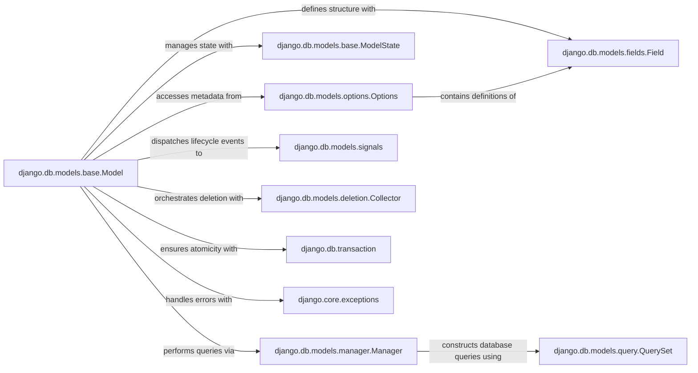

## Component Details

This overview details the structure, flow, and purpose of the `django.db.models.base.Model` subsystem, which forms the bedrock of Django's Object-Relational Mapper (ORM). It identifies the central components and their intricate relationships, explaining why each is fundamental to the ORM's operation.

### django.db.models.base.Model
The abstract base class from which all Django models inherit. It provides the core functionalities for defining database tables, managing instance state, handling data persistence (saving, updating, deleting), and performing validation. It acts as the primary interface for developers to interact with database records as Python objects.

**Related Classes/Methods**:

- <a href="https://github.com/django/django/blob/master/django/db/models/base.py#L480-L2407" target="_blank" rel="noopener noreferrer">`django.db.models.base.Model` (480:2407)</a>

### django.db.models.options.Options
This class, typically accessed via a model's `_meta` attribute, is a metadata container. It stores all configuration and structural information about a model, such as its database table name, field definitions, relationships, ordering, and unique constraints. It's the blueprint that guides the ORM's interaction with the database for a specific model.

**Related Classes/Methods**:

- <a href="https://github.com/django/django/blob/master/django/db/models/options.py#L89-L1042" target="_blank" rel="noopener noreferrer">`django.db.models.options.Options` (89:1042)</a>

### django.db.models.base.ModelState
A lightweight class that tracks the internal state of a model instance. This includes whether the instance is new (not yet saved to the database), whether it's been loaded from a specific database, and if it's currently undergoing a save operation. This state information is crucial for optimizing database interactions and ensuring correct behavior during object lifecycle.

**Related Classes/Methods**:

- <a href="https://github.com/django/django/blob/master/django/db/models/base.py#L468-L477" target="_blank" rel="noopener noreferrer">`django.db.models.base.ModelState` (468:477)</a>

### django.db.models.manager.Manager
The primary interface for performing database query operations on a model. Every `Model` class has at least one `Manager` instance (e.g., `objects`). Managers provide methods like `all()`, `filter()`, `get()`, `create()`, and `update()` that translate Python calls into database queries.

**Related Classes/Methods**:

- <a href="https://github.com/django/django/blob/master/django/db/models/manager.py#L175-L176" target="_blank" rel="noopener noreferrer">`django.db.models.manager.Manager` (175:176)</a>

### django.db.models.fields.Field
An abstract base class representing a column in a database table. Subclasses (e.g., `CharField`, `IntegerField`, `ForeignKey`) define specific data types, validation rules, and database column properties. They are the fundamental building blocks that define a model's structure and data types.

**Related Classes/Methods**:

- `django.db.models.fields.Field` (1:1)

### django.db.models.signals
A module containing predefined signals (e.g., `pre_init`, `post_init`, `pre_save`, `post_save`, `pre_delete`, `post_delete`) that are dispatched by `Model` instances at various points in their lifecycle. These signals enable decoupled components to react to model events, facilitating extensibility and custom logic.

**Related Classes/Methods**:

- <a href="https://github.com/django/django/blob/master/django/db/models/signals.py#L1-L1" target="_blank" rel="noopener noreferrer">`django.db.models.signals` (1:1)</a>

### django.db.models.deletion.Collector
A utility class used during the deletion process of model instances. When a model instance is deleted, the `Collector` is responsible for traversing its relationships and gathering all related objects that also need to be deleted or have their foreign keys modified, based on the `on_delete` behavior defined on related fields.

**Related Classes/Methods**:

- <a href="https://github.com/django/django/blob/master/django/db/models/deletion.py#L93-L516" target="_blank" rel="noopener noreferrer">`django.db.models.deletion.Collector` (93:516)</a>

### django.db.transaction
This module provides utilities for managing database transactions, ensuring that a series of database operations are treated as a single, atomic unit. If any operation within the transaction fails, all changes are rolled back, guaranteeing data integrity.

**Related Classes/Methods**:

- <a href="https://github.com/django/django/blob/master/django/db/transaction.py#L1-L1" target="_blank" rel="noopener noreferrer">`django.db.transaction` (1:1)</a>

### django.core.exceptions
This module defines various standard exceptions used throughout Django, including `ValidationError`, `ObjectDoesNotExist`, and `MultipleObjectsReturned`. These exceptions are crucial for robust error handling and communicating specific issues that arise during model operations and data validation.

**Related Classes/Methods**:

- <a href="https://github.com/django/django/blob/master/django/core/exceptions.py#L1-L1" target="_blank" rel="noopener noreferrer">`django.core.exceptions` (1:1)</a>

### django.db.models.query.QuerySet
Represents a collection of database queries. Managers use `QuerySet` objects to construct, refine, and execute database queries. It provides methods for filtering, ordering, and retrieving data from the database in a lazy and chainable manner.

**Related Classes/Methods**:

- <a href="https://github.com/django/django/blob/master/django/db/models/query.py#L1-L1" target="_blank" rel="noopener noreferrer">`django.db.models.query.QuerySet` (1:1)</a>

### [FAQ](https://github.com/CodeBoarding/GeneratedOnBoardings/tree/main?tab=readme-ov-file#faq)