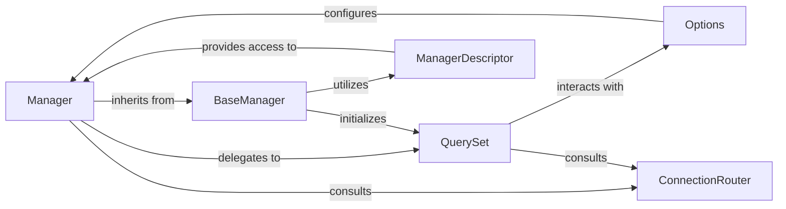

## Component Details

The `django.db.models.manager.Manager` subsystem is central to how Django models interact with the database. It provides the primary interface for performing database queries, acting as a crucial bridge between the declarative model definition and the underlying database operations. The core purpose of this subsystem is to abstract away the complexities of SQL query generation and execution, offering a Pythonic API for data retrieval and manipulation.

### Manager
The default concrete implementation of a model manager. It serves as the primary entry point for database query operations (e.g., `MyModel.objects.all()`), delegating most of the actual query building and execution to a `QuerySet` instance. It inherits core functionalities from `BaseManager`.

**Related Classes/Methods**:

- <a href="https://github.com/django/django/blob/master/django/db/models/manager.py#L175-L176" target="_blank" rel="noopener noreferrer">`django.db.models.manager.Manager` (175:176)</a>

### BaseManager
The foundational abstract class for all model managers. It provides the core logic for manager creation, registration with a model, and the basic interface for interacting with `QuerySet` objects. It defines methods like `contribute_to_class`, which is crucial for attaching the manager to a model.

**Related Classes/Methods**:

- <a href="https://github.com/django/django/blob/master/django/db/models/manager.py#L9-L172" target="_blank" rel="noopener noreferrer">`django.db.models.manager.BaseManager` (9:172)</a>

### QuerySet
Represents a collection of database queries that can be chained together. Managers are essentially a facade over `QuerySet` instances, providing convenient access to query methods like `filter()`, `all()`, `get()`, etc. `QuerySet` is responsible for building the SQL queries and interacting with the database backend.

**Related Classes/Methods**:

- <a href="https://github.com/django/django/blob/master/django/db/models/query.py#L1-L1" target="_blank" rel="noopener noreferrer">`django.db.models.query.QuerySet` (1:1)</a>

### ManagerDescriptor
A Python descriptor that controls how a manager instance is accessed from a model class or instance. When `Model.objects` is accessed, `ManagerDescriptor` ensures that a properly configured `Manager` instance (or a custom manager) is returned, often caching the instance for efficiency.

**Related Classes/Methods**:

- <a href="https://github.com/django/django/blob/master/django/db/models/manager.py#L179-L203" target="_blank" rel="noopener noreferrer">`django.db.models.manager.ManagerDescriptor` (179:203)</a>

### Options
An internal class (named `Options` but commonly referred to as `_meta` due to its attribute name on models) that stores all metadata about a Django model, including its fields, relationships, and registered managers. Managers use `Options` to understand the model they are attached to, such as its primary key, table name, and available fields.

**Related Classes/Methods**:

- <a href="https://github.com/django/django/blob/master/django/db/models/options.py#L89-L1042" target="_blank" rel="noopener noreferrer">`django.db.models.options.Options` (89:1042)</a>

### ConnectionRouter
Responsible for determining which database connection to use for a given model and operation, especially in multi-database setups. Managers and `QuerySet`s consult the `ConnectionRouter` to ensure queries are directed to the correct database.

**Related Classes/Methods**:

- <a href="https://github.com/django/django/blob/master/django/db/utils.py#L199-L280" target="_blank" rel="noopener noreferrer">`django.db.utils.ConnectionRouter` (199:280)</a>

### [FAQ](https://github.com/CodeBoarding/GeneratedOnBoardings/tree/main?tab=readme-ov-file#faq)