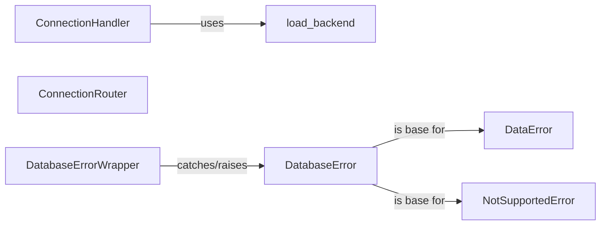

## Component Details

The `django.db.utils` module serves as a critical utility hub within Django's database layer, providing essential components for managing database connections, routing operations across multiple databases, and standardizing error handling. It acts as an abstraction layer, allowing Django to interact seamlessly with various database backends while presenting a consistent interface to developers.

### ConnectionHandler
This class is the central manager for all database connections configured in a Django project. It's responsible for initializing, configuring, and providing access to database connections. Its `create_connection` method dynamically loads the appropriate database backend.

**Related Classes/Methods**:

- `ConnectionHandler:create_connection` (0:0)

### ConnectionRouter
In multi-database setups, `ConnectionRouter` determines which database should be used for specific operations (e.g., reads, writes, migrations, relations) based on a set of defined routing rules. It iterates through configured routers to find the appropriate database alias.

**Related Classes/Methods**: _None_

### load_backend
A utility function that dynamically imports and returns the base module for a specified database backend (e.g., `django.db.backends.postgresql`). This function is essential for Django's pluggable database architecture.

**Related Classes/Methods**: _None_

### DatabaseErrorWrapper
This context manager (and decorator) wraps database operations to catch backend-specific exceptions (e.g., `psycopg2.Error`, `sqlite3.Error`) and re-raises them as Django's standardized `DatabaseError` or its subclasses. This ensures consistent error handling across different database systems.

**Related Classes/Methods**: _None_

### DatabaseError
The base exception class for all database-related errors in Django. All other specific database exceptions (like `DataError`, `IntegrityError`, `NotSupportedError`) inherit from this class.

**Related Classes/Methods**: _None_

### DataError
A specific exception subclass of `DatabaseError`, raised when issues related to data integrity or invalid data input occur (e.g., data too long for a column, invalid numeric value).

**Related Classes/Methods**: _None_

### NotSupportedError
A specific exception subclass of `DatabaseError`, raised when a requested database operation or feature is not supported by the current database backend (e.g., attempting to use a feature only available in a specific database version or type).

**Related Classes/Methods**: _None_

### [FAQ](https://github.com/CodeBoarding/GeneratedOnBoardings/tree/main?tab=readme-ov-file#faq)