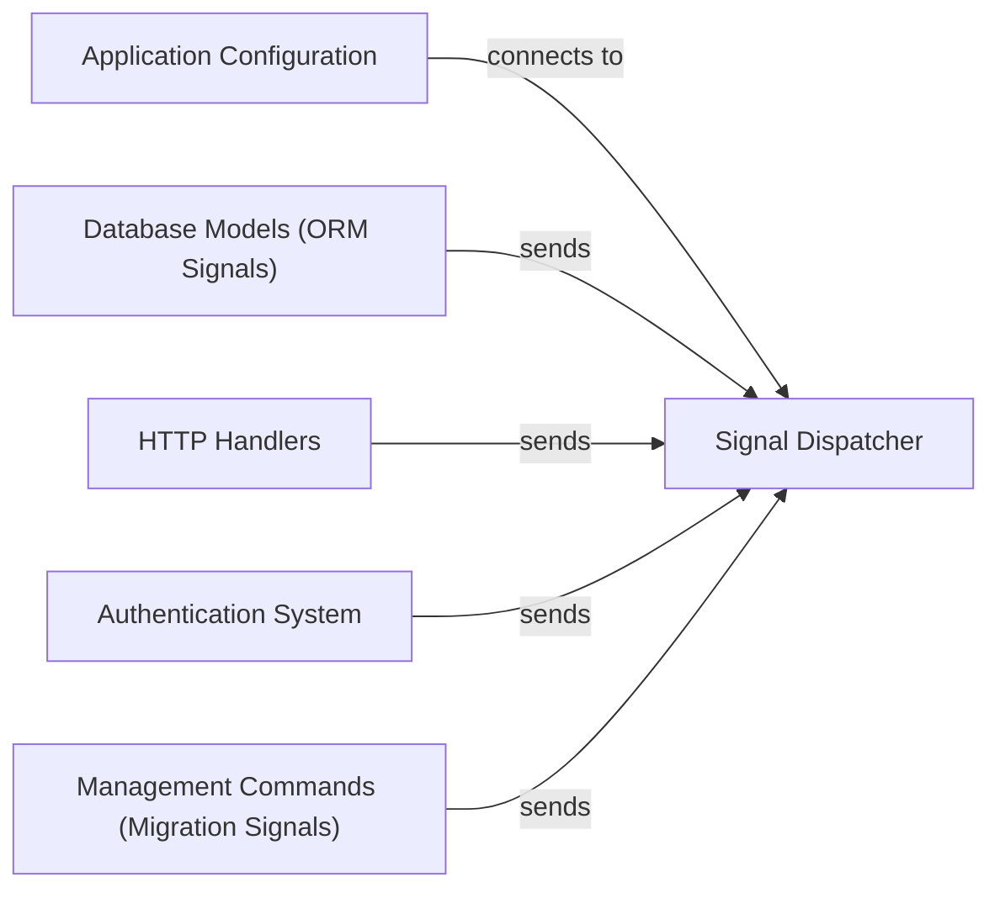

## Component Details

Overview of Django's signal system components and their interactions, highlighting the central role of the Signal Dispatcher and how various parts of Django interact with it by sending or connecting to signals to enable extensibility and decoupled communication within the framework.

### Signal Dispatcher
This is the foundational component for Django's signal system, implementing the publish-subscribe pattern. It provides the `Signal` class, which acts as a central hub for registering "receivers" (callable functions or methods) to specific signals and dispatching those signals to all connected receivers. It manages the lifecycle of signal connections, including synchronous and asynchronous dispatch, robust error handling, and efficient management of receiver references (weak references).

**Related Classes/Methods**:

- <a href="https://github.com/django/django/blob/master/django/dispatch/dispatcher.py#L24-L487" target="_blank" rel="noopener noreferrer">`django.dispatch.dispatcher.Signal` (24:487)</a>

### Application Configuration
This component, primarily represented by `django.apps.AppConfig`, manages application-specific setup and lifecycle. Its `ready()` method is a standard and crucial entry point for connecting receivers to signals, ensuring that application-specific functionalities are initialized or hooked into the signal system when a Django application starts. This makes `AppConfig` a primary consumer of the `Signal Dispatcher`'s connection capabilities.

**Related Classes/Methods**:

- <a href="https://github.com/django/django/blob/master/django/apps/config.py#L12-L273" target="_blank" rel="noopener noreferrer">`django.apps.config.AppConfig` (12:273)</a>
- <a href="https://github.com/django/django/blob/master/django/apps/config.py#L270-L273" target="_blank" rel="noopener noreferrer">`django.apps.config.AppConfig.ready` (270:273)</a>

### Database Models (ORM Signals)
This component represents the Django ORM's model lifecycle, encompassing operations like object creation, saving, and deletion. It dispatches a rich set of signals (e.g., `pre_init`, `post_init`, `pre_save`, `post_save`, `pre_delete`, `post_delete`, `m2m_changed`) at various stages of a model's existence. These signals are fundamental for allowing developers to execute custom logic tied to data persistence events, making the ORM highly extensible.

**Related Classes/Methods**:

- <a href="https://github.com/django/django/blob/master/django/db/models/signals.py#L1-L10" target="_blank" rel="noopener noreferrer">`django.db.models.signals` (1:10)</a>
- <a href="https://github.com/django/django/blob/master/django/db/models/base.py#L480-L2407" target="_blank" rel="noopener noreferrer">`django.db.models.base.Model` (480:2407)</a>

### HTTP Handlers
These components, such as `django.core.handlers.wsgi.WSGIHandler` and `django.core.handlers.asgi.ASGIHandler`, are responsible for processing incoming HTTP requests and generating responses. They dispatch critical signals at different stages of the request-response cycle (e.g., `request_started`, `request_finished`, `got_request_exception`). These signals are essential for middleware and other components to intervene, modify, or react to web traffic events, forming the backbone of Django's request processing extensibility.

**Related Classes/Methods**:

- <a href="https://github.com/django/django/blob/master/django/core/handlers/wsgi.py#L112-L143" target="_blank" rel="noopener noreferrer">`django.core.handlers.wsgi.WSGIHandler` (112:143)</a>
- <a href="https://github.com/django/django/blob/master/django/core/handlers/asgi.py#L138-L380" target="_blank" rel="noopener noreferrer">`django.core.handlers.asgi.ASGIHandler` (138:380)</a>
- <a href="https://github.com/django/django/blob/master/django/core/signals.py#L1-L10" target="_blank" rel="noopener noreferrer">`django.core.signals` (1:10)</a>

### Authentication System
This component handles user authentication processes, including user login and logout. It dispatches specific signals (e.g., `user_logged_in`, `user_logged_out`, `password_changed`) to notify other parts of the application about changes in user authentication status. This enables decoupled reactions to authentication events, suchs as logging user activity or updating session information.

**Related Classes/Methods**:

- <a href="https://github.com/django/django/blob/master/django/contrib/auth/signals.py#L1-L10" target="_blank" rel="noopener noreferrer">`django.contrib.auth.signals` (1:10)</a>

### Management Commands (Migration Signals)
This component is integral to managing database schema migrations. It dispatches signals before and after migrations are applied (`pre_migrate`, `post_migrate`). These signals are crucial for allowing applications to perform setup or cleanup tasks related to database schema changes, such as populating initial data or running custom scripts after a migration completes.

**Related Classes/Methods**:

- `django.db.migrations.signals` (1:10)
- <a href="https://github.com/django/django/blob/master/django/core/management/sql.py#L1-L10" target="_blank" rel="noopener noreferrer">`django.core.management.sql` (1:10)</a>

### [FAQ](https://github.com/CodeBoarding/GeneratedOnBoardings/tree/main?tab=readme-ov-file#faq)