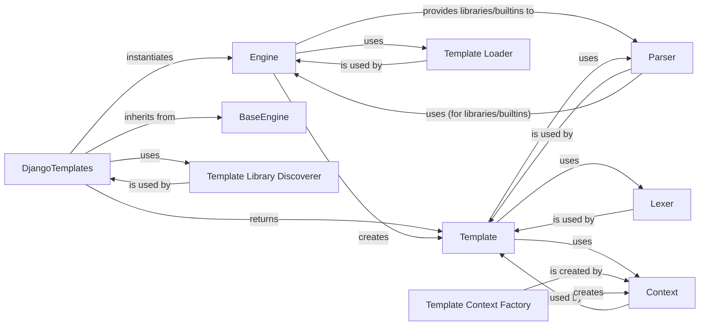

## Component Details

Abstract Components Overview of Django Template System

### DjangoTemplates
This class serves as the public-facing backend for the Django template engine. It acts as the primary interface for Django applications, handling the initial setup of template engine settings, including the discovery and management of template tag libraries, and delegating core operations to the `Engine`.

**Related Classes/Methods**:

- <a href="https://github.com/django/django/blob/master/django/template/backends/django.py#L15-L89" target="_blank" rel="noopener noreferrer">`django.template.backends.django.DjangoTemplates` (15:89)</a>

### Engine
The central processing unit of the Django template system. It is responsible for the core logic of finding, compiling, and rendering templates. It manages template loaders, built-in tags, and custom template libraries, making them available for template processing.

**Related Classes/Methods**:

- <a href="https://github.com/django/django/blob/master/django/template/engine.py#L12-L213" target="_blank" rel="noopener noreferrer">`django.template.engine.Engine` (12:213)</a>

### Template
Represents a parsed and compiled template. Once a template file is processed by the `Engine`, it is transformed into a `Template` object. This object encapsulates the parsed structure (nodelist) and provides the `render` method, which takes a `Context` and produces the final output.

**Related Classes/Methods**:

- <a href="https://github.com/django/django/blob/master/django/template/base.py#L12-L172" target="_blank" rel="noopener noreferrer">`django.template.base.Template` (12:172)</a>
- <a href="https://github.com/django/django/blob/master/django/template/base.py#L137-L172" target="_blank" rel="noopener noreferrer">`django.template.base.Template.render` (137:172)</a>

### Context
A data structure that holds variables and their values, making them accessible within a template during rendering. It functions like a stack, allowing for hierarchical variable scope management, which is crucial for template inheritance and inclusion.

**Related Classes/Methods**:

- <a href="https://github.com/django/django/blob/master/django/template/context.py#L137-L172" target="_blank" rel="noopener noreferrer">`django.template.context.Context` (137:172)</a>

### BaseEngine
An abstract base class that defines the fundamental interface and common properties for all template backends in Django. `DjangoTemplates` inherits from this class, ensuring that all template engines adhere to a consistent API, allowing Django to interact with different template systems uniformly.

**Related Classes/Methods**:

- <a href="https://github.com/django/django/blob/master/django/template/backends/base.py#L6-L82" target="_blank" rel="noopener noreferrer">`django.template.backends.base.BaseEngine` (6:82)</a>

### Template Loader
A set of classes (e.g., `FileSystemLoader`, `AppDirectoriesLoader`, `CachedLoader`) responsible for finding and loading raw template content from various configured locations (e.g., file system paths, installed application directories). The `Engine` relies on these loaders to retrieve the template source.

**Related Classes/Methods**:

- <a href="https://github.com/django/django/blob/master/django/template/loaders/filesystem.py#L8-L30" target="_blank" rel="noopener noreferrer">`django.template.loaders.filesystem.Loader` (8:30)</a>
- <a href="https://github.com/django/django/blob/master/django/template/loaders/app_directories.py#L8-L30" target="_blank" rel="noopener noreferrer">`django.template.loaders.app_directories.Loader` (8:30)</a>
- <a href="https://github.com/django/django/blob/master/django/template/loaders/cached.py#L10-L46" target="_blank" rel="noopener noreferrer">`django.template.loaders.cached.Loader` (10:46)</a>

### Lexer
This component is responsible for the initial phase of template parsing, breaking down the raw template string into a stream of meaningful tokens (e.g., text, variables, template tags). This token stream is then consumed by the `Parser`.

**Related Classes/Methods**:

- <a href="https://github.com/django/django/blob/master/django/template/base.py#L174-L220" target="_blank" rel="noopener noreferrer">`django.template.base.Lexer` (174:220)</a>
- <a href="https://github.com/django/django/blob/master/django/template/base.py#L100-L109" target="_blank" rel="noopener noreferrer">`django.template.base.Template.compile_nodelist` (100:109)</a>

### Parser
Takes the token stream generated by the `Lexer` and constructs the `nodelist`, which is a tree-like representation of the template's logical structure. It interprets template tags and filters, building the executable components of the template.

**Related Classes/Methods**:

- <a href="https://github.com/django/django/blob/master/django/template/base.py#L223-L600" target="_blank" rel="noopener noreferrer">`django.template.base.Parser` (223:600)</a>
- <a href="https://github.com/django/django/blob/master/django/template/base.py#L100-L109" target="_blank" rel="noopener noreferrer">`django.template.base.Template.compile_nodelist` (100:109)</a>

### Template Library Discoverer
This component, primarily represented by functions like `get_installed_libraries` and `get_template_tag_modules`, is responsible for dynamically locating and registering template tag and filter libraries from Django's built-in set and from installed applications. This ensures that all available template extensions are known to the `Engine` and `Parser`.

**Related Classes/Methods**:

- <a href="https://github.com/django/django/blob/master/django/template/utils.py#L10-L24" target="_blank" rel="noopener noreferrer">`django.template.utils.get_installed_libraries` (10:24)</a>
- <a href="https://github.com/django/django/blob/master/django/template/utils.py#L27-L41" target="_blank" rel="noopener noreferrer">`django.template.utils.get_template_tag_modules` (27:41)</a>

### Template Context Factory
A utility function (`make_context`) that facilitates the creation of `Context` objects. It can optionally enrich the context with request-specific data, leading to a `RequestContext` which is commonly used in web applications to provide access to request variables within templates.

**Related Classes/Methods**:

- <a href="https://github.com/django/django/blob/master/django/template/context.py#L285-L302" target="_blank" rel="noopener noreferrer">`django.template.context.make_context` (285:302)</a>

### [FAQ](https://github.com/CodeBoarding/GeneratedOnBoardings/tree/main?tab=readme-ov-file#faq)