```mermaid
graph LR
    django_template_base_Lexer["django.template.base.Lexer"]
    django_template_base_Lexer_tokenize["django.template.base.Lexer.tokenize"]
    django_template_base_Lexer_create_token["django.template.base.Lexer.create_token"]
    django_template_base_Token["django.template.base.Token"]
    django_template_base_TokenType["django.template.base.TokenType"]
    django_template_base_DebugLexer["django.template.base.DebugLexer"]
    django_template_base_Template_compile_nodelist["django.template.base.Template.compile_nodelist"]
    django_template_base_Parser["django.template.base.Parser"]
    django_utils_translation_template_templatize["django.utils.translation.template.templatize"]
    django_template_base_Lexer -- "contains" --> django_template_base_Lexer_tokenize
    django_template_base_Lexer -- "contains" --> django_template_base_Lexer_create_token
    django_template_base_Lexer_tokenize -- "calls" --> django_template_base_Lexer_create_token
    django_template_base_Lexer_tokenize -- "produces" --> django_template_base_Token
    django_template_base_Lexer_create_token -- "creates" --> django_template_base_Token
    django_template_base_Lexer_create_token -- "uses" --> django_template_base_TokenType
    django_template_base_Token -- "classified by" --> django_template_base_TokenType
    django_template_base_Token -- "consumed by" --> django_template_base_Parser
    django_template_base_DebugLexer -- "inherits from" --> django_template_base_Lexer
    django_template_base_DebugLexer -- "overrides" --> django_template_base_Lexer_tokenize
    django_template_base_Template_compile_nodelist -- "instantiates" --> django_template_base_Lexer
    django_template_base_Template_compile_nodelist -- "instantiates" --> django_template_base_Parser
    django_template_base_Parser -- "receives" --> django_template_base_Token
    django_utils_translation_template_templatize -- "instantiates" --> django_template_base_Lexer
    django_utils_translation_template_templatize -- "uses" --> django_template_base_TokenType
    click django_template_base_Lexer href "https://github.com/CodeBoarding/GeneratedOnBoardings/blob/main//django/django_template_base_Lexer.md" "Details"
    click django_template_base_Token href "https://github.com/CodeBoarding/GeneratedOnBoardings/blob/main//django/django_template_base_Token.md" "Details"
    click django_template_base_Parser href "https://github.com/CodeBoarding/GeneratedOnBoardings/blob/main//django/django_template_base_Parser.md" "Details"
```

## Component Details

This overview details the core components involved in the lexing (tokenization) phase of Django's template engine, focusing on `django.template.base.Lexer` and its immediate collaborators and consumers. These components are fundamental because they form the initial crucial step in transforming a raw template string into a structured, machine-readable format that can then be parsed and rendered.

### django.template.base.Lexer
The central component responsible for the tokenization phase of template compilation. It takes a raw template string and breaks it down into a sequence of `Token` objects, identifying different template language constructs like variables, block tags, comments, and plain text.

**Related Classes/Methods**:

- <a href="https://github.com/django/django/blob/master/django/template/base.py#L1-L1" target="_blank" rel="noopener noreferrer">`django.template.base.Lexer` (1:1)</a>

### django.template.base.Lexer.tokenize
The primary method within the `Lexer` class that implements the tokenization algorithm. It iterates through the template string, using regular expressions to identify segments, and delegates the creation of `Token` objects to `create_token`. This method is the operational heart of the lexer.

**Related Classes/Methods**:

- <a href="https://github.com/django/django/blob/master/django/template/base.py#L1-L1" target="_blank" rel="noopener noreferrer">`django.template.base.Lexer:tokenize` (1:1)</a>

### django.template.base.Lexer.create_token
A crucial helper method used by `tokenize` to construct and return a `Token` object. It determines the specific `TokenType` (e.g., `TEXT`, `VAR`, `BLOCK`, `COMMENT`) based on the content and context of the token string, effectively translating raw text segments into typed data.

**Related Classes/Methods**:

- <a href="https://github.com/django/django/blob/master/django/template/base.py#L1-L1" target="_blank" rel="noopener noreferrer">`django.template.base.Lexer:create_token` (1:1)</a>

### django.template.base.Token
A fundamental data structure representing a single, atomic unit of the template language. Each `Token` object encapsulates its type (`TokenType`), its raw string content, and its positional information (line number, start/end index) within the original template source. It is the output of the lexer and the input for the parser.

**Related Classes/Methods**:

- <a href="https://github.com/django/django/blob/master/django/template/base.py#L1-L1" target="_blank" rel="noopener noreferrer">`django.template.base.Token` (1:1)</a>

### django.template.base.TokenType
An enumeration that defines the distinct categories of tokens recognized by the lexer (e.g., `TEXT`, `VAR`, `BLOCK`, `COMMENT`). This provides a standardized and explicit classification system for `Token` objects, which is essential for the parser to correctly interpret the template structure.

**Related Classes/Methods**:

- <a href="https://github.com/django/django/blob/master/django/template/base.py#L1-L1" target="_blank" rel="noopener noreferrer">`django.template.base.TokenType` (1:1)</a>

### django.template.base.DebugLexer
A specialized subclass of `Lexer` designed for debugging purposes. It enhances the tokenization process by capturing more detailed positional information for each token, which is vital for generating precise and helpful error messages during template development. It demonstrates the extensibility of the core lexer.

**Related Classes/Methods**:

- <a href="https://github.com/django/django/blob/master/django/template/base.py#L1-L1" target="_blank" rel="noopener noreferrer">`django.template.base.DebugLexer` (1:1)</a>

### django.template.base.Template.compile_nodelist
This method, part of the `Template` class, orchestrates the overall template compilation process. It is the primary entry point for compiling a template, responsible for instantiating either `Lexer` or `DebugLexer` to tokenize the template string and then passing the resulting token stream to the `Parser`.

**Related Classes/Methods**:

- <a href="https://github.com/django/django/blob/master/django/template/base.py#L1-L1" target="_blank" rel="noopener noreferrer">`django.template.base.Template:compile_nodelist` (1:1)</a>

### django.template.base.Parser
Responsible for the parsing phase of template compilation. It is the direct consumer of the `Token` stream produced by the `Lexer`. The `Parser` transforms these tokens into a hierarchical structure of `Node` objects, which forms the template's executable representation (the nodelist). Its existence validates the lexer's output.

**Related Classes/Methods**:

- <a href="https://github.com/django/django/blob/master/django/template/base.py#L1-L1" target="_blank" rel="noopener noreferrer">`django.template.base.Parser` (1:1)</a>

### django.utils.translation.template.templatize
A utility function within Django's internationalization (i18n) module. Its purpose is to extract translatable strings from Django template code. It achieves this by instantiating and using the `Lexer` to break down the template into tokens, which it then processes to identify and format translatable content for gettext tools. This highlights a significant external use case for the lexer.

**Related Classes/Methods**:

- <a href="https://github.com/django/django/blob/master/django/utils/translation/template.py#L38-L245" target="_blank" rel="noopener noreferrer">`django.utils.translation.template.templatize` (38:245)</a>

### [FAQ](https://github.com/CodeBoarding/GeneratedOnBoardings/tree/main?tab=readme-ov-file#faq)