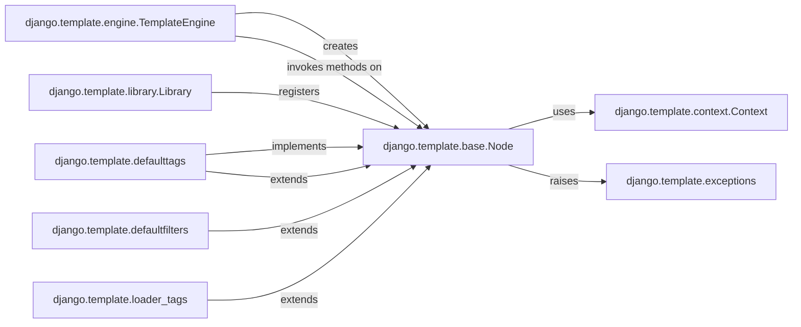

## Component Details

Here's the final component overview for `django.template.base.Node`, focusing on its structure, flow, and purpose within the Django templating system.

### django.template.base.Node
The abstract base class for all template elements. It defines the `render()` method, which concrete subclasses must implement to produce their output. It also includes `render_annotated` for debug-friendly error handling and `get_nodes_by_type` for traversing the node tree.

**Related Classes/Methods**:

- <a href="https://github.com/django/django/blob/master/django/template/base.py#L0-L0" target="_blank" rel="noopener noreferrer">`django.template.base.Node:render` (0:0)</a>
- <a href="https://github.com/django/django/blob/master/django/template/base.py#L0-L0" target="_blank" rel="noopener noreferrer">`django.template.base.Node:render_annotated` (0:0)</a>
- <a href="https://github.com/django/django/blob/master/django/template/base.py#L0-L0" target="_blank" rel="noopener noreferrer">`django.template.base.Node:get_nodes_by_type` (0:0)</a>

### django.template.context.Context
This component is a dictionary-like object that holds all the variables and their values available to the template during rendering. `Node` instances receive a `Context` object in their `render` method to access the data needed for dynamic content generation.

**Related Classes/Methods**: _None_

### django.template.engine.TemplateEngine
The central orchestrator of the Django templating system. It is responsible for parsing template strings into a tree of `Node` objects and then initiating the rendering process by calling the `render` (or `render_annotated`) method on the root `Node` of the parsed template. It also manages template settings like debug mode.

**Related Classes/Methods**: _None_

### django.template.exceptions
This module defines custom exception classes specific to the Django template system. `Node` implementations, particularly the `render_annotated` method, interact with these exceptions to provide detailed and context-aware error reporting during template rendering, which is crucial for debugging.

**Related Classes/Methods**: _None_

### django.template.library.Library
This component provides the mechanism for developers to register custom template tags and filters. Many template tags are implemented as subclasses of `Node`, and `Library` makes these custom `Node` types available for use within templates.

**Related Classes/Methods**: _None_

### django.template.defaulttags
This module contains the concrete implementations of `Node` subclasses that represent Django's built-in template tags (e.g., ``, ``, ``). Each class in these modules overrides the `render()` method of `Node` to provide its specific rendering logic for the corresponding template construct.

**Related Classes/Methods**:

- <a href="https://github.com/django/django/blob/master/django/template/base.py#L0-L0" target="_blank" rel="noopener noreferrer">`django.template.base.Node:render` (0:0)</a>

### django.template.defaultfilters
This module contains concrete implementations of `Node` subclasses related to Django's built-in template filters.

**Related Classes/Methods**:

- <a href="https://github.com/django/django/blob/master/django/template/base.py#L0-L0" target="_blank" rel="noopener noreferrer">`django.template.base.Node:render` (0:0)</a>

### django.template.loader_tags
This module contains concrete implementations of `Node` subclasses related to Django's template loader tags.

**Related Classes/Methods**:

- <a href="https://github.com/django/django/blob/master/django/template/base.py#L0-L0" target="_blank" rel="noopener noreferrer">`django.template.base.Node:render` (0:0)</a>

### [FAQ](https://github.com/CodeBoarding/GeneratedOnBoardings/tree/main?tab=readme-ov-file#faq)