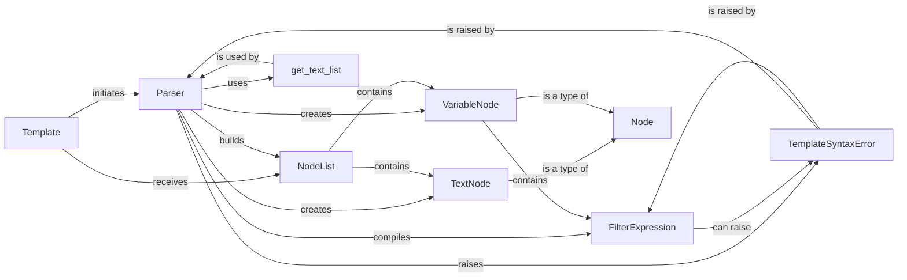

## Component Details

The `django.template.base.Parser` subsystem is fundamental to Django's template engine, acting as the core compiler that transforms raw template tokens into an executable structure. It bridges the gap between the lexical analysis (tokenization) and the rendering phase, ensuring that the template's logic and data access are correctly interpreted. 

### Template
Represents a compiled Django template. It serves as the primary entry point for processing a template string. Its `compile_nodelist` method orchestrates the entire parsing process by initiating the lexer and then the parser. It's fundamental because it's the user-facing object that encapsulates the template's compiled state and provides the `render` method.

**Related Classes/Methods**:

- <a href="https://github.com/django/django/blob/master/django/template/base.py#L1-L1" target="_blank" rel="noopener noreferrer">`django.template.base.Template` (1:1)</a>
- <a href="https://github.com/django/django/blob/master/django/template/base.py#L1-L1" target="_blank" rel="noopener noreferrer">`django.template.base.Template:compile_nodelist` (1:1)</a>
- <a href="https://github.com/django/django/blob/master/django/template/base.py#L1-L1" target="_blank" rel="noopener noreferrer">`django.template.base.Template:render` (1:1)</a>

### Parser
The core component responsible for the second phase of template compilation: parsing. It consumes a stream of `Token` objects (from a lexer) and constructs a tree-like structure of `Node` objects, primarily a `NodeList`. It interprets template tags, variables, and text, managing the parsing state and handling syntax errors. It's fundamental as it's the engine that understands and translates the Django template language.

**Related Classes/Methods**:

- <a href="https://github.com/django/django/blob/master/django/template/base.py#L1-L1" target="_blank" rel="noopener noreferrer">`django.template.base.Parser` (1:1)</a>
- <a href="https://github.com/django/django/blob/master/django/template/base.py#L1-L1" target="_blank" rel="noopener noreferrer">`django.template.base.Parser:parse` (1:1)</a>
- <a href="https://github.com/django/django/blob/master/django/template/base.py#L1-L1" target="_blank" rel="noopener noreferrer">`django.template.base.Parser:compile_filter` (1:1)</a>

### NodeList
A specialized list-like object that holds an ordered collection of compiled template `Node` objects. It represents the parsed structure of the template and is the direct output of the `Parser`. It's fundamental as it's the data structure that holds the entire parsed template, ready for the rendering phase.

**Related Classes/Methods**:

- <a href="https://github.com/django/django/blob/master/django/template/base.py#L1-L1" target="_blank" rel="noopener noreferrer">`django.template.base.NodeList` (1:1)</a>

### TextNode
A concrete `Node` subclass representing a static block of text within the template. It's the simplest form of content in a template. It's fundamental because it handles the most basic and common element of any template: plain, uninterpreted text.

**Related Classes/Methods**:

- <a href="https://github.com/django/django/blob/master/django/template/base.py#L1-L1" target="_blank" rel="noopener noreferrer">`django.template.base.TextNode` (1:1)</a>

### VariableNode
A concrete `Node` subclass representing a variable expression (e.g., `{{ my_variable }}`) that needs to be resolved and potentially filtered during template rendering. It's fundamental as it enables dynamic content by representing placeholders that will be replaced with actual data.

**Related Classes/Methods**:

- <a href="https://github.com/django/django/blob/master/django/template/base.py#L1-L1" target="_blank" rel="noopener noreferrer">`django.template.base.VariableNode` (1:1)</a>

### FilterExpression
Responsible for parsing and resolving variable expressions, including any applied filters (e.g., `{{ value|date:"Y-m-d" }}`). It breaks down the variable string into the variable itself and a chain of filters. It's fundamental because it provides the mechanism for data manipulation and formatting directly within the template language.

**Related Classes/Methods**:

- <a href="https://github.com/django/django/blob/master/django/template/base.py#L1-L1" target="_blank" rel="noopener noreferrer">`django.template.base.FilterExpression` (1:1)</a>

### TemplateSyntaxError
A custom exception class specifically raised when a syntax error is encountered during the parsing or rendering of a template. It's fundamental for robust error handling, providing specific and actionable feedback to developers when templates are malformed.

**Related Classes/Methods**:

- <a href="https://github.com/django/django/blob/master/django/template/exceptions.py#L1-L1" target="_blank" rel="noopener noreferrer">`django.template.exceptions.TemplateSyntaxError` (1:1)</a>

### get_text_list
A utility function from `django.utils.text` that formats a list of strings into a human-readable, comma-separated list with a conjunction (e.g., "a, b, or c"). It's fundamental for user-friendly error reporting, particularly within the `Parser`, by making error messages more comprehensible.

**Related Classes/Methods**:

- <a href="https://github.com/django/django/blob/master/django/utils/text.py#L286-L308" target="_blank" rel="noopener noreferrer">`django.utils.text.get_text_list` (286:308)</a>

### [FAQ](https://github.com/CodeBoarding/GeneratedOnBoardings/tree/main?tab=readme-ov-file#faq)