```mermaid
graph LR
    django_template_engine_Engine["django.template.engine.Engine"]
    django_template_base_Template["django.template.base.Template"]
    django_template_base_Lexer["django.template.base.Lexer"]
    django_template_base_Parser["django.template.base.Parser"]
    django_template_base_NodeList["django.template.base.NodeList"]
    django_template_context_Context["django.template.context.Context"]
    django_template_exceptions["django.template.exceptions"]
    django_template_library_Library["django.template.library.Library"]
    django_template_loader["django.template.loader"]
    django_template_engine_Engine -- "creates instances of" --> django_template_base_Template
    django_template_engine_Engine -- "utilizes" --> django_template_loader
    django_template_engine_Engine -- "manages" --> django_template_library_Library
    django_template_base_Template -- "orchestrates" --> django_template_base_Lexer
    django_template_base_Template -- "orchestrates" --> django_template_base_Parser
    django_template_base_Template -- "delegates rendering to" --> django_template_base_NodeList
    django_template_base_Template -- "requires" --> django_template_context_Context
    django_template_base_Template -- "raises/handles" --> django_template_exceptions
    django_template_base_Lexer -- "produces tokens for" --> django_template_base_Parser
    django_template_base_Parser -- "constructs" --> django_template_base_NodeList
    django_template_base_Parser -- "uses" --> django_template_library_Library
    django_template_base_NodeList -- "renders with" --> django_template_context_Context
    django_template_loader -- "raises" --> django_template_exceptions
    click django_template_engine_Engine href "https://github.com/CodeBoarding/GeneratedOnBoardings/blob/main//django/django_template_engine_Engine.md" "Details"
    click django_template_base_Template href "https://github.com/CodeBoarding/GeneratedOnBoardings/blob/main//django/django_template_base_Template.md" "Details"
    click django_template_base_Lexer href "https://github.com/CodeBoarding/GeneratedOnBoardings/blob/main//django/django_template_base_Lexer.md" "Details"
    click django_template_base_Parser href "https://github.com/CodeBoarding/GeneratedOnBoardings/blob/main//django/django_template_base_Parser.md" "Details"
    click django_template_context_Context href "https://github.com/CodeBoarding/GeneratedOnBoardings/blob/main//django/django_template_context_Context.md" "Details"
    click django_template_library_Library href "https://github.com/CodeBoarding/GeneratedOnBoardings/blob/main//django/django_template_library_Library.md" "Details"
    click django_template_loader href "https://github.com/CodeBoarding/GeneratedOnBoardings/blob/main//django/django_template_loader.md" "Details"
```

## Component Details

These components are fundamental because they represent the core stages and essential elements of the Django template processing pipeline:

1.  **`Engine`**: It's the entry point and configuration hub. Without an `Engine`, the template system cannot be initialized or configured, nor can templates be loaded or compiled.
2.  **`Template`**: This is the central object representing a parsed and ready-to-render template. It orchestrates the entire compilation process (tokenization and parsing) and is the object that ultimately performs the rendering.
3.  **`Lexer`**: The very first step in processing a raw template string. It breaks down the string into meaningful tokens, which are the building blocks for the parser. Without tokenization, the template cannot be understood.
4.  **`Parser`**: Takes the tokens from the `Lexer` and builds the hierarchical structure (`NodeList`) of the template. It applies the template language's grammar rules, making it crucial for interpreting the template's logic.
5.  **`NodeList`**: Represents the compiled, executable form of the template. The `Template` object delegates the actual rendering to the `NodeList`, making it the direct executor of the template's logic.
6.  **`Context`**: Templates are designed to display dynamic data. The `Context` object provides this data to the template during rendering, managing variable lookup and scope. Without a `Context`, templates would be static.
7.  **`Library`**: Django's template language is extensible through custom tags and filters. The `Library` component is the mechanism for registering and making these extensions available to the parser, enabling powerful customization.
8.  **`Loader`**: While `Template` can be instantiated with a string, most real-world templates are loaded from files. The `Loader` component is responsible for finding and retrieving these template files from various configured locations, making file-based templates possible.
9.  **`Exceptions`**: Robust software requires proper error handling. The `exceptions` module defines specific errors for the template system, allowing for clear diagnostics and graceful error recovery during template processing.

These components collectively cover the entire lifecycle of a template, from initial loading and parsing to final rendering and error handling, making them indispensable to the Django template system.

### django.template.engine.Engine
The central registry and entry point for the Django template system. It manages the configuration of template engines, discovers template loaders, and provides methods to load, compile, and render templates from strings or files. It acts as the orchestrator for the entire template processing pipeline.

**Related Classes/Methods**:

- <a href="https://github.com/django/django/blob/master/django/template/engine.py#L12-L213" target="_blank" rel="noopener noreferrer">`django.template.engine.Engine` (12:213)</a>

### django.template.base.Template
Represents a compiled template. It encapsulates the raw template string, orchestrates the tokenization and parsing processes to build its internal structure (a `NodeList`), and is responsible for the actual rendering when provided with a `Context`. It acts as the central orchestrator for transforming a template string into renderable output.

**Related Classes/Methods**:

- <a href="https://github.com/django/django/blob/master/django/template/base.py#L0-L0" target="_blank" rel="noopener noreferrer">`django.template.base.Template` (0:0)</a>

### django.template.base.Lexer
This component performs the initial phase of template processing: lexical analysis. It takes the raw template string and breaks it down into a sequence of meaningful tokens (e.g., variables, tags, text), preparing it for the parser. `DebugLexer` is a specialized subclass used when debugging is enabled.

**Related Classes/Methods**:

- <a href="https://github.com/django/django/blob/master/django/template/base.py#L0-L0" target="_blank" rel="noopener noreferrer">`django.template.base.Lexer` (0:0)</a>

### django.template.base.Parser
This component performs syntactic analysis. It takes the stream of tokens generated by the `Lexer` (or `DebugLexer`) and constructs the template's Abstract Syntax Tree (AST) in the form of a `NodeList`. It understands the grammar of Django's template language and builds the hierarchical structure of template nodes.

**Related Classes/Methods**:

- <a href="https://github.com/django/django/blob/master/django/template/base.py#L0-L0" target="_blank" rel="noopener noreferrer">`django.template.base.Parser` (0:0)</a>

### django.template.base.NodeList
Represents a collection of `Node` objects, which are the compiled, executable units of a template. After parsing, the template's structure is represented as a `NodeList`. Its primary responsibility is to recursively render its contained nodes, producing the final output string.

**Related Classes/Methods**:

- <a href="https://github.com/django/django/blob/master/django/template/base.py#L0-L0" target="_blank" rel="noopener noreferrer">`django.template.base.NodeList` (0:0)</a>

### django.template.context.Context
Manages the data available to the template during rendering. It's a dictionary-like object that holds variables and provides mechanisms for variable lookup, scope management (e.g., pushing and popping contexts), and handling context processors.

**Related Classes/Methods**:

- <a href="https://github.com/django/django/blob/master/django/template/context.py#L137-L172" target="_blank" rel="noopener noreferrer">`django.template.context.Context` (137:172)</a>

### django.template.exceptions
Defines custom exceptions specific to the Django template system, such as `TemplateSyntaxError` (raised during parsing) or `TemplateDoesNotExist` (raised by loaders). These exceptions provide structured error handling and clearer diagnostics for template-related issues.

**Related Classes/Methods**:

- <a href="https://github.com/django/django/blob/master/django/template/exceptions.py#L0-L0" target="_blank" rel="noopener noreferrer">`django.template.exceptions` (0:0)</a>

### django.template.library.Library
Provides a mechanism for registering custom template tags and filters. Developers use this class to define and expose their own template extensions, allowing for a modular and extensible template language.

**Related Classes/Methods**:

- <a href="https://github.com/django/django/blob/master/django/template/library.py#L15-L287" target="_blank" rel="noopener noreferrer">`django.template.library.Library` (15:287)</a>

### django.template.loader
Manages the process of finding and loading template files from various configured sources (e.g., file system, installed applications' `templates` directories). It provides a unified interface for template discovery and caching.

**Related Classes/Methods**:

- <a href="https://github.com/django/django/blob/master/django/template/loader.py#L0-L0" target="_blank" rel="noopener noreferrer">`django.template.loader` (0:0)</a>

### [FAQ](https://github.com/CodeBoarding/GeneratedOnBoardings/tree/main?tab=readme-ov-file#faq)