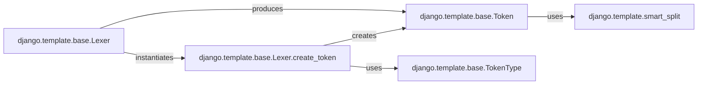

## Component Details

I chose these components because they represent the core of the tokenization process within Django's template engine.

1.  **`django.template.base.Token`**: This is the central data structure. Without `Token` objects, the raw template string would have no structured intermediate representation, making further parsing impossible. It's the fundamental unit of information passed from the lexer to the parser.

2.  **`django.template.base.Lexer.create_token`**: This method is the factory for `Token` objects. It embodies the logic of how raw template segments are transformed into meaningful `Token` instances. Its role is critical in correctly identifying the type and content of each token, which directly impacts how the template is subsequently processed.

3.  **`django.template.base.TokenType`**: While not explicitly shown in the provided code snippets, the `TokenType` enumeration is implicitly used by `Lexer.create_token` to categorize the `Token` objects. It's fundamental because it provides the classification system for tokens, enabling the template engine to differentiate between variables, blocks, comments, and plain text. Without these distinct types, the template parser wouldn't know how to interpret the tokens.

4.  **`django.template.base.Lexer`**: The `Lexer` class orchestrates the entire tokenization process. It's responsible for iterating through the raw template string and, using `create_token`, generating the stream of `Token` objects. It's the entry point for the tokenization phase and manages the state (like `verbatim` mode) that influences how tokens are created.

5.  **`django.template.smart_split`**: This utility, though seemingly minor, is crucial for the `Token.split_contents` method. It ensures that the contents of a token (especially for template tags) are correctly broken down into individual arguments, respecting quoting rules. This is vital for the correct interpretation of tag arguments and prevents parsing errors due to spaces or special characters within arguments.

These components are fundamental because they collectively define the initial and critical step of the Django template rendering process: converting a raw template string into a structured, interpretable sequence of tokens. This token stream then serves as the input for the subsequent parsing and rendering stages.

### django.template.base.Token
Represents a single, meaningful unit identified by the `Lexer` during the tokenization process (e.g., a variable, a tag, or plain text). These tokens are the intermediate representation between the raw template string and the parsed node structure. Each `Token` object encapsulates its `token_type` (e.g., block, variable), its raw `contents` (the original string from the template), and optional `position` and `lineno` for debugging and traceback purposes. It also provides a `split_contents` method to further process the token's content, particularly for handling translation-marked template pieces.

**Related Classes/Methods**:

- <a href="https://github.com/django/django/blob/master/django/template/base.py#L0-L0" target="_blank" rel="noopener noreferrer">`django.template.base.Token` (0:0)</a>
- <a href="https://github.com/django/django/blob/master/django/template/base.py#L0-L0" target="_blank" rel="noopener noreferrer">`django.template.base.Token:split_contents` (0:0)</a>

### django.template.base.Lexer.create_token
This method, part of the `Lexer` class, is responsible for converting raw string segments (token strings) from a template into structured `Token` objects. It acts as a factory for `Token` instances. It determines the type of token (e.g., `TokenType.BLOCK`, `TokenType.VAR`, `TokenType.COMMENT`, `TokenType.TEXT`) based on the string's content and context (specifically, whether it's inside a tag). It also includes special parsing logic for `verbatim` blocks, ensuring that content within these tags is treated as plain text and not further interpreted.

**Related Classes/Methods**:

- <a href="https://github.com/django/django/blob/master/django/template/base.py#L0-L0" target="_blank" rel="noopener noreferrer">`django.template.base.Lexer.create_token` (0:0)</a>

### django.template.base.TokenType
An enumeration (likely an internal one, though not explicitly shown in the provided code for `Token` or `create_token`) that defines the different types of tokens that can be identified during the lexing process. These types include `TEXT`, `VAR` (variable), `BLOCK` (template tag block), and `COMMENT`. This component is fundamental as it categorizes the parsed template elements, allowing subsequent parsing stages to correctly interpret and process them.

**Related Classes/Methods**:

- <a href="https://github.com/django/django/blob/master/django/template/base.py#L0-L0" target="_blank" rel="noopener noreferrer">`django.template.base.TokenType` (0:0)</a>

### django.template.base.Lexer
The `Lexer` class is responsible for the initial phase of template parsing: tokenization. It takes a raw template string and breaks it down into a stream of `Token` objects. It uses `create_token` to generate these tokens and handles the overall logic of identifying different template constructs (tags, variables, comments, and plain text). It also manages the state for special parsing modes like `verbatim` blocks.

**Related Classes/Methods**:

- <a href="https://github.com/django/django/blob/master/django/template/base.py#L0-L0" target="_blank" rel="noopener noreferrer">`django.template.base.Lexer` (0:0)</a>

### django.template.smart_split
A utility function used by `Token.split_contents` to intelligently split a string into a list of arguments, respecting quoted strings. This is crucial for correctly parsing the arguments within template tags or variables, especially when they contain spaces or special characters that should be treated as part of a single argument.

**Related Classes/Methods**:

- <a href="https://github.com/django/django/blob/master/django/template/backends/django.py#L0-L0" target="_blank" rel="noopener noreferrer">`django.template.smart_split` (0:0)</a>

### [FAQ](https://github.com/CodeBoarding/GeneratedOnBoardings/tree/main?tab=readme-ov-file#faq)