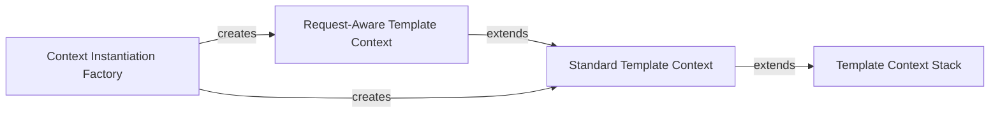

## Component Details

This subsystem is fundamental to Django's template rendering process, providing the mechanisms for managing and accessing data within templates. It defines the core data structures and logic for how variables are passed from views to templates, how they are resolved, and how request-specific data is integrated.

### Template Context Stack
This is the foundational component responsible for managing the hierarchical data structure (a stack of dictionaries) that holds variables accessible within templates. It provides mechanisms for pushing and popping context layers, and for resolving variables across these layers, ensuring proper variable scoping and inheritance.

**Related Classes/Methods**:

- <a href="https://github.com/django/django/blob/master/django/template/context.py#L27-L134" target="_blank" rel="noopener noreferrer">`django.template.context.BaseContext` (27:134)</a>
- <a href="https://github.com/django/django/blob/master/django/template/context.py#L13-L24" target="_blank" rel="noopener noreferrer">`django.template.context.ContextDict` (13:24)</a>

### Standard Template Context
This component extends the basic context stack with features relevant to general template rendering, such as auto-escaping behavior, localization settings (use_l10n), and timezone settings (use_tz). It also manages the binding of the context to a specific template during the rendering process, ensuring that template-specific configurations are applied.

**Related Classes/Methods**:

- <a href="https://github.com/django/django/blob/master/django/template/context.py#L137-L172" target="_blank" rel="noopener noreferrer">`django.template.context.Context` (137:172)</a>

### Request-Aware Template Context
This specialized component builds upon the Standard Template Context to integrate HTTP request-specific data. It automatically populates the context using configured template context processors, which inject variables like the request object itself, user information, or messages. This is crucial for rendering templates within the context of a web request.

**Related Classes/Methods**:

- <a href="https://github.com/django/django/blob/master/django/template/context.py#L219-L282" target="_blank" rel="noopener noreferrer">`django.template.context.RequestContext` (219:282)</a>

### Context Instantiation Factory
This utility component provides a convenient factory function to create the appropriate template context instance (Context or RequestContext) based on whether an HttpRequest object is present. It simplifies the process of setting up the initial context for template rendering, abstracting away the choice between standard and request-aware contexts.

**Related Classes/Methods**:

- <a href="https://github.com/django/django/blob/master/django/template/context.py#L285-L302" target="_blank" rel="noopener noreferrer">`django.template.context.make_context` (285:302)</a>

### [FAQ](https://github.com/CodeBoarding/GeneratedOnBoardings/tree/main?tab=readme-ov-file#faq)