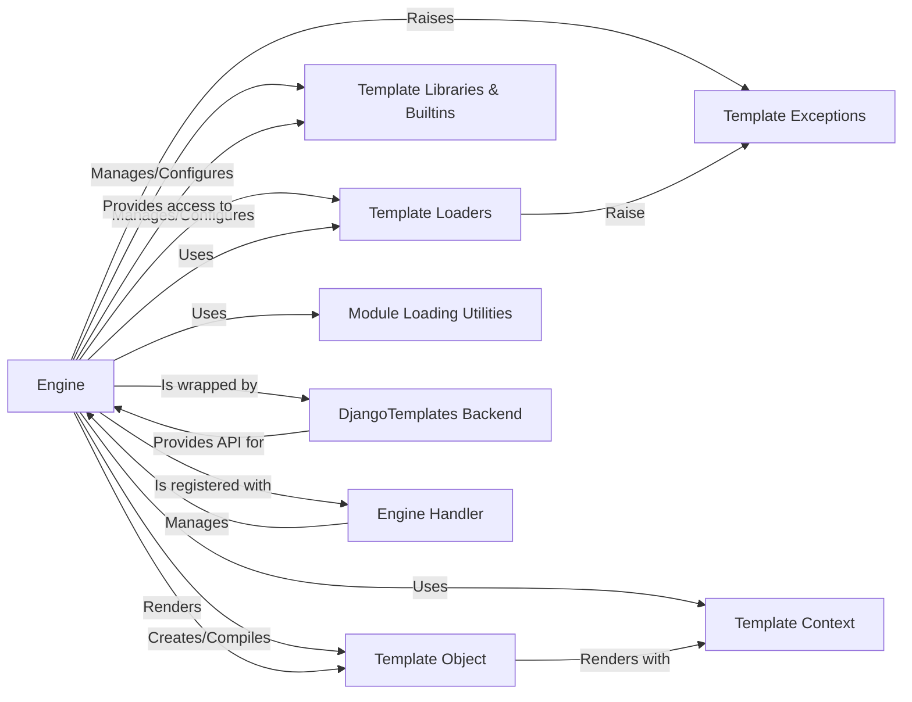

## Component Details

Overview of the Django template system, focusing on the `django.template.engine.Engine` and its interactions with other core components.

### Engine
The central orchestrator of the Django template system. It manages configuration (loaders, built-ins, context processors), retrieves and compiles templates, and coordinates the rendering process. It acts as the primary interface for loading and rendering templates programmatically.

**Related Classes/Methods**:

- <a href="https://github.com/django/django/blob/master/django/template/engine.py#L12-L213" target="_blank" rel="noopener noreferrer">`django.template.engine.Engine` (12:213)</a>

### Template Loaders
Responsible for locating and loading template files from various sources (e.g., filesystem, app directories, cache). The `Engine` delegates the task of finding raw template content to these loaders.

**Related Classes/Methods**:

- <a href="https://github.com/django/django/blob/master/django/template/backends/django.py#L1-L1" target="_blank" rel="noopener noreferrer">`django.template.loaders` (1:1)</a>

### Template Libraries & Builtins
Provide the custom tags and filters that extend the functionality of the template language. The `Engine` is responsible for discovering and registering these components so they can be used within templates.

**Related Classes/Methods**:

- <a href="https://github.com/django/django/blob/master/django/template/defaulttags.py#L1-L1" target="_blank" rel="noopener noreferrer">`django.template.defaulttags` (1:1)</a>
- <a href="https://github.com/django/django/blob/master/django/template/defaultfilters.py#L1-L1" target="_blank" rel="noopener noreferrer">`django.template.defaultfilters` (1:1)</a>
- <a href="https://github.com/django/django/blob/master/django/template/loader_tags.py#L1-L1" target="_blank" rel="noopener noreferrer">`django.template.loader_tags` (1:1)</a>

### Template Object
Represents a compiled template, ready for rendering. The `Engine` takes raw template code or content found by loaders and transforms it into this executable object.

**Related Classes/Methods**:

- <a href="https://github.com/django/django/blob/master/django/template/base.py#L1-L1" target="_blank" rel="noopener noreferrer">`django.template.base.Template` (1:1)</a>

### Template Context
A dictionary-like object that holds the data available to a template during its rendering process. The `Engine` passes this context to the `Template Object` for interpolation.

**Related Classes/Methods**:

- <a href="https://github.com/django/django/blob/master/django/template/context.py#L137-L172" target="_blank" rel="noopener noreferrer">`django.template.context.Context` (137:172)</a>

### Template Exceptions
Specific exception classes used to signal errors within the template system, such as a template not being found or a syntax error. The `Engine` raises and handles these to provide informative error messages.

**Related Classes/Methods**:

- <a href="https://github.com/django/django/blob/master/django/template/exceptions.py#L1-L1" target="_blank" rel="noopener noreferrer">`django.template.exceptions` (1:1)</a>

### Module Loading Utilities
Helper functions used by the `Engine` to dynamically import Python modules, classes, or functions based on string paths provided in settings (e.g., for loaders, context processors, libraries).

**Related Classes/Methods**:

- <a href="https://github.com/django/django/blob/master/django/utils/module_loading.py#L18-L34" target="_blank" rel="noopener noreferrer">`django.utils.module_loading.import_string` (18:34)</a>

### DjangoTemplates Backend
A higher-level template backend interface that wraps the `Engine` and provides a standardized API for Django applications to interact with the template system. It's often the primary entry point for template rendering in Django projects.

**Related Classes/Methods**:

- <a href="https://github.com/django/django/blob/master/django/template/backends/django.py#L15-L89" target="_blank" rel="noopener noreferrer">`django.template.backends.django.DjangoTemplates` (15:89)</a>

### Engine Handler
Manages multiple configured template engines (including instances of `Engine` wrapped by `DjangoTemplates`), allowing applications to retrieve the correct engine instance based on its settings.

**Related Classes/Methods**:

- <a href="https://github.com/django/django/blob/master/django/template/utils.py#L1-L1" target="_blank" rel="noopener noreferrer">`django.template.utils.engines` (1:1)</a>

### [FAQ](https://github.com/CodeBoarding/GeneratedOnBoardings/tree/main?tab=readme-ov-file#faq)