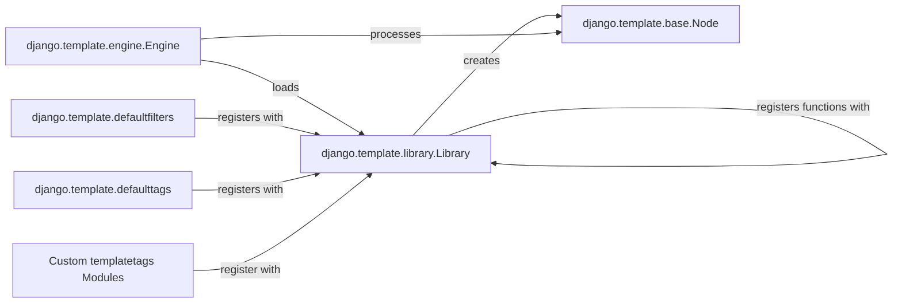

## Component Details

This analysis focuses on the `django.template.library.Library` component and its integral role within Django's template system, particularly concerning the extensibility of template tags and filters. The selected components are fundamental because they collectively define how custom logic is registered, compiled, and executed within Django templates, enabling both built-in functionalities and developer-defined extensions.

### django.template.library.Library
The core registry for custom template tags and filters. It provides decorator methods (`tag()`, `filter()`, `simple_tag()`, `inclusion_tag()`, `simple_block_tag()`) that allow Python functions to be registered and compiled into `Node` objects for template rendering. It maintains internal dictionaries (`self.filters` and `self.tags`) to store these registered elements.

**Related Classes/Methods**:

- <a href="https://github.com/django/django/blob/master/django/template/library.py#L15-L287" target="_blank" rel="noopener noreferrer">`django.template.library.Library` (15:287)</a>
- <a href="https://github.com/django/django/blob/master/django/template/library.py#L27-L49" target="_blank" rel="noopener noreferrer">`django.template.library.Library:tag` (27:49)</a>
- <a href="https://github.com/django/django/blob/master/django/template/library.py#L55-L96" target="_blank" rel="noopener noreferrer">`django.template.library.Library:filter` (55:96)</a>
- <a href="https://github.com/django/django/blob/master/django/template/library.py#L101-L153" target="_blank" rel="noopener noreferrer">`django.template.library.Library:simple_tag` (101:153)</a>
- <a href="https://github.com/django/django/blob/master/django/template/library.py#L239-L287" target="_blank" rel="noopener noreferrer">`django.template.library.Library:inclusion_tag` (239:287)</a>
- <a href="https://github.com/django/django/blob/master/django/template/library.py#L155-L237" target="_blank" rel="noopener noreferrer">`django.template.library.Library:simple_block_tag` (155:237)</a>

### django.template.engine.Engine
The primary component responsible for loading, compiling, and rendering templates. It discovers and loads `Library` instances (including built-in and custom ones) to make their registered tags and filters available during template parsing and rendering. It orchestrates the execution of `Node` objects.

**Related Classes/Methods**:

- <a href="https://github.com/django/django/blob/master/django/template/engine.py#L12-L213" target="_blank" rel="noopener noreferrer">`django.template.engine.Engine` (12:213)</a>

### django.template.base.Node
`Node` is the abstract base class for all compiled template tags. `TagHelperNode` serves as a common base for simple tags, managing argument resolution. `SimpleNode`, `SimpleBlockNode`, and `InclusionNode` are concrete implementations representing different types of tags (simple output, block content, and inclusion of another template, respectively). These objects encapsulate the rendering logic for a specific tag.

**Related Classes/Methods**:

- <a href="https://github.com/django/django/blob/master/django/template/base.py#L1-L1" target="_blank" rel="noopener noreferrer">`django.template.base.Node` (1:1)</a>
- <a href="https://github.com/django/django/blob/master/django/template/library.py#L290-L308" target="_blank" rel="noopener noreferrer">`django.template.library.TagHelperNode` (290:308)</a>
- <a href="https://github.com/django/django/blob/master/django/template/library.py#L311-L326" target="_blank" rel="noopener noreferrer">`django.template.library.SimpleNode` (311:326)</a>
- <a href="https://github.com/django/django/blob/master/django/template/library.py#L329-L343" target="_blank" rel="noopener noreferrer">`django.template.library.SimpleBlockNode` (329:343)</a>
- <a href="https://github.com/django/django/blob/master/django/template/library.py#L346-L380" target="_blank" rel="noopener noreferrer">`django.template.library.InclusionNode` (346:380)</a>

### django.template.defaultfilters
A module containing Django's built-in template filters. These filters are registered with a `Library` instance during the template engine's initialization, making them globally available in templates without explicit loading.

**Related Classes/Methods**:

- <a href="https://github.com/django/django/blob/master/django/template/defaultfilters.py#L1-L1" target="_blank" rel="noopener noreferrer">`django.template.defaultfilters` (1:1)</a>

### django.template.defaulttags
A module containing Django's built-in template tags. Similar to `defaultfilters`, these tags are registered with a `Library` instance and are automatically available for use in templates, providing core template functionalities.

**Related Classes/Methods**:

- <a href="https://github.com/django/django/blob/master/django/template/defaulttags.py#L1-L1" target="_blank" rel="noopener noreferrer">`django.template.defaulttags` (1:1)</a>

### Custom templatetags Modules
Represents user-defined or application-specific modules that create and utilize `Library` instances to register custom template tags and filters. This demonstrates the extensibility of the Django template system, allowing developers to extend template capabilities with their own logic.

**Related Classes/Methods**:

- <a href="https://github.com/django/django/blob/master/django/contrib/admin/templatetags/admin_list.py#L1-L1" target="_blank" rel="noopener noreferrer">`django.contrib.admin.templatetags.admin_list` (1:1)</a>

### [FAQ](https://github.com/CodeBoarding/GeneratedOnBoardings/tree/main?tab=readme-ov-file#faq)