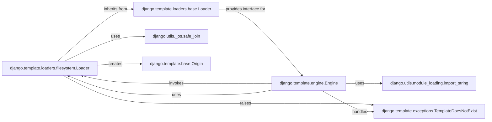

## Component Details

This subsystem focuses on how Django locates and loads template files from the file system. The `filesystem.Loader` is a concrete implementation that leverages a predefined list of directories to find templates, ensuring secure path handling and integrating seamlessly with the broader template engine.

### django.template.loaders.filesystem.Loader
This is the primary component under analysis. It's a concrete template loader responsible for locating and reading template files from a list of specified file system directories. It implements the `get_template_sources` method to generate potential file paths and `get_contents` to read the file content, handling `FileNotFoundError` by raising `TemplateDoesNotExist`.

**Related Classes/Methods**:

- <a href="https://github.com/django/django/blob/master/django/template/loaders/filesystem.py#L-1-L-1" target="_blank" rel="noopener noreferrer">`django.template.loaders.filesystem.Loader` (-1:-1)</a>
- <a href="https://github.com/django/django/blob/master/django/template/loaders/filesystem.py#L-1-L-1" target="_blank" rel="noopener noreferrer">`django.template.loaders.filesystem.Loader:get_template_sources` (-1:-1)</a>
- <a href="https://github.com/django/django/blob/master/django/template/loaders/filesystem.py#L-1-L-1" target="_blank" rel="noopener noreferrer">`django.template.loaders.filesystem.Loader:get_contents` (-1:-1)</a>

### django.template.loaders.base.Loader
An abstract base class that `filesystem.Loader` inherits from. It defines the common interface and core logic for all Django template loaders, including the `get_template` method which orchestrates the template lookup process by calling `get_template_sources` and `get_contents` (methods implemented by concrete loaders like `filesystem.Loader`).

**Related Classes/Methods**:

- <a href="https://github.com/django/django/blob/master/django/template/loaders/base.py#L3-L50" target="_blank" rel="noopener noreferrer">`django.template.loaders.base.Loader` (3:50)</a>
- <a href="https://github.com/django/django/blob/master/django/template/loaders/base.py#L7-L34" target="_blank" rel="noopener noreferrer">`django.template.loaders.base.Loader:get_template` (7:34)</a>
- <a href="https://github.com/django/django/blob/master/django/template/loaders/base.py#L36-L43" target="_blank" rel="noopener noreferrer">`django.template.loaders.base.Loader:get_template_sources` (36:43)</a>
- <a href="https://github.com/django/django/blob/master/django/template/loaders/base.py#L-1-L-1" target="_blank" rel="noopener noreferrer">`django.template.loaders.base.Loader:get_contents` (-1:-1)</a>

### django.template.engine.Engine
The central orchestrator of the Django template system. It's responsible for configuring and managing template loaders, including `filesystem.Loader`. The `Engine` uses its configured loaders to find and load templates, and it handles exceptions like `TemplateDoesNotExist` that may arise during the loading process.

**Related Classes/Methods**:

- <a href="https://github.com/django/django/blob/master/django/template/engine.py#L12-L213" target="_blank" rel="noopener noreferrer">`django.template.engine.Engine` (12:213)</a>

### django.utils._os.safe_join
A critical security utility that safely joins path components. `filesystem.Loader` uses this function to construct absolute file paths from base directories and template names, preventing malicious directory traversal attacks by raising a `SuspiciousFileOperation` if an unsafe path is detected.

**Related Classes/Methods**:

- <a href="https://github.com/django/django/blob/master/django/utils/_os.py#L8-L34" target="_blank" rel="noopener noreferrer">`django.utils._os.safe_join` (8:34)</a>

### django.template.base.Origin
A data structure that encapsulates metadata about a template's source. `filesystem.Loader` creates `Origin` objects to represent the absolute path (`name`), the requested template name, and the loader that found the template. This object is crucial for tracking where a template came from.

**Related Classes/Methods**:

- <a href="https://github.com/django/django/blob/master/django/template/base.py#L-1-L-1" target="_blank" rel="noopener noreferrer">`django.template.base.Origin` (-1:-1)</a>

### django.template.exceptions.TemplateDoesNotExist
A specific exception raised when a template cannot be found by any of the configured template loaders. `filesystem.Loader` raises this exception when a file is not found, and the `Engine` catches and aggregates these exceptions to provide detailed error messages.

**Related Classes/Methods**:

- <a href="https://github.com/django/django/blob/master/django/template/exceptions.py#L-1-L-1" target="_blank" rel="noopener noreferrer">`django.template.exceptions.TemplateDoesNotExist` (-1:-1)</a>

### django.utils.module_loading.import_string
A utility function used by the `Engine` to dynamically import Python modules or classes given their fully qualified string path. This allows the `Engine` to load template loaders (like `filesystem.Loader`) configured in Django's settings without hardcoding their imports, promoting flexibility.

**Related Classes/Methods**:

- <a href="https://github.com/django/django/blob/master/django/utils/module_loading.py#L18-L34" target="_blank" rel="noopener noreferrer">`django.utils.module_loading.import_string` (18:34)</a>

### [FAQ](https://github.com/CodeBoarding/GeneratedOnBoardings/tree/main?tab=readme-ov-file#faq)