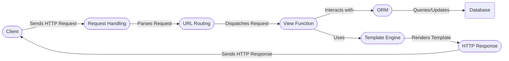

# Django High-Level Data Flow Overview

Django is a high-level Python web framework that encourages rapid development and clean, pragmatic design. It provides a robust set of tools and conventions for building web applications, including an ORM, templating engine, URL routing, and more.

## Component Descriptions

**Request Handling:** This component receives HTTP requests from the client, parses the request data (headers, body, etc.), and provides a convenient interface (`HttpRequest`) for accessing this information. It relates to the `URL Routing` component by passing the request object for further processing.

**URL Routing:** This component takes the incoming URL from the `Request Handling` component and maps it to the appropriate view function based on the defined URL patterns. It then dispatches the request to the selected `View Function`.

**View Function:** This component is a callable that receives the `HttpRequest`, processes it (often interacting with the `ORM` to fetch or update data), and prepares data for the `Template Engine` or directly constructs an `HTTP Response`.

**ORM:** The Object-Relational Mapper provides an abstraction layer for interacting with the database. It allows `View Functions` to query and update data using Python objects instead of raw SQL queries. It interacts with the `Database` to persist and retrieve data.

**Template Engine:** This component takes data from the `View Function` and a template file, merges them together, and generates dynamic HTML content. It then passes the rendered HTML to the `HTTP Response` component.

**HTTP Response:** This component constructs and sends the HTTP response back to the client. It sets the response headers, content type, status code, and body (which may be the rendered HTML from the `Template Engine`). It receives the rendered template from the `Template Engine` and sends the final response to the `Client`.
