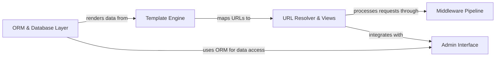

## Details

One paragraph explaining the functionality which is represented by this graph. What the main flow is and what is its purpose.

### ORM & Database Layer [[Expand]](./ORM_Database_Layer.md)
Central data abstraction layer handling model definitions, query execution, and database abstraction.

**Related Classes/Methods**:

- `django.db.models.Model` (100:150)
- `django.db.backends.base.base.DatabaseWrapper`

### Middleware Pipeline [[Expand]](./Middleware_Pipeline.md)
Request/response processing pipeline for cross-cutting concerns like authentication and security.

**Related Classes/Methods**:

- <a href="https://github.com/django/django/blob/main/django/core/handlers/wsgi.py#L112-L143" target="_blank" rel="noopener noreferrer">`django.core.handlers.wsgi.WSGIHandler` (112:143)</a>
- <a href="https://github.com/django/django/blob/main/django/middleware/csrf.py#L10-L40" target="_blank" rel="noopener noreferrer">`django.middleware.csrf.CsrfViewMiddleware` (10:40)</a>

### URL Resolver & Views [[Expand]](./URL_Resolver_Views.md)
URL routing system mapping endpoints to view functions.

**Related Classes/Methods**:

- <a href="https://github.com/django/django/blob/main/django/urls/resolvers.py#L150-L180" target="_blank" rel="noopener noreferrer">`django.urls.resolvers.URLResolver` (150:180)</a>
- `django.http.HttpRequest`

### Template Engine [[Expand]](./Template_Engine.md)
Template rendering engine for dynamic content generation.

**Related Classes/Methods**:

- <a href="https://github.com/django/django/blob/main/django/template/engine.py#L12-L213" target="_blank" rel="noopener noreferrer">`django.template.engine.Engine` (12:213)</a>
- <a href="https://github.com/django/django/blob/main/django/template/context.py#L140-L175" target="_blank" rel="noopener noreferrer">`django.template.context.Context` (140:175)</a>

### Admin Interface
Auto-generated admin interface built on ORM and URL routing.

**Related Classes/Methods**:

- <a href="https://github.com/django/django/blob/main/django/contrib/admin/sites.py#L29-L605" target="_blank" rel="noopener noreferrer">`django.contrib.admin.sites.AdminSite` (29:605)</a>
- <a href="https://github.com/django/django/blob/main/django/contrib/admin/options.py#L634-L2340" target="_blank" rel="noopener noreferrer">`django.contrib.admin.options.ModelAdmin` (634:2340)</a>

### [FAQ](https://github.com/CodeBoarding/GeneratedOnBoardings/tree/main?tab=readme-ov-file#faq)